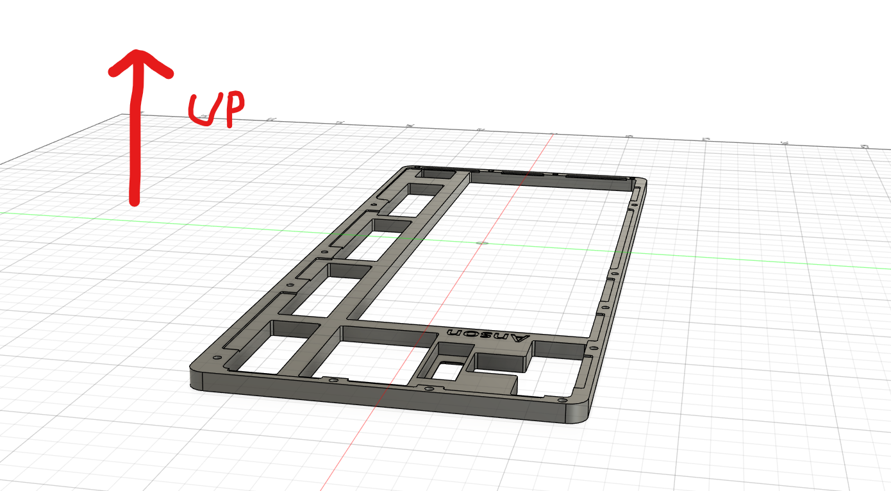
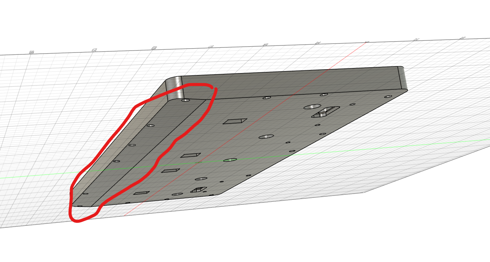
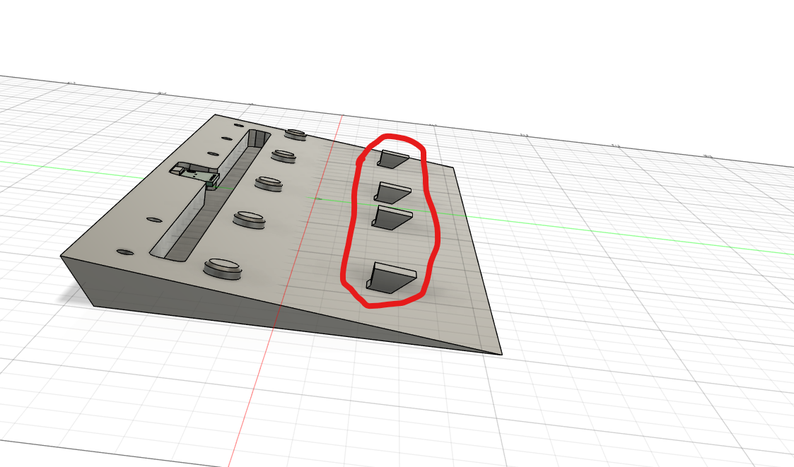

# Anson's Keyboard
This is a generic looking 80% TKL keyboard I made over the span of a month. In total, I've spent about 80 hours in total for PCB redesigns, writing the keyboard firmware and case redesigns.

## Features
- Individually backlit keys with software addressable RGB
- 0.91" OLED display
- USB and Bluetooth connectivity

### LED Control
The keyboard has three LED modes:
1. **Off Mode**: All LEDs are turned off
2. **RGB Mode**: LEDs display a rainbow effect
3. **Custom Color Mode**: All LEDs use a user-defined color

### LED Mode Controls
* **Toggle LED Mode**: `Ctrl + Alt + Pause/Break`
   * Cycles through Off → RGB → Custom Color
* **Adjust Brightness Up**: `Ctrl + Alt + Shift + Up Arrow`
* **Adjust Brightness Down**: `Ctrl + Alt + Shift + Down Arrow`

### Custom Color Configuration
1. **Enter Custom Color Mode**: `Ctrl + Alt + Page Up`
2. When in custom color mode:
   * The OLED will prompt for R, G, and B values sequentially
   * Use number keys (0-9) to enter a value between 0-255
   * Press `Backspace` to delete the last digit
   * Press `Enter` to confirm and move to the next color component
   * After setting all three RGB values, the keyboard returns to normal operation with your custom color

### Bluetooth Functionality
The keyboard can operate in either USB or Bluetooth mode:
* **Check Current Mode**: The OLED screen displays either "USB Mode" or "BT Mode"
* **Switch to Bluetooth Mode**: Hold the Pause/Break key during boot (pin IO36)
   * Note: After setup, the keyboard will remain in Bluetooth mode until changed

### OLED Display
The OLED display shows:
1. "KMK Keyboard" (title)
2. Connection mode (USB or Bluetooth)
3. Current WPM (words per minute) typing speed
4. Current LED mode

When in custom color configuration mode, the display shows prompts for entering RGB values.

### Performance Monitoring
The keyboard automatically calculates your typing speed (WPM) and displays it on the OLED screen. This is calculated based on:
* Number of keypresses
* Time elapsed since last keypress
* Standard conversion (5 characters = 1 word)

### Special Key Combinations
| Function | Key Combination |
|----------|----------------|
| Toggle LED Mode | Ctrl + Alt + Pause/Break |
| Enter Custom Color Mode | Ctrl + Alt + Page Up |
| Increase LED Brightness | Ctrl + Alt + Shift + Up Arrow |
| Decrease LED Brightness | Ctrl + Alt + Shift + Down Arrow |
| Enter Bluetooth Mode | Hold Pause/Break during boot |

## Design Process
I started with a simple idea which was a flat minimalistic TKL keyboard (inspired by the Apple keyboard). The goal was to keep it clean and 
modern, and remove unnecessary designs. However, as I thought more about ergonomics, I quickly realized that a completely flat keyboard wouldn't be comfortable at all
to use during typing.

My initial PCB design had borders that were too thick, which also made the case borders too thick, it was quite bulky and ugly that what I wanted

I originally planned to use the Orpheus Pico as the microcontroller. However, due to the large footprint (making the case even bulkier) and the lack of wireless connectivity, I scrapped that idea
and moved on to a new design. At this point, I also decided to make a triangle wedge to set the keyboard at 6 degrees for a better typing experience.

I wanted an integrated USB C port directly on the PCB, but when I redesigned the case and PCB to fit it, I realized that it would be close to impossible for someone with my skill level to hand solder the USB C port and it
would have stuck up at an angle anyway (this stresses the cable)

For the final design, I came up a solution. Instead of mounting the USB C port directly onto the PCB, I would purchase a USB C breakout board instead and connect it via cables to the PCB.

# Pictures
## Schematic

## PCB

## Assembled Keyboard

## Case Stand (CaseStand.step)

## Lower Case (LowerCase.step)

## Plate (Plate.step)

## Top Case (TopCase.step)

# Bill Of Material

## Electronics (LCSC)

### Passive Components

| QTY  | Name          | Part Number         | LCSC Part Number | Price |
|------|--------------|---------------------|------------------|-------|
| 100x | 4.7kΩ Resistor | 1206W4F4701T5E     | [C17936](https://www.lcsc.com/product-detail/Chip-Resistor-Surface-Mount_UNI-ROYAL-Uniroyal-Elec-1206W4F4701T5E_C17936.html) | $0.32 |
| 100x | 5.1kΩ Resistor | 1206W4F5101T5E     | [C26033](https://www.lcsc.com/product-detail/Chip-Resistor-Surface-Mount_UNI-ROYAL-Uniroyal-Elec-1206W4F5101T5E_C26033.html) | $0.30 |
| 20x  | Tact Switch   | TS-1187A-B-A-B      | [C318884](https://www.lcsc.com/product-detail/Tactile-Switches_XKB-Connection-TS-1187A-B-A-B_C318884.html) | $0.39 |
| 5x   | 3.3v Regulator | AMS1117-3.3        | [C6186](https://www.lcsc.com/product-detail/Voltage-Regulators-Linear-Low-Drop-Out-LDO-Regulators_Advanced-Monolithic-Systems-AMS1117-3-3_C6186.html) | $0.80 |
| 150x | 100nF Capacitor | CC1206KRX7R9BB104  | [C82601](https://www.lcsc.com/product-detail/Multilayer-Ceramic-Capacitors-MLCC-SMD-SMT_YAGEO-CC1206KRX7R9BB104_C82601.html) | $1.76 |
| 20x  | 10uF Capacitor | CL31B106KAHNNNE    | [C14860](https://www.lcsc.com/product-detail/Multilayer-Ceramic-Capacitors-MLCC-SMD-SMT_Samsung-Electro-Mechanics-CL31B106KAHNNNE_C14860.html) | $0.44 |
| 200x | Diode         | 1N4148WL            | [C33962554](https://www.lcsc.com/product-detail/Diodes-General-Purpose_Slkor-SLKORMICRO-Elec-1N4148WL_C33962554.html) | $1.02 |

### Active Components

| QTY  | Name         | Part Number          | LCSC Part Number | Price |
|------|-------------|----------------------|------------------|-------|
| 150x | RGB LED     | SK6812MINI-E         | [C5149201](https://www.lcsc.com/product-detail/RGB-LEDs-Built-in-IC_OPSCO-Optoelectronics-SK6812MINI-E_C5149201.html) | $8.97 |
| 1x   | ESP-32-S3   | ESP32-S3-WROOM-1-N16R2 | [C2913205](https://www.lcsc.com/product-detail/WiFi-Modules_Espressif-Systems-ESP32-S3-WROOM-1-N16R2_C2913205.html) | $4.64 |
| 5x   | Level Shifter | SN74LV1T34DBVR      | [C100024](https://www.lcsc.com/product-detail/Buffers-Drivers-Receivers-Transceivers_Texas-Instruments-SN74LV1T34DBVR_C100024.html) | $0.83 |

**LCSC Shipping**: Singapore Post – $5.66  

## Electronics (Local Vendor)

| QTY  | Name | Local Price | Conversion Upcharge | Price |
|------|------|------------|---------------------|-------|
| 5x   | [USB C Breakout Board](https://shopee.com.my/product/145270449/29272008539) | RM8.13 | +$0.15 | $2.10 |
| 1x  | [0.91" OLED](https://shopee.com.my/product/145270449/4639327724) | RM10.62 | +$0.15 | $2.65 |
| 1x   | SPX Express Shipping | RM5.20 | +$0.15 | $1.40 |

---

## Production  

| QTY  | Name       | File Name      | Production Method | Price  |
|------|-----------|---------------|------------------|--------|
| 1x   | Top Case  | TopCase.step  | FDM 3D Print    | -      |
| 1x   | Plate     | Plate.step    | FDM 3D Print    | -      |
| 1x   | Lower Case | LowerCase.step | FDM 3D Print    | -      |
| 1x   | Case Stand | CaseStand.step | FDM 3D Print    | -      |
| 5x   | PCB       | gerbers.zip   | JLCPCB          | $22.20 |
| 1x   | PCB Shipping | -          | E-Post         | $13.94 |

**Special Printing Request:**
- The Top Case (TopCase.step) should be with the flat side facing down

- The Lower Case (LowerCase.step) should be printed **with** supports due to steep overhangs

- The Case Stand (CaseStand.step) should be printed **with** supports due to steep overhangs

---

## Fasteners  

| QTY  | Name | Local Price | Conversion Upcharge | Price |
|------|------|------------|---------------------|-------|
| 9x   | [M3x5x4 Heat Set Insert](https://shopee.com.my/product/327548229/21958741418) | RM3.96 | +$0.15 | $1.05 |
| 15x  | [M2x3 Heat Set Insert](https://shopee.com.my/product/327548229/21958741418) | RM6.90 | +$0.15 | $1.70 |
| 5x   | [M3x6 Allen Screw](https://shopee.com.my/product/327548229/18214883983) | RM1.30 | +$0.15 | $0.45 |
| 4x   | [M3x4 Allen Screw](https://shopee.com.my/product/327548229/18214883983) | RM0.96 | +$0.15 | $0.40 |
| 15x  | [M2x12 Allen Screw](https://shopee.com.my/product/327548229/18514346852) | RM5.25 | +$0.15 | $1.35 |
| 1x   | SPX Express Shipping | RM10.60 | +$0.15 | $2.55 |

---

## Mechanical  

| QTY  | Name | Local Price | Conversion Upcharge | Price |
|------|------|------------|---------------------|-------|
| 1x   | [XDA Keycap Set](https://shopee.com.my/product/72068395/13588811898) | RM85.00 | +$2.50 | $22.07 |
| 1x   | [TX Almost Perfect Stabilizers](https://shopee.com.my/product/72068395/18489170375) | RM85.00 | +$2.50 | $22.07 |
| 91x  | [Gateron Smoothie Switches](https://shopee.com.my/product/72068395/14635071158) | RM136.50 | +$4.00 | $35.42 |
| 1x   | SPX Express Shipping | RM17.00 | +$0.40  | $4.31 |

**Note:** Price for stabilizers should be brought down below $20 after promo codes.

---

## Total Costs  

- **LCSC Total**: $25.13  
- **Electronics (Local) Total**: $6.15
- **JLCPCB Total**: $36.14  
- **Fasteners Total**: $7.50  
- **Mechanical Total**: $83.87  

## **Grand Total: $158.79**

**Note:** The price should not exceed the grand total unless there is a specific exception. Promo codes will be applied to reduce the total cost.

