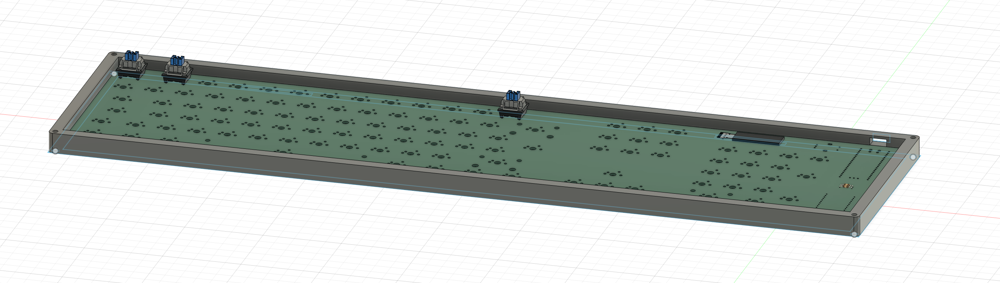
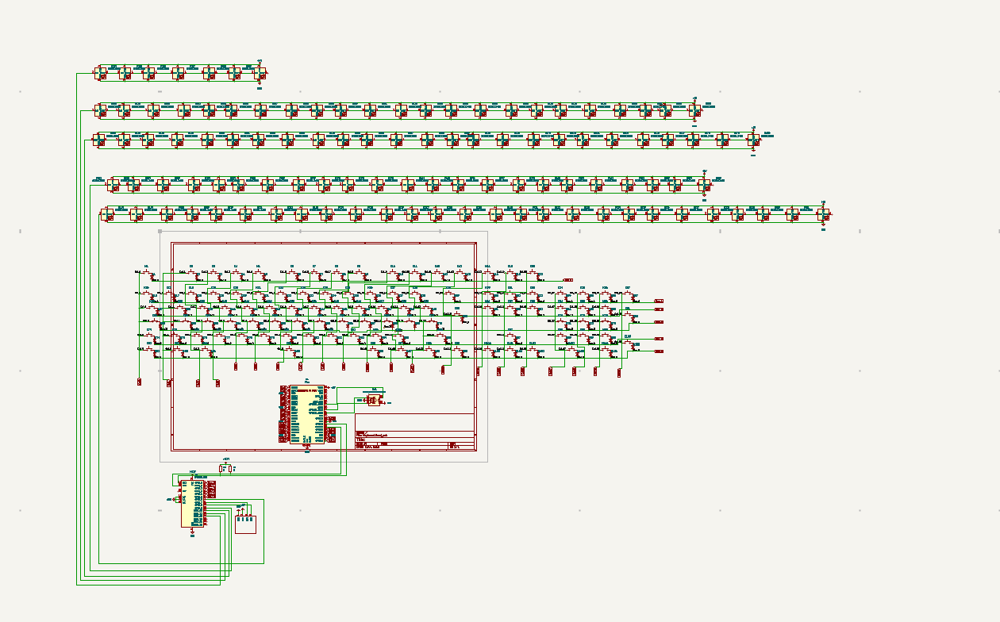
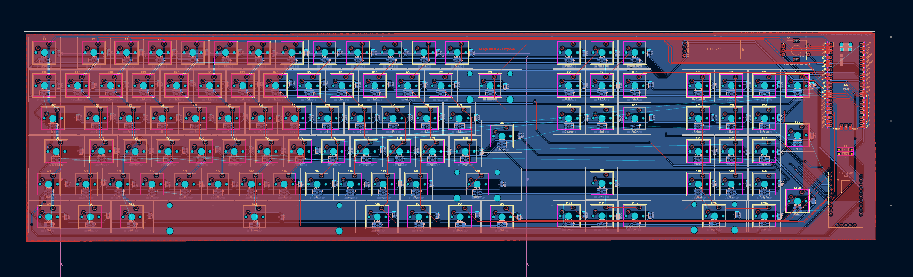

# Barni Keyboard

Barni Keyboard is a cool custom keyboard with 106 keys and colorful lights for each key. It has a small OLED screen that shows the time and other info, plus a rotary knob to easily scroll through menus. This keyboard is perfect for gamers, coders, or anyone looking for a unique and fun typing experience.

## BOM (Bill of Materials)

- 106 Key switches (Gateron Clear Switches, ~$0.50 each) --> Total: ~$53.00

- 105 Diodes (1N4148 SMD, ~$0.10 each) --> Total: ~$10.50

- 105 LEDs (SK6812MINI for per-key lighting, ~$0.50 each) --> Total: ~$52.50

- Keycap set (YMDK Transparent PBT, ~$25.00 total) --> Total: ~$25.00

- Stabilizers (Durock V2, high-quality for smooth feel, ~$20.00 total) --> Total: ~$20.00

- Fasteners (screws, nuts, etc., assorted, ~$15.00 total) --> Total: ~$15.00

- Misc Electronics (resistors, Kailh hotswap sockets, etc., ~$15.00 total) --> Total: ~$15.00

- Raspberry Pi Pico (official board, ~$4.00 each) --> Total: ~$4.00

- OLED Display (0.96" module, ~$3.00 each) --> Total: ~$3.00

- IO Expander (STMPE1600, for extended I/O, ~$3.00 each) --> Total: ~$3.00

- Rotary Encoder (Alps EC11, ~$1.00 each) --> Total: ~$1.00 

- PCB --> Total: $110.00

- 3D print (no price, included)

Total $312.00  

## Images of the keyboard
  
  
  
