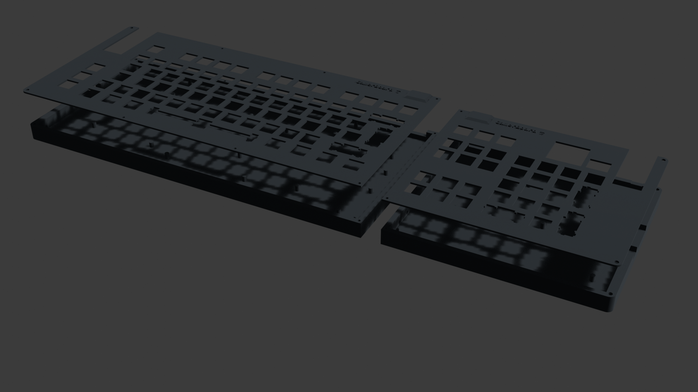

# GamerBoard

I really wanted to make a split keyboard, but not with the typical ergonomic split - so instead, I made it so you can decide between just the main keyblock or a full keyboard. Also, both parts can be used seperately.

The way I split the key matrix and pinout between the sides is incompatible with QMK, and barely compatible with KMK, so I used that this time (instead of QMK, which I used on my hackpad). The firmware currently is just a very basic variant with some features missing, I will develop it more once I get the keyboard.

## Pictures

[PDF for the PCB](assets/pcb.pdf)

The screw holes are very close to the edge of the plate/case, because I wanted to make it as small as possible.

Also, the two sides of the keyboard are going to connect by JST cable, and are going to stick together with magnets. There are holes in the side of the case for up to ten magnets on both sides.

## BoM

Prices might not be the same as setting the currency on AliExpress to USD, I converted the prices in EUR to USD for this table.
All prices include taxes.

### Electronics

|qty|name|price in USD|link|
|---|----|-----|----|
|2|100x Diode 1N4148|3.38|<https://www.aliexpress.com/item/1005004962400215.html?mp=1>|
|1|100x Resistor 5,1k|1.73|<https://de.aliexpress.com/item/1005001652314923.html>|
|1|OLED display 128x64|1.84|<https://de.aliexpress.com/item/1005006901604221.html>|
|1|USB-C receptacle (incl. shipping to DE)|4.24|<https://de.aliexpress.com/item/1005008600540419.html>|
|1|5x EC11 encoder|2.71|<https://de.aliexpress.com/item/1005005983134515.html>|
|2|Orpheus Pico|-|-|

sum: _13.90 USD (of 15 USD)_

I will buy the RGB leds and capacitors myself.

### Keys

|qty|name|price in USD|link|
|---|----|-----|----|
|110|MX Switch|0.40 per switch|<https://candykeys.com/product/gateron-smoothie-pom-silver-switch>|
|1|HyperX Pudding Keycaps|25.26|<https://www.amazon.de/gp/product/B08DJ8Q7M4/>|
|1|Stabilizers|18.41|<https://candykeys.com/product/owlab-screw-in-stabilizers-v2>|

I hope the 26 cents above 25 USD are fine. I'll pay them myself if necessary.

### Fasteners

|qty|name|price in USD|link|
|---|----|-----|----|
|1|100x 3x1mm Magnets|2.06|<https://de.aliexpress.com/item/1005008094695227.html>|
|1|100x Heatset insert, M2x4x3|5.19|<https://www.aliexpress.com/item/4000232858343.html>|
|1|Screw Set|2.33|<https://de.aliexpress.com/item/4000056753202.html>|

### PCB

- Left PCB: $24.40 (326.23 mm * 147.64 mm, lead free HASL)
- Right PCB: $15.10 (169.07 mm * 147.64 mm, lead free HASL)
- Shipping estimate (both at once): $19.70
- Taxes: $11.25
- **Total: $70.45**

I'm willing to pay for lead free HASL myself, it only adds $4.42 to the whole PCB order.

Cost of whole keyboard (excl. RGB LEDs and Orph. Pico): **_$181.60_**
