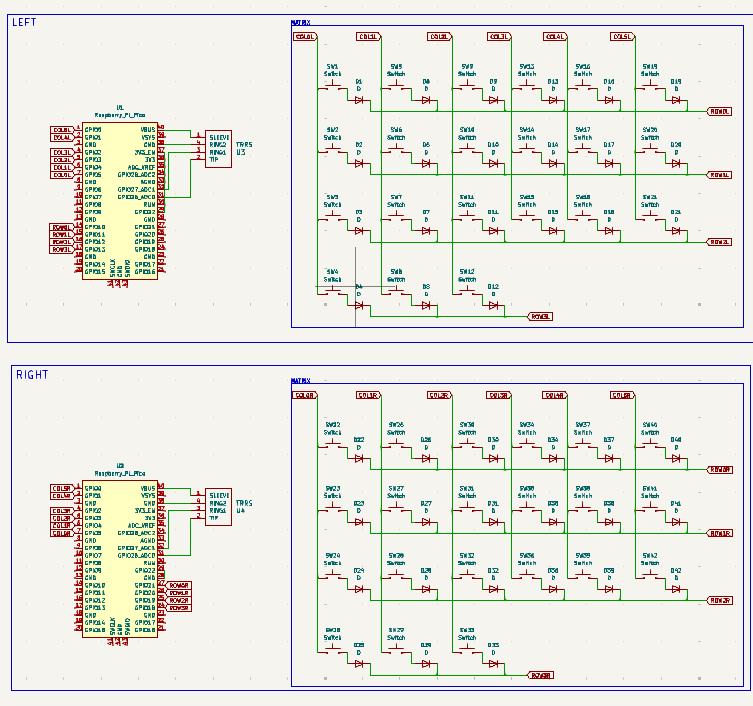
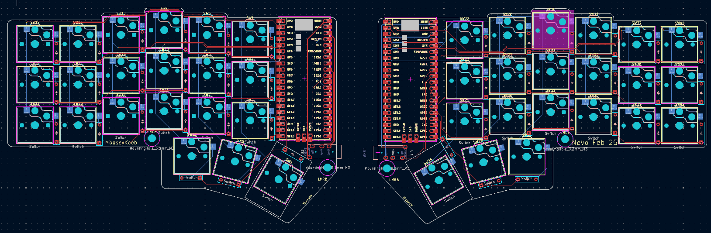
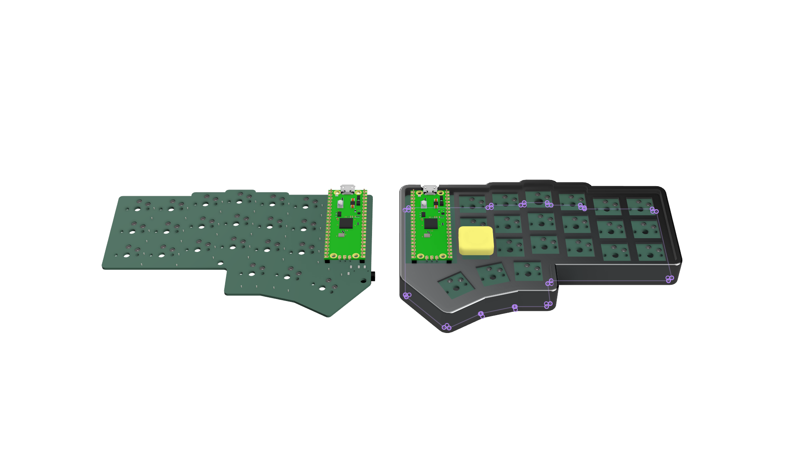

# MouseySplitKeeb
## BOM
|Item| Quantity|
|-----|-----|
|1N4148 Diodes| 42 |
|Orpheus pico| 2|
| Hotswap Choc v1| 42|
| Kalih Choc v1 Switches | 42|
| Choc v1 Keycaps | 42|
| TRRS Jack | 2|
|Case (2 parts)| 1|
|M3x5x4 Heatset inserts|4|
| M3x12mm SHCS Bolts |4|

### Images:

