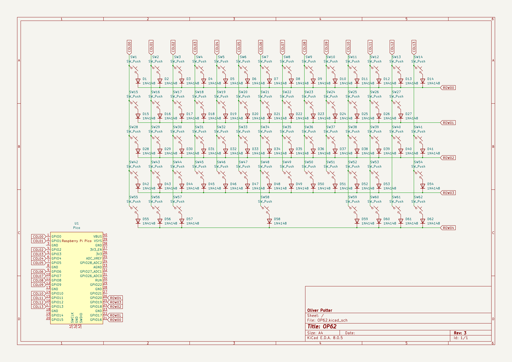
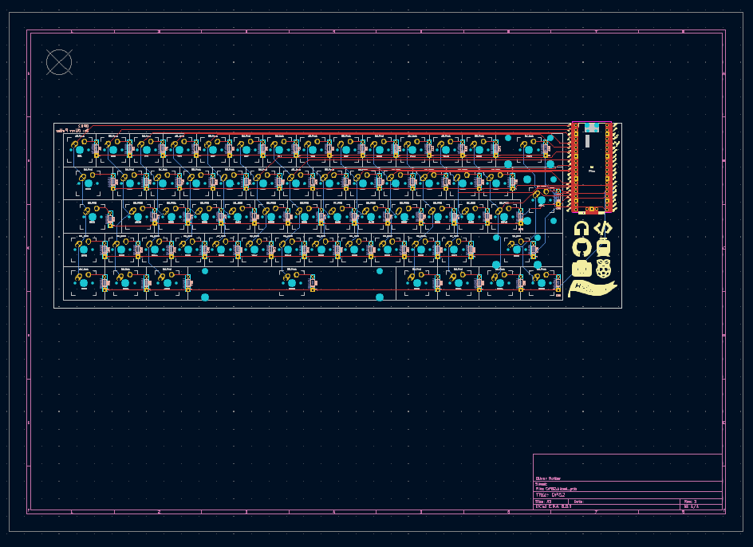
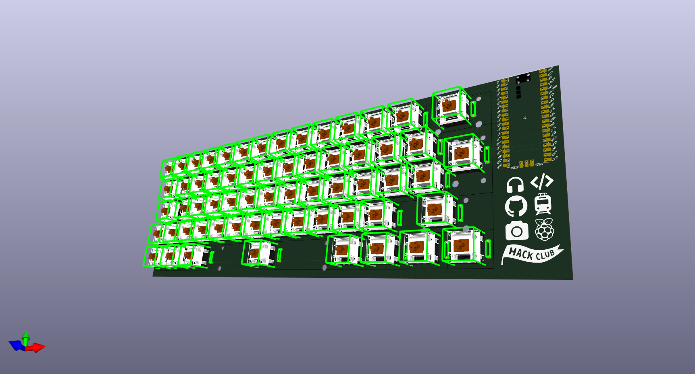
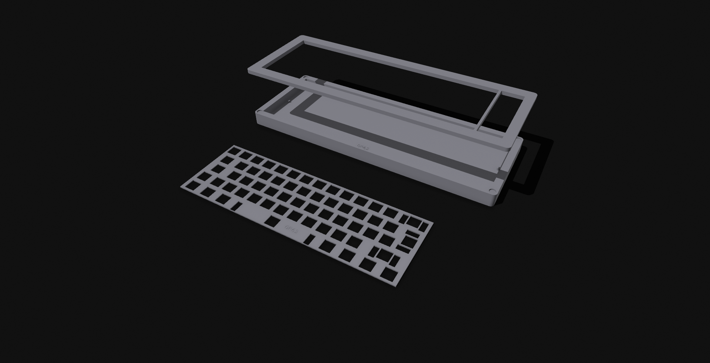

# OP62
This is a 60% (62 key) mechanical keyboard designed for Hackpad V2.

## PCB

## Case
The 3D printed case will consist of three parts:
- Top Assembly
- Plate
- Bottom Assembly

The top and bottom assembly will be attached with magnets. This is a screwless keyboard!

## Firmware
The current firmware is a **VERY** basic prototype created with [Pog](https://pog.heaper.de/).

A final firmware version will be created upon recieving the hardware.