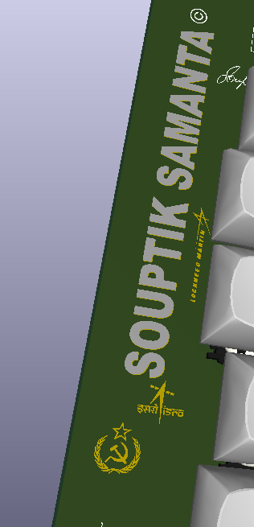

Below is an example Bill of Materials (BOM) for Soup_pad 88‐key keyboard build. This BOM lists the main electronic components, mechanical parts (switches, keycaps, stabilizers), and other necessary hardware
---

### Looks (pic quality is bad as its a screenshot from jlcpcb gerber vieweer)
.png>)

.png>)

### Bill of Materials (BOM)
- 88 cherry mx switches 

- [keycaps](https://www.aliexpress.com/item/1005005335190929.html?spm=a2g0n.productlist.0.0.13a256dbhw8qK1&browser_id=9ec0a3feef18424b80e562233bd2f20d&aff_trace_key=70f910bbb0c44088949780ce2279a348-1732000714130-06888-nmMrBE6&aff_platform=msite&m_page_id=dbehgemgzccaslhd1951c935213c1cc2dad7df7baf&gclid=&pdp_ext_f=%7B%22order%22%3A%221%22%2C%22eval%22%3A%221%22%7D&pdp_npi=4%40dis%21INR%212118.31%211546.40%21%21%21171.64%21125.30%21%402102f0cc17399411717113680ee1a8%2112000032651854707%21sea%21IN%213949123155%21ABX&algo_pvid=ebbcfa52-d630-4ea3-863a-c61fc5c34441)
- ssd1306 oled .96"
- rpi pico 
- 79 ws2812b neopixel 5050
- below parts bought from grant (20$)
- C1	805	1	1uf
- C2, C3, C4, C5	805	4x	20 uf
- C6	CP_Radial_D6.3mm_P2.50mm	1x	100uF
- usb c Receptacle
- R1, R2	805	2x	4.7kΩ
- R3	805	1x	220Ω
- R4	805	1x	100Ω
- R5, R6	805	2x	5.1k
- S1, S3, S4	Stabilizer_Cherry_MX_2.00u	3x	MX_stab
- S2	Stabilizer_Cherry_MX_6.25u	1x	MX_stab
- S5	Stabilizer_Cherry_MX_3.00u	1x	MX_stab
- 2 × Green LED (0805 package)

- **PCB:**  
  - Name: **Soup_pad**  
  - Color: **Black**
- **Case:**  
  - Material/Finish: **Black** (to match PCB aesthetics) 

  
- assembly

- Schematic

- pcb top

- my branding with isro lockheed martin and meth and more 

- pcb bot 

---