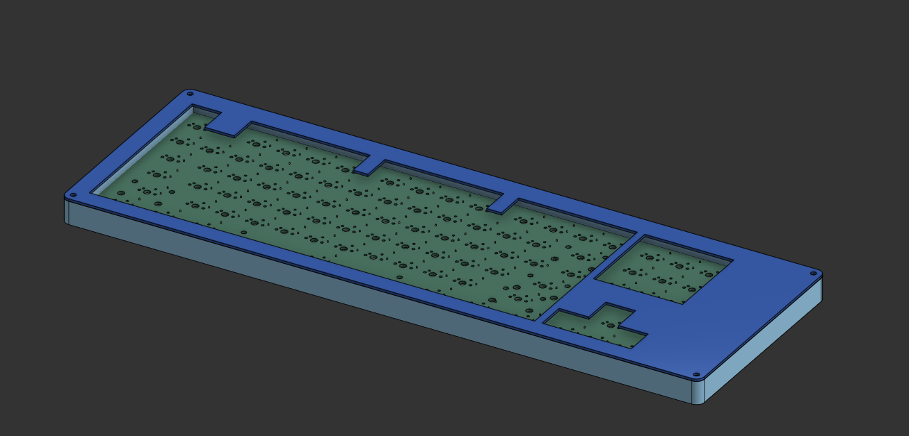
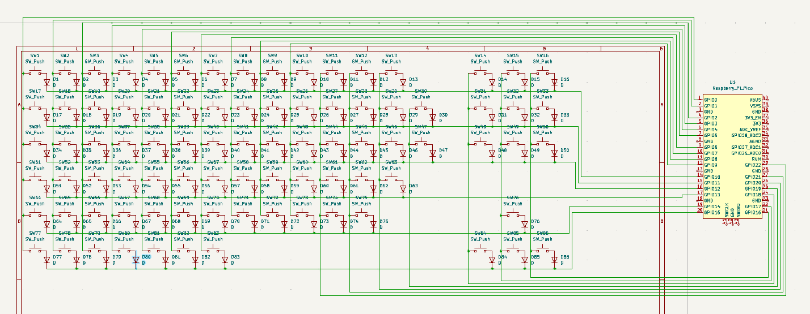
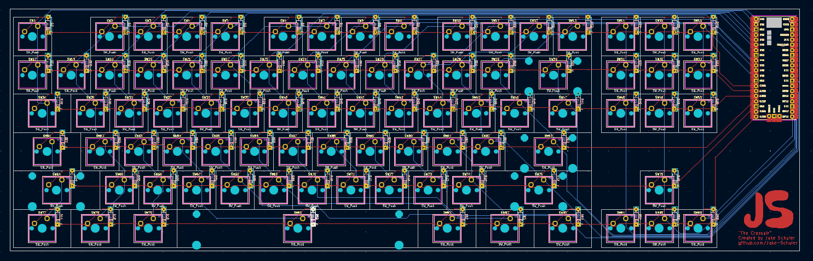
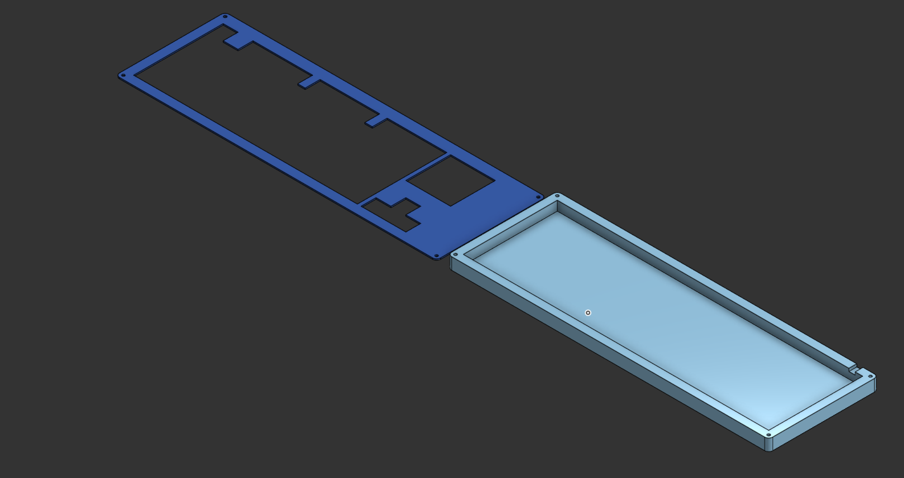

# The Crossair
A Very Epicly Epic Keyboard _**WOAH**_!

*I was too lazy to place all the switches if I need to lmk
## Inspiration
The layout of my keyboard was from my CORSAIR K55 RGB Pro, but I cut off the volume and keypad. And replaced the keys above the arrow keys with macros.
## Challenges
* Wiring this big of a project in KICad (soldering's gonna be a pain)
* Making the case, I tried to use the ai03 faceplate generator, but I realized the sizes weren't write so I did a bunch of measurements.
## Specifications
### BOM
- 1x Orpheus Pico
- 86x [Cherry MX Brown](https://a.co/d/bLIl3li) (I choose a pack of 120 because it was cheaper) ~$0.20/unit
- 86x Diodes [1N4148](https://www.digikey.com/en/products/detail/onsemi/1N4148/458603) ~$0.04/unit
- 4x [M3 Heatset](https://a.co/d/5gRKhQB) ~$0.04/unit (set of 200 total $7.99)
- 4x [M3x16 Bolt](https://a.co/d/axPe6Du) ~$0.16/unit total: $7.99
- 1x [YMDK Keycaps Set](https://a.co/d/c98JH9Q) $18.00
- PCB $35.35
- Case (3d printed)
- [Foam](https://a.co/d/8Bgm3h6) $7.89

Schem | PCB | Case
:----------:|:----------:|:----------:
 |  | 