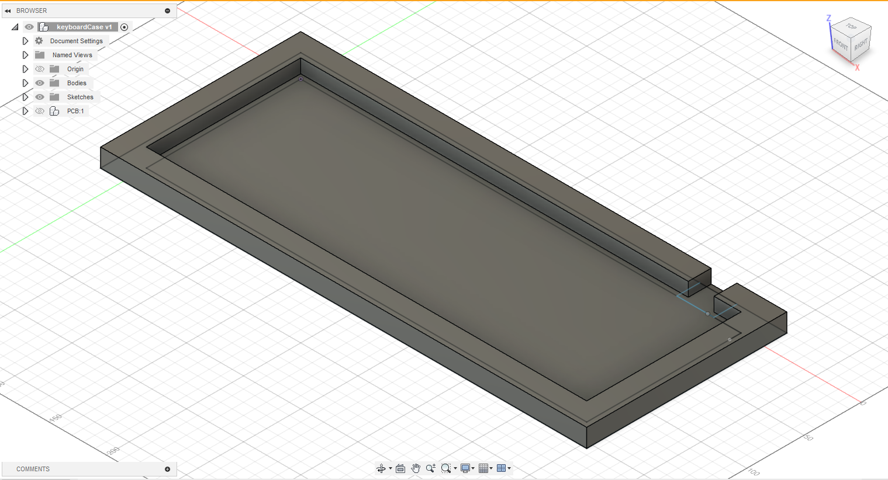

# CmBoard
A board made by me, CMB!!!!!!

# Bill of Materials
1x Orpheus Pico
1x PCB
x79 1N4148 Diodes
x4 Resistor (4.7kΩ)
x66 Cherry Switch (Any color) 1.0 size
x2 Cherry Switch (Any color) 1.25 size
x3 Cherry Switch (Any color) 1.5 size
x2 Cherry Switch (Any color) 1.75 size
x2 Cherry Switch (Any color) 2.0 size
x2 Cherry Switch (Any color) 2.25 size
x1 Cherry Switch (Any color) 2.75 size
x1 Cherry Switch (Any color) 6.25 size
x1 128x64 OLED screen
x1 Rotary Encoder Switch
x1 MCP23017_SO IO Expander

# Layout
Standard keyboard similar to the ones found on Thinkpads. 79 keys, OLED Screen, Rotary Encoder, and IO expander are the major parts, while using the Orpheus Pico as the main microcontroller. 