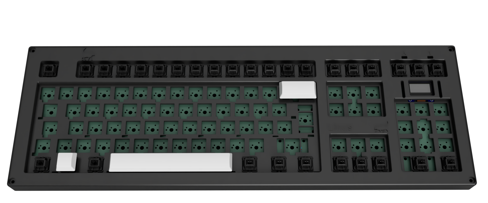
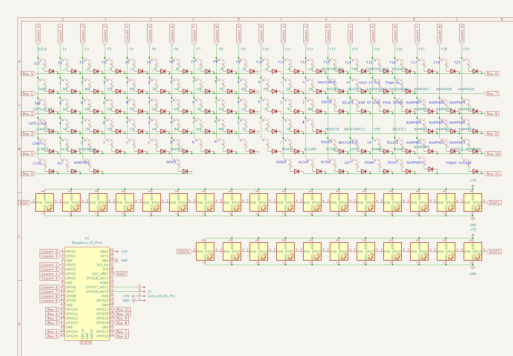
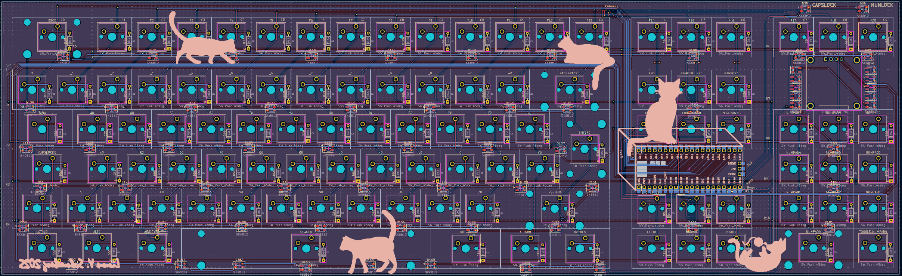

# Linus Keyboard

## Description
This is an almost full sized keyboard with a slightly modified ISO layout.
Here is a list of all the differences:

- The keys in the top row are ESC, F1 - F18, F25
- I removed the right column of the numpad since I never use it
- I also moved the numlock key to the bottom row and removed the 
top row of the numpad as well
- I replaced the second Windows key with another key which will probably activate a
  custom layer in my keymap
- I added two buttons to the sides of the up arrow key:
  - A backspace key on the left
  - A delete key on the right
  
## Features
There are 67 RGB LEDS in the keyboard which can be individually controlled.
I have also added a 128x64 OLED display. I'm planning to implement tetris on it!

## Schematic

## PCB

### F.Cu

### B.Cu

### B.Silkscreen
I added a few cats to the back silkscreen. I hope you like them!

## BOM
| Part                                               | Quantity | Value (taxes included)                   | Value in $                                     | Link                                                                                                                            |
|----------------------------------------------------|----------|------------------------------------------|------------------------------------------------|---------------------------------------------------------------------------------------------------------------------------------|
| Orpheus Pico                                       | 1        | -                                        |                                                | -                                                                                                                               |
| PCB                                                | 1        | 26.58€ (+14.10€ shipping)                | 27.58\$ (+14.63\$ shipping)                    | https://jlcpcb.com/                                                                                                             |
| 3.3V 0.5W Zener diodes                             | 110      | 4.55€ (+9.95€ shipping)                  | 4.72\$ (+10.33\$ shipping)                     | https://www.reichelt.com/ie/en/shop/product/zener_diode_3_3_v_0_5_w_sod27_do-35-219430                                          |
| OPSCO Optoelectronics SK6812MINI-E RGB LED Modules | 70       | 4.75€ (+3€ handling fee +7.21€ shipping) | 4.93\$ (+3.11\$ handling fee +7.48\$ shipping) | https://www.lcsc.com/product-detail/RGB-LEDs-Built-in-IC_OPSCO-Optoelectronics-SK6812MINI-E_C5149201.html?s_z=n_sk8612%20mini-e |
| OLED 0.96" 128x64                                  | 1        | 1.96€ (can ship with the leds)           | 2.03\$ (can ship with the leds)                | https://www.lcsc.com/product-detail/OLED-Display_HS-HS96L03W2C03_C5248080.html                                                  |
| Gateron G Pro 3.0 Brown Switches 108pcs            | 1        | 34.69€ (+9.23€ shipping)                 | 36.00\$ (+9.58\$ shipping)                     | https://www.amazon.com/Zjmehty-Switches-Mechanical-Pre-Lubed-Pin-Enhanced/dp/B0CF8DWDGF/                                        |
| TX AP Clip-in PCB Mount Stabilizer Set             | 1        | 13.99€                                   | 14.52\$                                        | https://candykeys.com/product/tx-ap-clip-in-pcb-mount-stabilizer/ap-clip-in-pcb-mount-stabilizer-2u3-12-white-pink-longpole     |
| Keycaps 150 Keys                                   | 1        | 24.99€                                   | 25.93\$                                        | https://www.amazon.de/-/en/Keycaps-Profile-Switches-Mechanical-Keyboard/dp/B0B56982GX                                           |
| M3 x 16mm Screws 50pcs                             | 1        | 6.19€                                    | 6.42\$                                         | https://www.amazon.de/-/en/ORTAVA-Cylindrical-Screws-Hexagon-Socket/dp/B0D5V8V5FZ                                               |
| M3 Hexagon Nuts 50pcs                              | 1        | 3.23€                                    | 3.35\$                                         | https://www.amazon.de/Hexagon-Stainless-Steel-A2-70-Thread/dp/B0CKN96BJX                                                        |
| M3 x 28mm Hex Bolt Screws 50pcs                    | 1        | 10.49€                                   | 10.89\$                                        | https://www.amazon.de/-/en/Alloy-Steel-Socket-Screws-Black/dp/B00W97R898                                                        |
