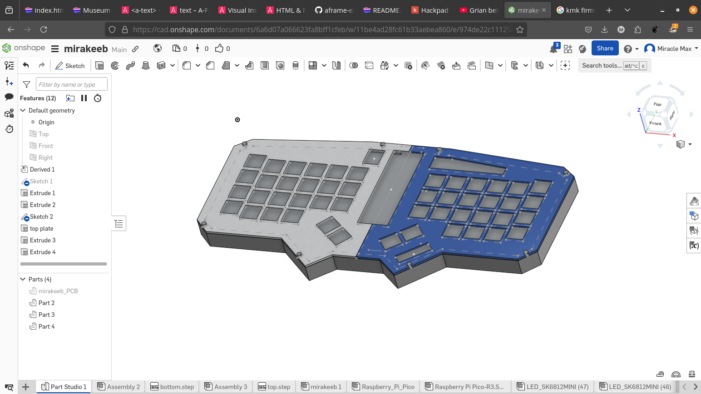
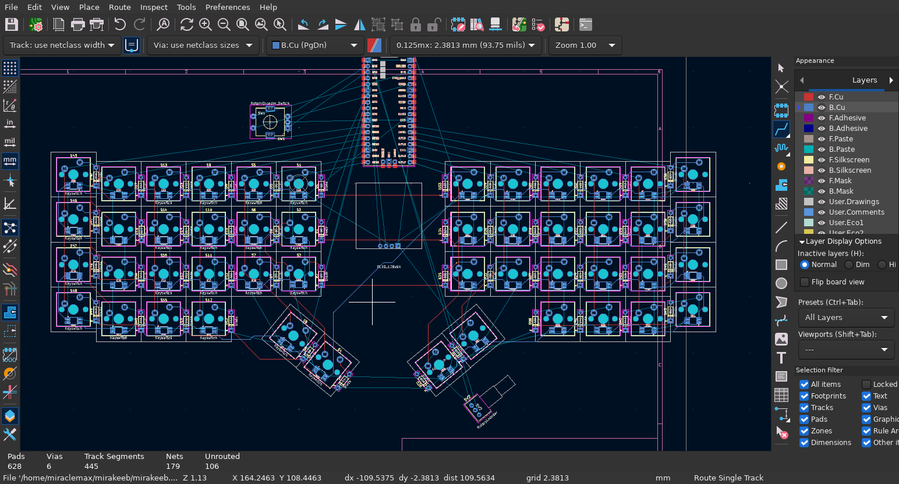
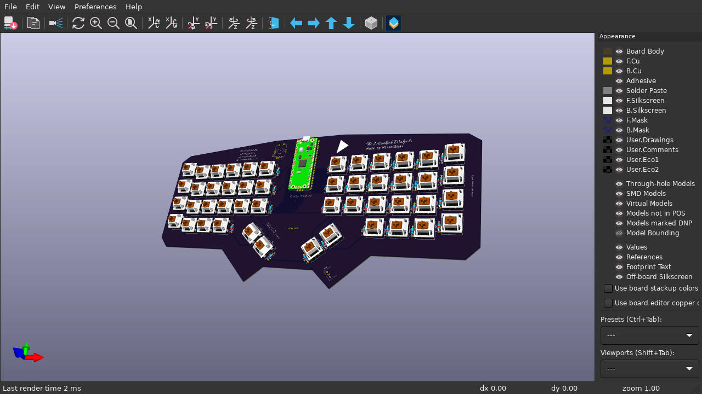

# The Mirakeeb Walpole \
---
Now, you may ask yourself: 'why the hell does this exist?' and my answer would be: 'and why the hell not? I was bored.' The Walpole is a compact, cool, and multi-layered keyboard build to be simple to assemble, simple to modify, and just neat to use. (also, I didn't want to use stabs because this is the first keyboard i've designed and I don't know how to use them lol)
## BOM \
| part | count | link |
| ---- | ----- | ---- |
| gateron g pro browns | 48 | [gateron store](https://www.gateron.co/collections/hand-lubed-switches/products/gateron-switch-set?variant=40017397448793) |
| DO-35 THT diodes | 48 | whatever you have on hand |
| these cool walnut keycaps i found | 48, but just get a set | [amazon](https://www.amazon.com/OHY-Double-Shot-Mechanical-Keyboard-Textures/dp/B0D7GXPVF4/ref=pb_allspark_dp_sims_pao_desktop_session_based_d_sccl_3_2/132-0840256-0410633?pd_rd_w=HVmxX&content-id=amzn1.sym.bb57ff9c-59bb-4b04-a98f-485dda19cac2&pf_rd_p=bb57ff9c-59bb-4b04-a98f-485dda19cac2&pf_rd_r=TKBTP9K0HTRFXQSX4GFF&pd_rd_wg=9C41i&pd_rd_r=d7562c73-5f63-4194-a7fd-4d20bd10f10b&pd_rd_i=B0D7GXPVF4&th=1) |
| adafruit reverse mount neopixels | 48 | [adafruit](https://www.adafruit.com/product/4960) |
| 128x64 oled display | 1 | whatever hq has |
| EC11e vert rotary encoder | 1 | [mouser](https://www.mouser.com/ProductDetail/Alps-Alpine/EC1110120201?qs=6EGMNY9ZYDQZuRRlni99ZQ%3D%3D) |
| Bourns PEC09 horzontal rotary | 1 | [digikey](https://www.digikey.be/en/products/detail/bourns-inc/PEC09-2315F-N0015/4699158) |
| orpheus pico (apparently pin compatible with pi pico) | 1 | no idea where the link is |

## images \

### case \
 \

### the pcb \
 \

