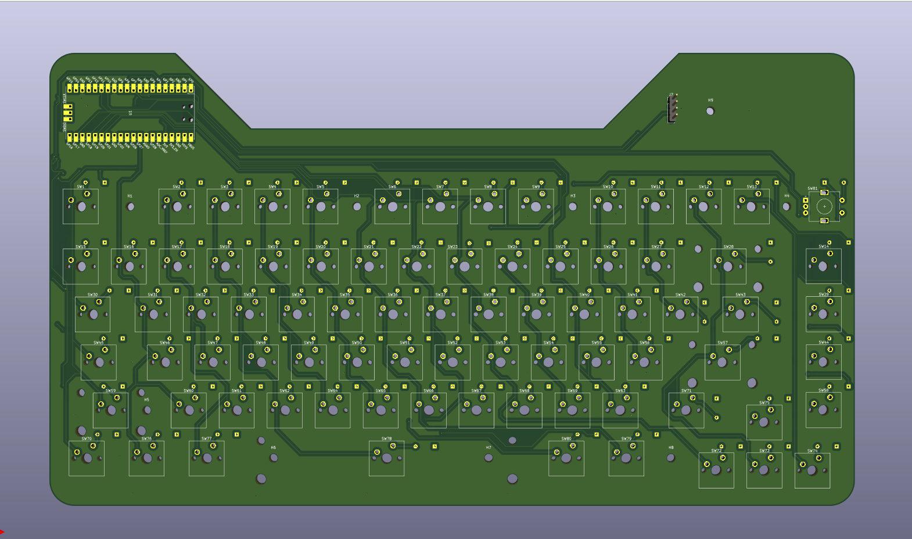
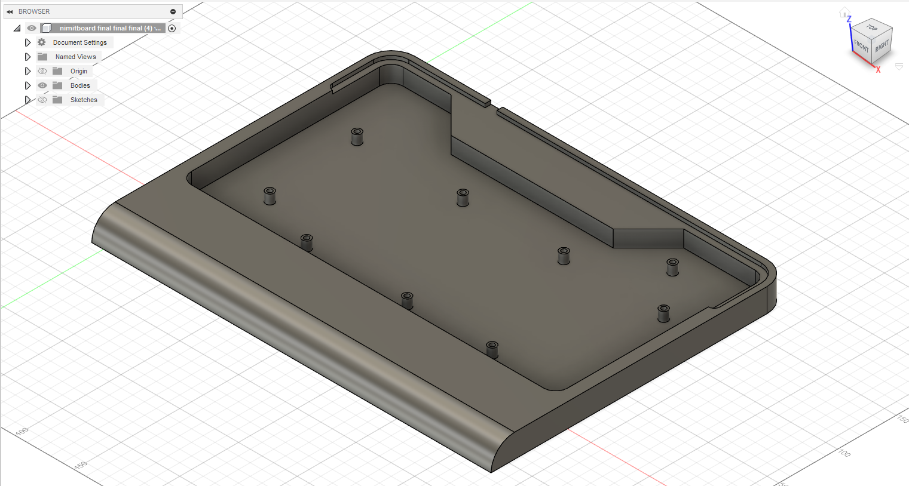
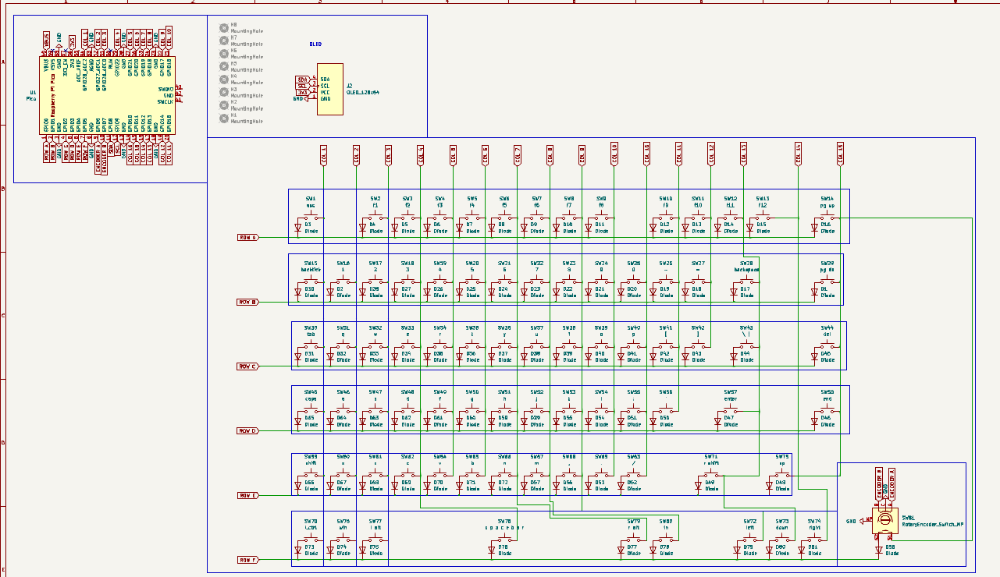
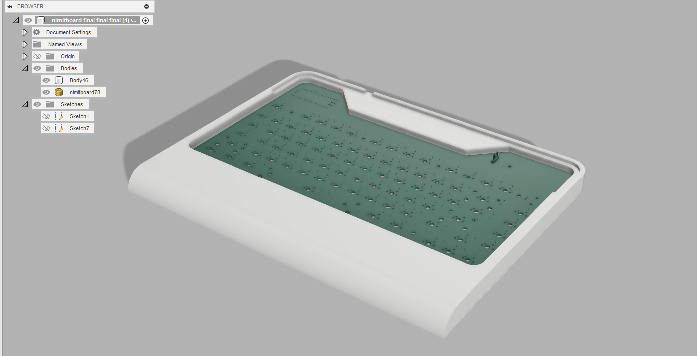

# nimitboard76 2025

# BOM:
- 80x Cherry MX switches
- 1x EC11 Encoder
- 1x PCB (White) [don't forget]
- 1x Acrylic cover (3mm) [optional but recommended to prevent dust]
- 81x Through-hole 1N4148 Diodes
- 80x Keycaps
    - 67x 1u
    - 5x 1.25u
    - 2x 1.5u
    - 2x 1.75u
    - 1x 2u
    - 2x 2.25u
    - 1x 6.25u
- 1x SSD1306 (0.96")
- Raspberry Pi Pico (or compatible RP2040 board)
- 1x Case (White)
- 1x Knob for encoder (optional)

# About:
A cool keyboard that follows the 75% ANSI layout, with a knob, an LCD and a rotary encoder. Built for design and vibes rather than functionality. Also want to make it run with QMK + VIAL and KMK in the fututre. Might add underglow but i can do that whenever tbh.

# Images:

- PCB

- Case and Plate

- Schematic

- All together!
