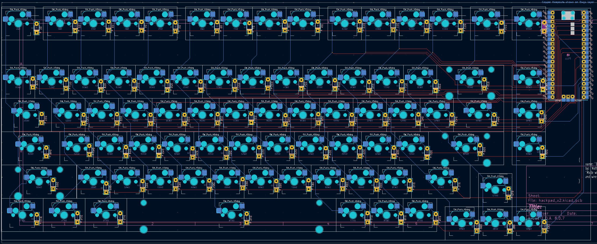

# NormalPad

## What is this?
This is a 75% keyboard inspired by the [Keychron Q1 Custom Keyboard](https://www.keychron.com/products/keychron-q1?srsltid=AfmBOorYcrgbMnQshTxcVkn31a3YPq6My79lAXlqjA35xHALWIpRg0Ld). It consists of 82 keys, hot-swappable switches a 3D printable case, and stabilizers. The bottom half is split in half to make it easier to sand

## Quick overview of repo
+ cad
    1. full_keyboard.stl
+ firmware
    1. normalPad.ino
+ pcb
    1. hackpad_v2.kicad_pcb
    2. hackpad_v2.kicad_prl
    3. hackpad_v2.kicad_pro
    4. hackpad_v2.kicad_sch
+ production
    + cad(stl)
        1. plate.stl
        2. upper_ex.stl
        3. bottom_left.stl
        4. bottom_right.stl
    1. normalPad.ino
+ src
    1. angle_bottom.png
    2. assembled_bottom.png
    3. bottom.png
    4. diagram.png
    5. pcb.png
    6. plate.png
    7. schem.png
    8. side_short.png
    9. side_long.png
    10. together.png
    11. top_plate.png
+ gerbers-zip.zip
+ README.md

## Why did I make this
I primarily made this for [HackPad v2](https://hackpad.hackclub.com/keyboard). However, during the process of making this, I learned more about the different types of switches, stabilizers, splitting up CAD designs into multiple parts, and all the parts of the keyboard. I learned a little bit more about the [Arduino Keyboard library](https://docs.arduino.cc/language-reference/en/functions/usb/Keyboard/), how to write relatively efficient code, and organize my pcb schematic and pcb in a larger scale than what I previously learned. 

## Pictures of my design:
### Schematic:
<b>My diagram, which depicts the row and column numbers</b>

<b>The schematic for the pcb, relatively organized in the order wanted</b>

### PCB
<b>My PCB</b>

### CAD Case(Disassembled)
From top to bottom 

<b>Top plate</b>

<b>Plate</b>

<b>Bottom<b>

### CAD case(relatively assembled)
<b>Two parts of bottom at an angle</b>

<b>Assembled case</b>

<b>Side analysis of case</b>

## Bill of Materials
See a more detailed BOM [here](https://docs.google.com/spreadsheets/d/11py9m45HcEIvmmcL5O4CRJL01YyzMnKtKQUrW-6ih8o/edit?gid=0#gid=0)

|mfg name|	Description|	        Price|	        shipping|	total|	    type|	grant$$|
| --- |     --- |                   --- |           --- |       --- |       --- | --- |
| AMAZON|	keycap|	                12.99|	        0|	        12.99|	    keycap|	25|
|AMAZON|	keyswitch(90)|	        52.99|		    0|          52.99|	    keyswitch|	41|
|AMAZON|	hot swap, diode(100)|	12.5*90%+4.74|	0|	        14.74|	    misc|	15|
|AMAZON|	stabilizer|         	19.99|		    0|          19.99|	    stabilizer|	20|
|ALIEXPRESS|bolts(2M*8mm*50)|   	1.76|		    0|          1.76|	    fastener|	15|
|LCPCB|	    pcb|                    20.9|	        15.23|	    36.13|		pcb|        #NaN
|CAD case(bottom left and right can be printed anywhere, but the upper plate and plate are around 330*120mm)|
| 1 Orpheus Pico |
*PRICES IN USD									
