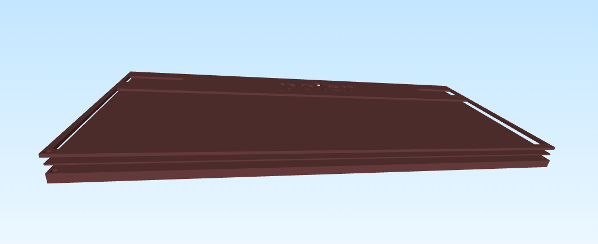
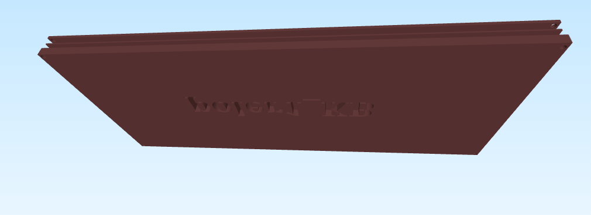
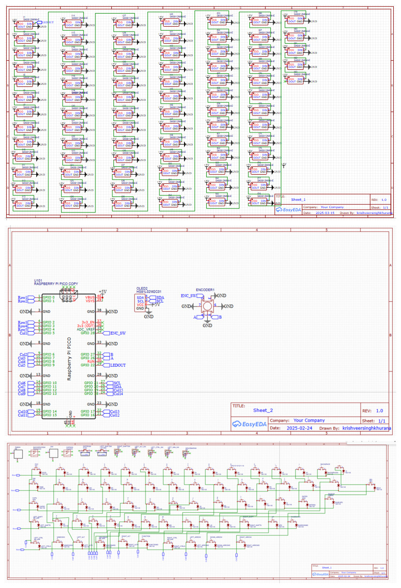
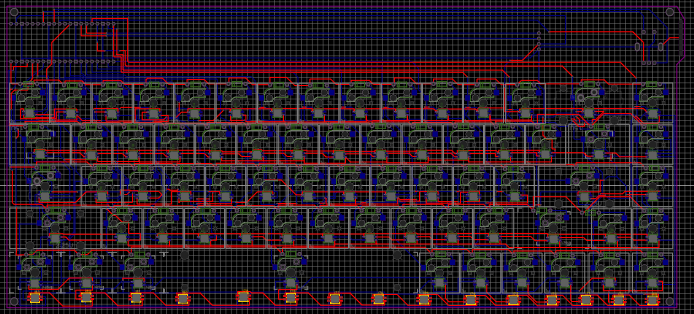
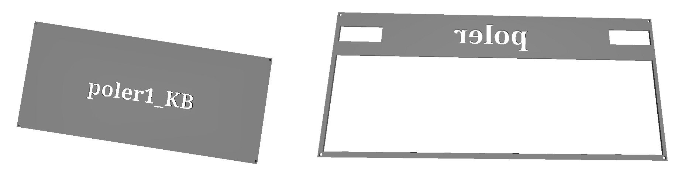

# poler1_KB

- This is a keyboard totally built from scratch and has anti ghosting 68 switches with a bunch of RGB and a display controlled by a knob.

---

## Inspiration

My inspiration for this keyboard is the wooting keyboard but due to my amateur routing techniques i had to come up with a slightly bigger keyboard than the original wooting keyboard but in return I added a display and a knob to show animations and probably change animations shown on the display.

## Challenges

I have no clue how I have managed to build the case for it. It was extremely challenging because I dont have the physical board to measure. I managed to build a really simple design which protects the base of PCB and also avoid the damage incase of a drop lol.

## Specifications

### BOM

1. PCB in black color
2. Orpheus Pico
3. 68 Gateron Jupiter Red Switches
4. 68 Keycaps
5. 83 SK6812 MINI-E LEDs
6. 4 M3x16mm screws
7. 4 M3 hex nuts
8. 68 Through-hole 1N4148 Diodes
9. 68 Kailh Hotswap Sockets
10. Stabilizers for Keys
11. 0.91 inch OLED display
12. EC11 Rotary encoder
13. 4 M3 spacers

Estimated Total for parts(excluding PCB) is roughly around 75$

### Others

- PCB Color: Black
- KMK Firmware
- Base.stl

### Top View

### Bottom View

|                Schematic                 |           PCB            |                Case                |
| :--------------------------------------: | :----------------------: | :--------------------------------: |
|  |  |  |
