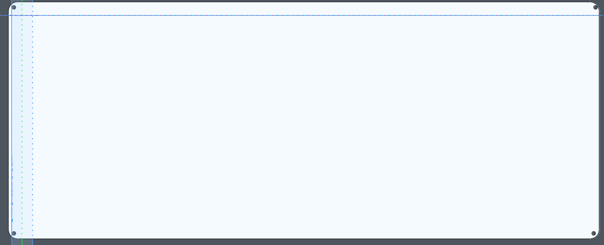
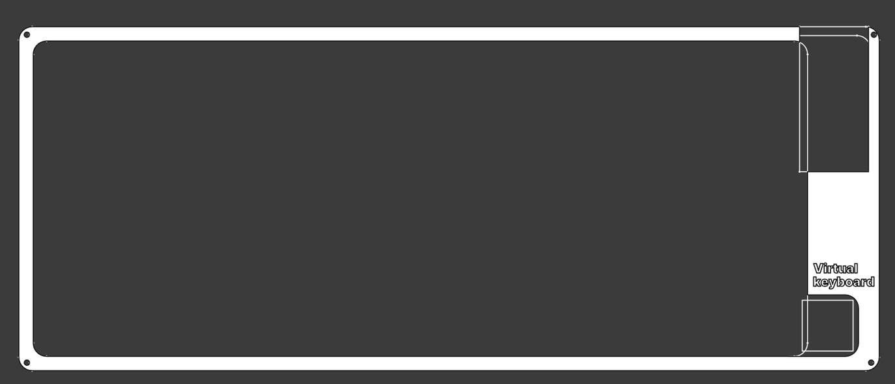

# virtual_keyboard


Uses kmk for the firmware, maybe in the future I will switch to Rust.

The goal of this keyboard is to be one that I like, not one with a bunch
of fancy features. It's as minimal as I like it to be, 65% keyboards seem
good, but I still need F keys because for some games it better to have them.

For the arrow keys, I don't think it's that bad not having them thanks to
WASD keys.

## Schematic


## PCB


## Case





The case is supposed to stick together using screws, not sure if they will fit.\
I think I'll use some tape or a wire to hold it together if it doesn't fit.

## Bill of Materials

### Electronics

|QTY|Name|Part number|
|---|----|-----------|
|1|Orpheus PICO|
|81|Diodes|1N4148WL|
|81|Kailh Hotswap Sockets|

### Keyboard components

|QTY|Name|
|---|----|
|1|Bottom case|
|1|Top case|
|4|2mm (Self-drilling?) Screws|
|81|DSA keycaps|
|81|Cherry MX Switches|
|1|6u Stabilizer|
|2|2u Stabilizers|

## Keyboard Layout (KLE raw data)

ISO layout


```
["Esc","F1","F2","F3","F4","F5","F6","F7","F8","F9","F10","F11","F12","Print screen","Delete"],
["#\n@","1\nà","2\né","3\nè","4\nê","5\n(","6\n)","7\n‘","8\n’","9\n«","0\n»","\"\n'","¨\n^",{w:2},"Backspace"],
[{w:1.5},"Tab","A","Z\n£","E\n€","R","T\n{","Y\n}","U","I","O","P","–\n-","±\n+",{x:0.25,w:1.25,h:2,w2:1.5,h2:1,x2:-0.25},"Enter"],
[{w:1.75},"Caps Lock","Q","S","D\n$","F","G","H","J","K","L","M","\\\n/","½\n*"],
[{w:1.25},"Shift",">\n<","W","X","C","V","B","N","?\n.","!\n,","…\n:","=\n;",{w:1.75},"Shift","↑"],
["Ctrl","Fn","Super","Alt",{a:7,w:6},"","Alt Gr","Super","Ctrl","←","↓","→"]
```

## License

[Licensed under the MIT license](LICENSE.md)
