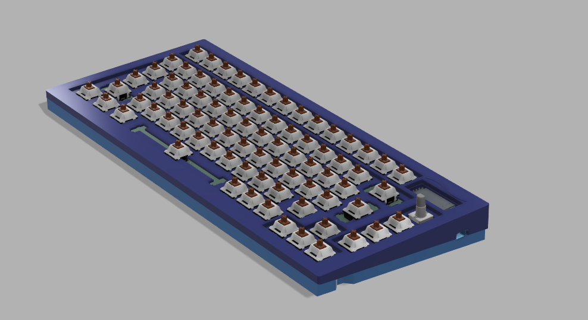
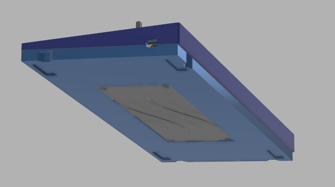
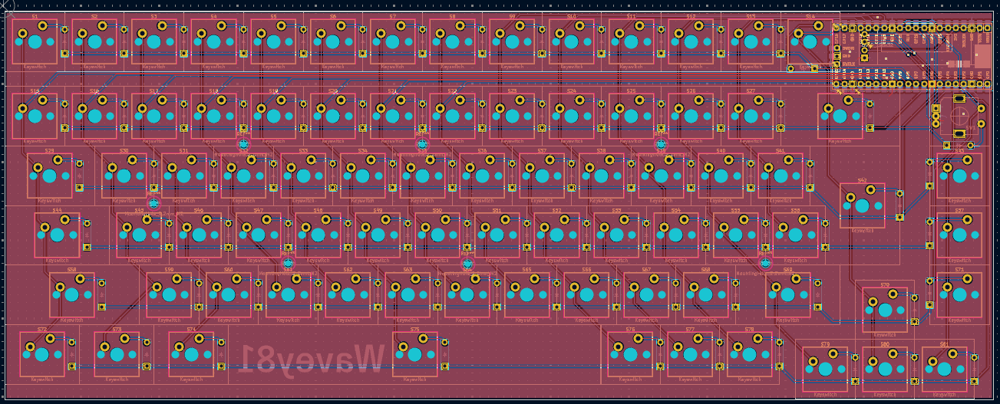
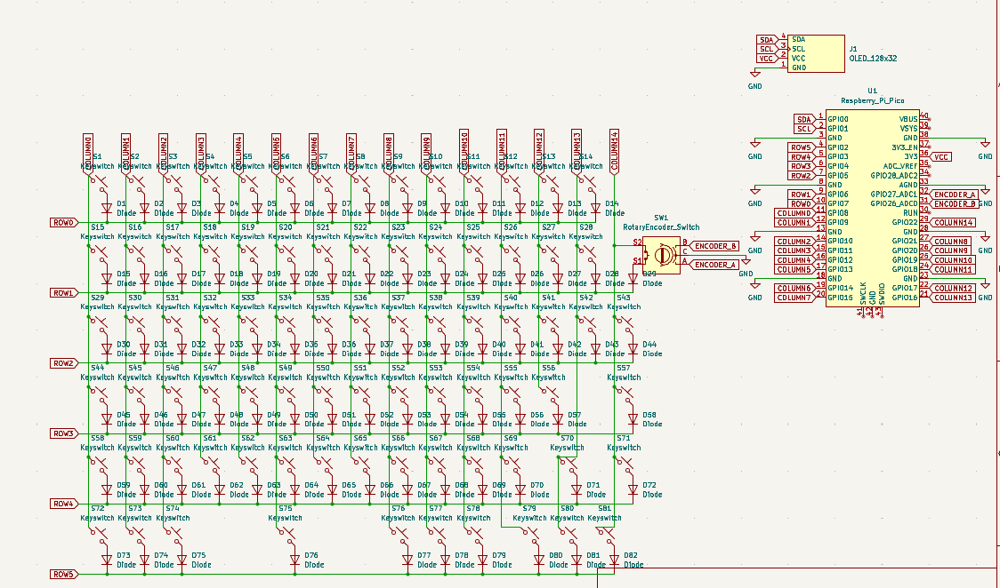

<h1> Wavey81 </h1>

81 key keyboard with an OLED screen & rotatory encoder

Before diving into this project, after finishing the macropad, I made sure to actually learn fusion360 to make a somewhat decent case. 
Something I really dislike about my macropad and that I will soon change is the case, bad as I barely understood fusion360 at the time.

The main theme of the keyboard is the sea / waves, and the keycaps set I will get will match the theme, together with the blue color it features.
This keyboard took me a while to make, specially considering the time spent learning fusion360 but I must say it was totally worth it, not only
can I now use these skills to design stuff I might need and print it but also because it is legit fun to use, and designing the case was
an enjoyable experience. Cant wait to debug and cry over the firmware

<h2> Images of the keyboard </h2>

