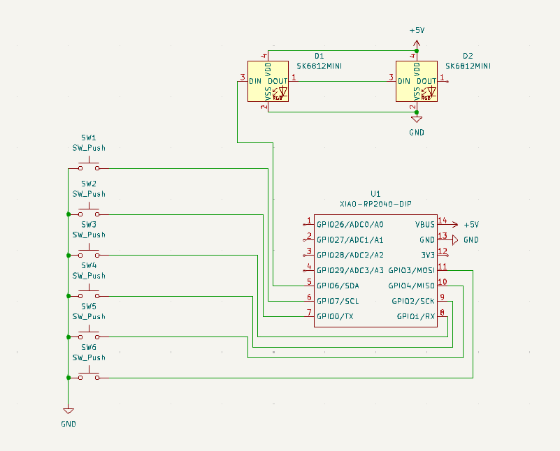
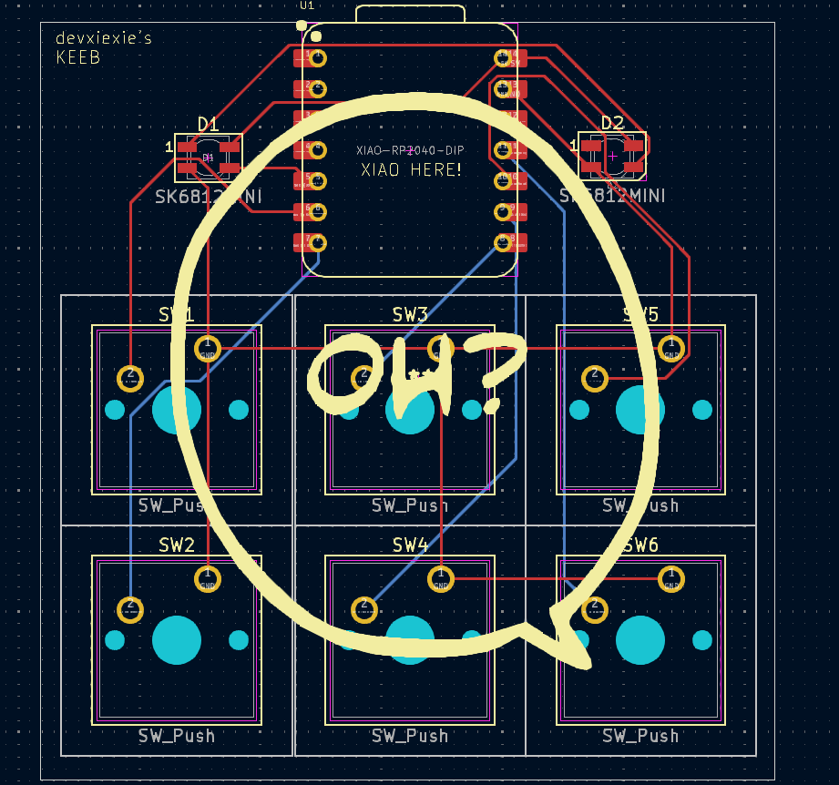
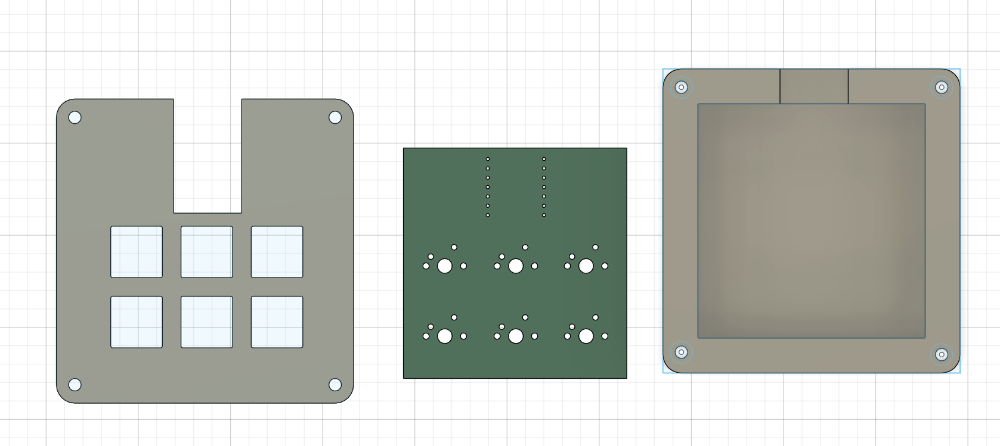
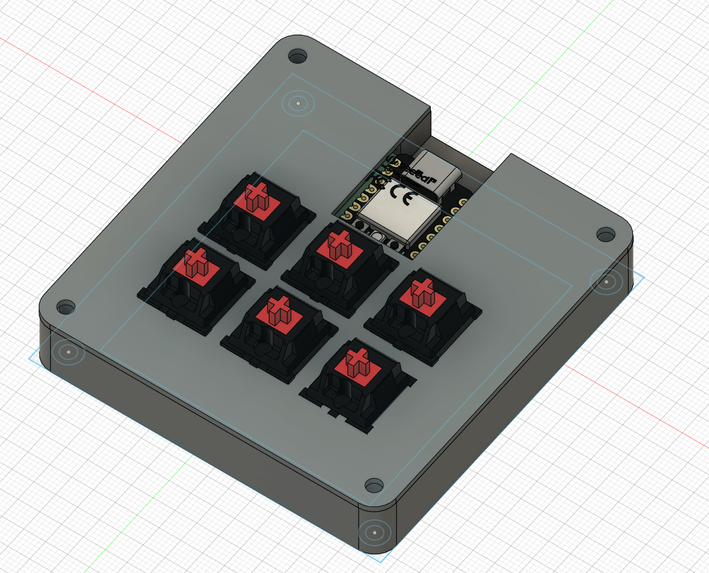

# 6keyKEEB

Tired of boring scrolling? Use the 6keyKEEB, with buttons for page up, page down, and all the arrow keys! how nice  
Inspiration: I like to read novels on websites or as pdfs, so I came up with the idea to make an all in one scroller.  
Challenges: Figuring out dimensions for the case was the toughest part personally, but I think I got it in the end!  

## BOM (Bill of Materials)

- 2 SK6812 MINI-E LED
- 6 Blank DSA black keycaps
- 4 M3x16mm screws
- 1 Seeed XIAO RP2040
- 6 MX-Style switches

## Images
  
  
  
  
