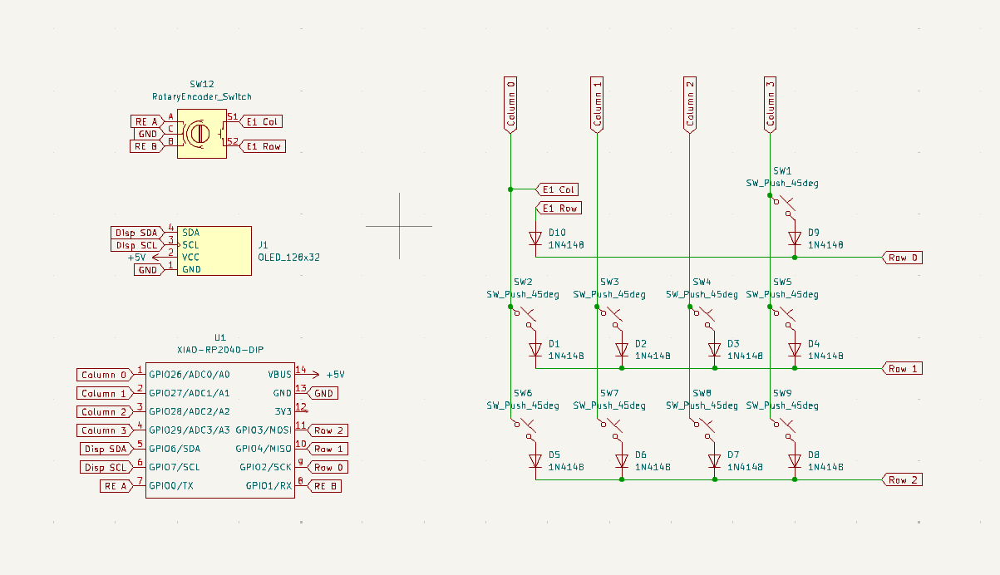
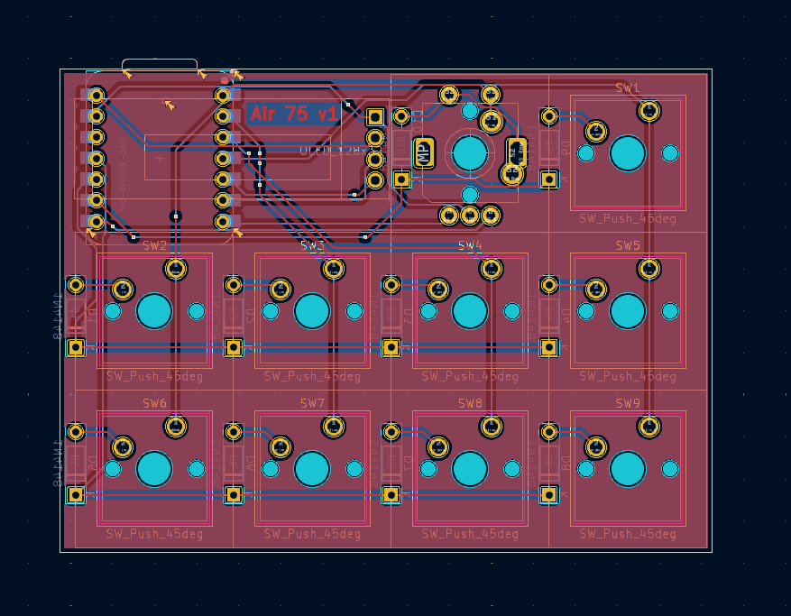
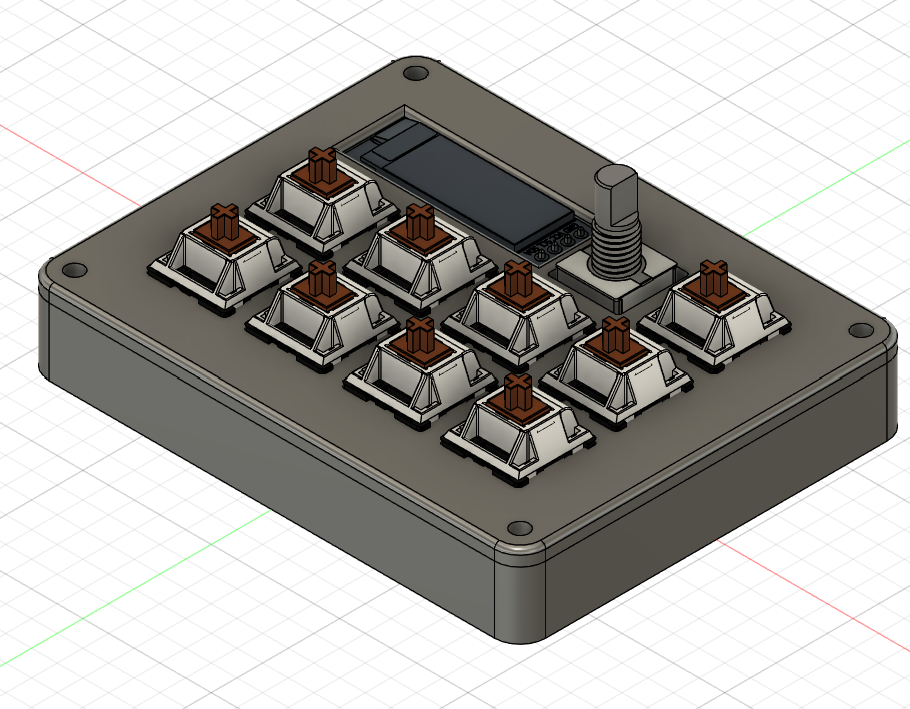

# Air 75 (mini)

A Macro Pad with rotary encoders and OLED display.

## Specifications

### BOM
- 9x Cherry MX Switches
- 9x Blank DSA Keycaps (1x Red, 4x White, 4x Black)
- 1x Rotary Encoder
- 1x 128x32 OLED Display
- 10x 1N4148 Diodes
- 1x XIAO RP2040
- 4x M3x16 Bolt

### Other Resources
- [PCB](PCB)
- [Images](images)

|             Schematic              |          PCB           |           Case           |
| :--------------------------------: | :--------------------: | :----------------------: |
|  |  |  |

## Author
- [Krish](https://github.com/ikrishagarwal)
