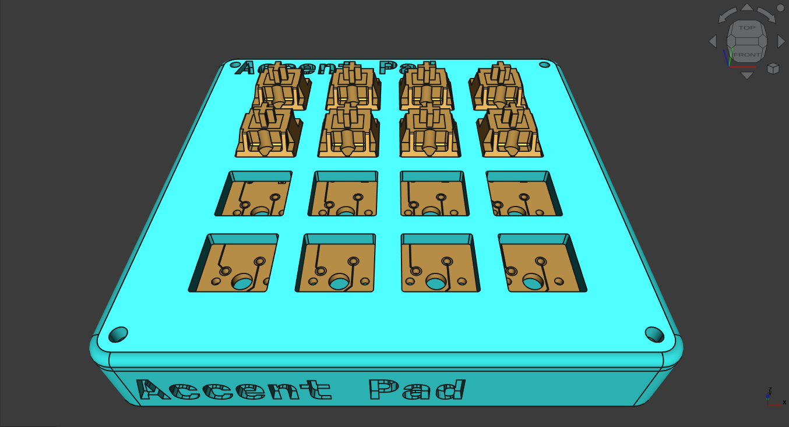
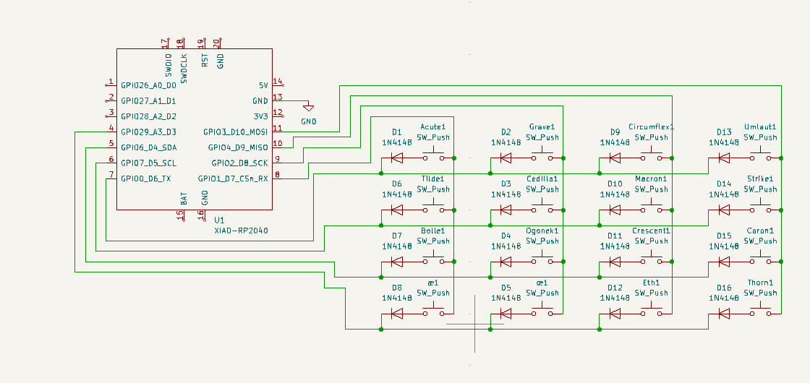
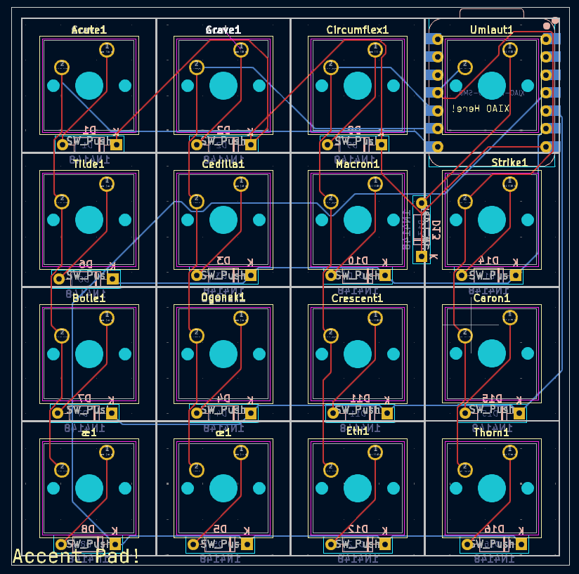
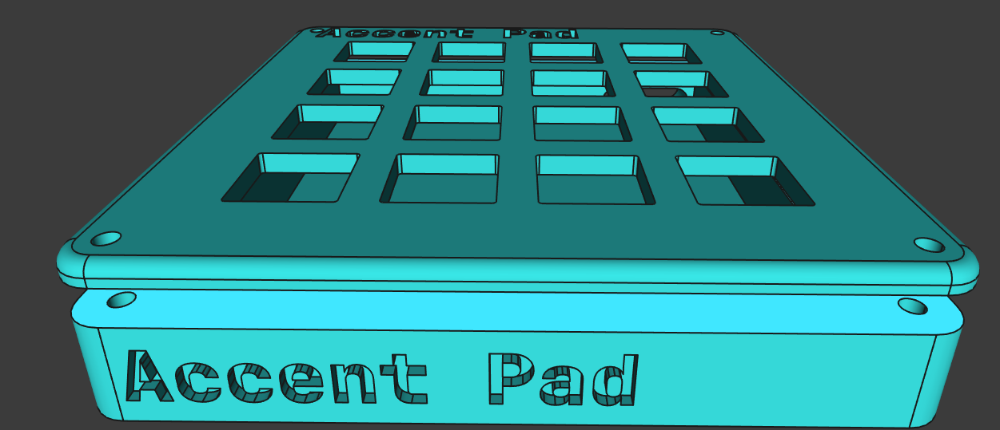

# AccentPad

*A 4x4 keypad that lets you type most common accents.*

Assembled:

* Keyboard Maintainer: [Hazel Viswanath](https://github.com/transdryad)
* Hardware Supported: *Accent Pad Board with Seeed Studio Xiao RP2040 Controller*

I was inspired to make the board because of the infuriating and fractured ways to characters with accents marks across different devices and OSes.
I almost gave up before discovering the US international keyboard and its keycodes.

The firmware was built with QMK, the PCBs with KiCad, and the case with FreeCAD.

**The OS keyboard layout must be set to US international. AltGr should be set to right alt.**

The main accents will work on any OS, but ā, å, ą, ă, and ǎ (substituting a) support may be spotty on other OSes than linux.

Layout:

       ┌───┬───┬───┬───┐
       │ á │ à │ â │ ä │
       ├───┼───┼───┼───┤
       │ ã │ ç │ ā │ ø │
       ├───┼───┼───┼───┤
       │ å │ ą │ ă │ ǎ │
       ├───┼───┼───┼───┤
       │ æ │ œ │ ð │ þ │
       └───┴───┴───┴───┘

Schematic:

PCB:

Case:

## BOM:
 - 16x Cherry MX switches
 - 1x PCB
 - 16x Through-hole 1N4148 Diodes
 - 1x Seeed Studio Xiao RP2040 Thru-hole for single MCU
