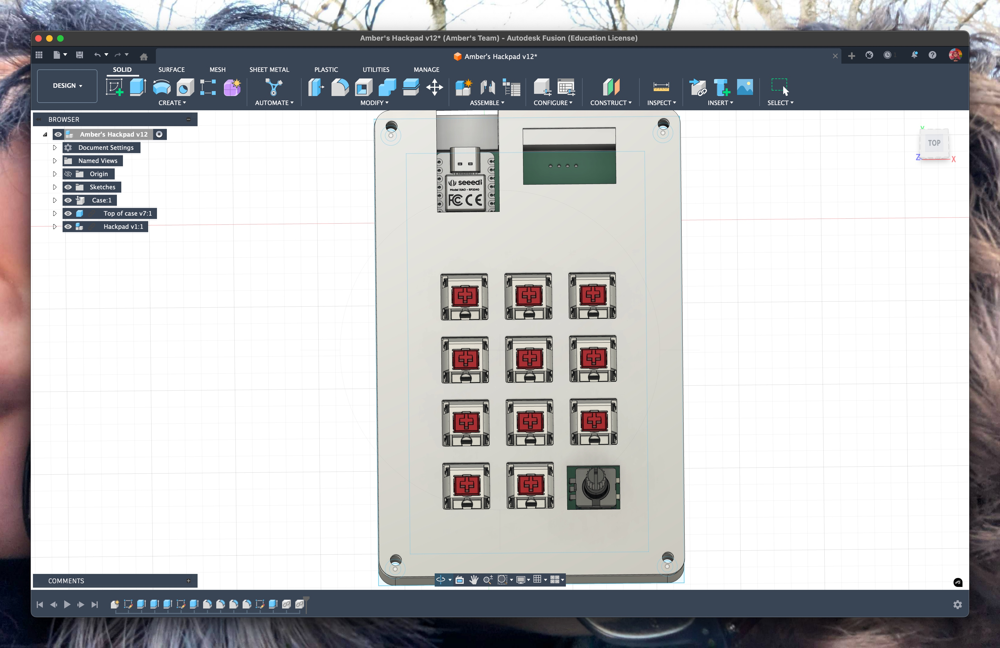

# Amber’s Hackpad

Unfortunately, I’ve not been able to come up with a fancy name for it :(

My hackpad is quite generic - it has 11 switches, 3 neopixels, a rotary encoder and a 128x64px OLED display. The idea is that different keys will be hooked up to quickly do different tasks such as running scripts or restarting services, and will execute different functions when clicked. The OLED will randomly switch between showing stats for my self-hosted stuff, stats for HC stuff or maybe fun art.

## Features

- Acrylic case
- 128x64 OLED display
- EC11 rotary encoder
- 3 WS2812B RGB LEDs
- 11 keys

## CAD Model:

Screws together using 4 M3 screws. Comes in two pieces - base and the top. The model was made in Fusion360.

## PCB

The PCB was made in KiCad!

### Schematic

The schematic was me figuring stuff out as I went along - part of it from my unused Hackpad v1 submission, part from the advanced guide and part from the inter webs.

### PCB

I borrowed some of Max’s Heidi & Orpheus art for the PCB as well as adding a Hack Club flag and my pfp, to make it more personal. Keys are MX_V2!

## Firmware

The firmware isn’t finished yet! I started it and I think the rotary encoder and some keys would work, but I want to make this when I get the hardware. 

## BOM

To make this hackpad you’ll need

- 11x Cherry MX Switches
- 11x DSA Keycaps
- 4x M3x16 screws
- 4x M3 hex nuts
- 1x EC11 Rotary Encoder
- 1x 0.96” 128x64 OLED display
- 3x SK6812 Mini-E LEDs
- 1x XIAO RP2040
- 1x case
