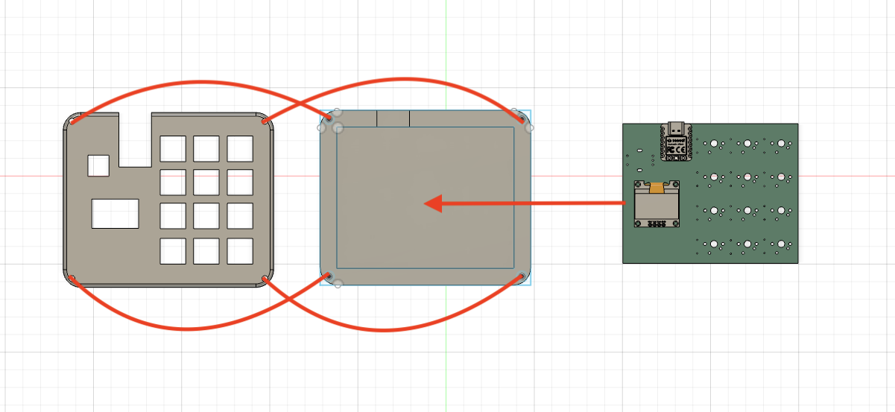

# overall of the Hack Pad

# Hack Pad case

# Hack Pad schematics

# Hck Pad PCB

# BOM

Seeed XIAO RP2040 (1)

Through-hole 1N4148 Diodes(12)

MX-Style switches(12)

EC11 Rotary encoders(1)

0.91 inch OLED displays(1)

Blank DSA keycaps(4,red)(8,white)

M3x16mm screws(4)

M3 hex nuts(4)

resistor (2)(4.7kΩ.)
