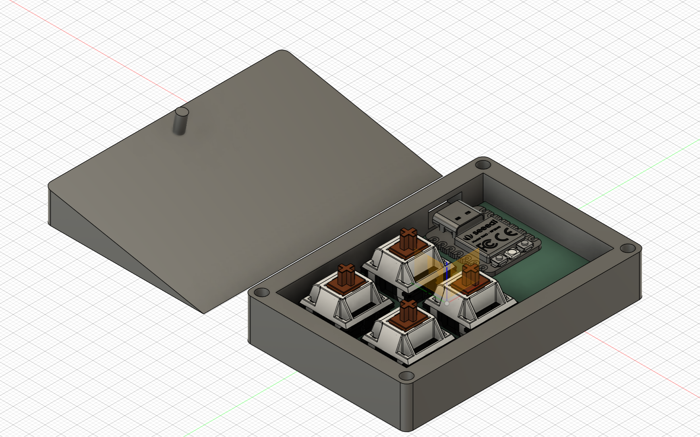
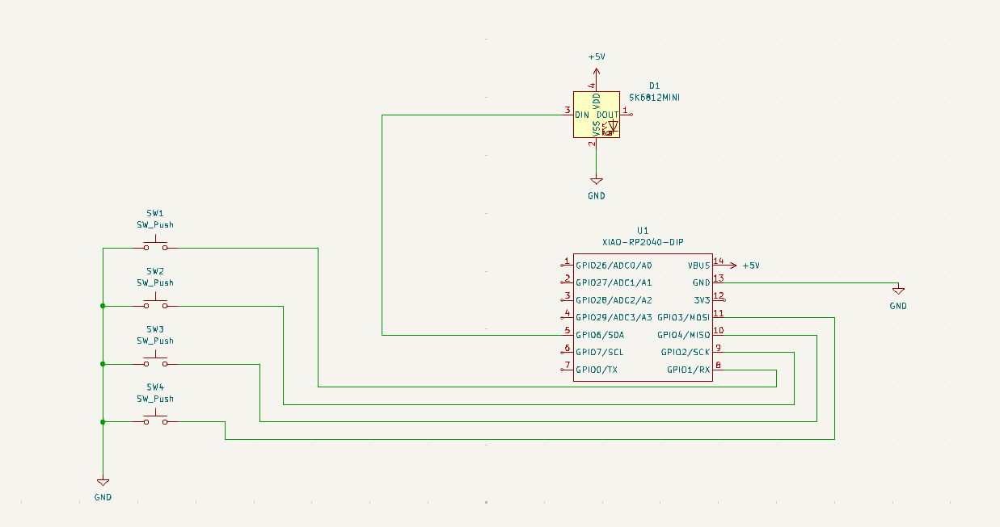
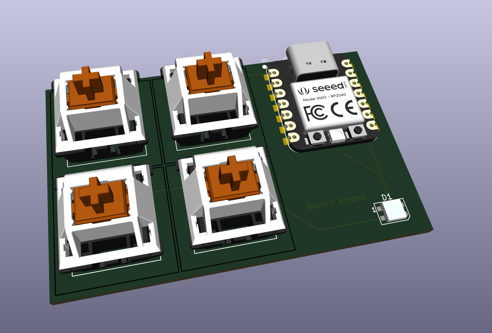

# Barni Hackpad

Introducing the Barni Hackpad, a sleek and innovative macropad designed with a unique, see-through honeycomb pattern. This compact device features 4 customizable keys and an LED indicator, making it an essential tool for any tech enthusiast. Whether you're a programmer, gamer, or simply someone who loves efficiency, the Barni Hackpad is perfect for you. I will be using it to assign hotkeys for opening various programs, streamlining my workflow and enhancing productivity.

## BOM (Bill of Materials)

- 1 SK6812 MINI-E LED
- 4 Blank DSA white keycaps
- 5 M3x16mm screws
- 1 Seeed XIAO RP2040
- 4 MX-Style switches

## Images of the makropad
  
  
  
