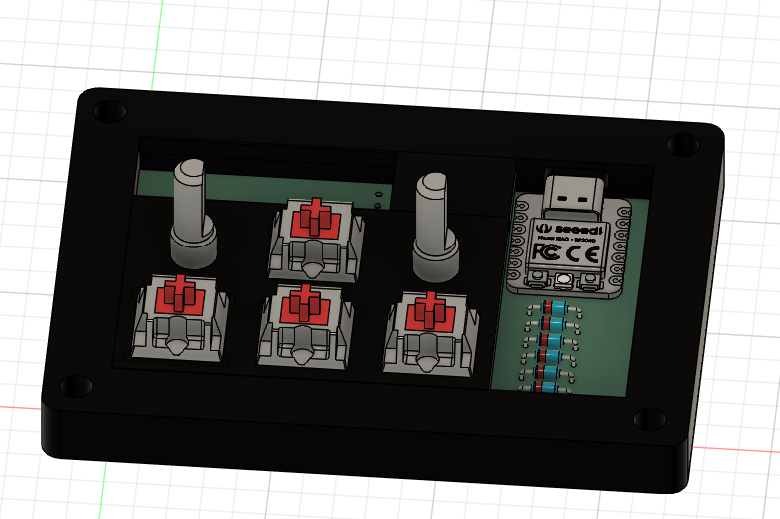

# BeliçBoard

### Inspiration
I wanted to have a macropad that allows me to do anything quickly (like changing microphone volume), while this is not really possible with the current version I plan to add a lot of things to the firmware once I recieve my hackpad.
I would also like to make some small games in it for when tings are loading :D

### Challenges
I struggled a lot with fusion as it was my first time using it, Kicad went pretty smooth.

My very cool macropad thing!
I have some plans to make it more functional but I want to get it first for debugging and stuff.

### Specifications

BOM: 
- 4x Cherry MX switches
- 2x EC11 Encoder
- 1x XIAO RP2040
- 6x Through-hole 1N4148 Diodes
- 1x OLED display (0.91 inch, 4 pin, ssd1306)
- 4x Black Blank DSA Keycaps

Others:
- QMK Firmware
- Body.stl 
- Top.stl

Schematic            |  PCB         |   Case
:-------------------------:|:-------------------------:|:-------------------------:|
  |    |  
