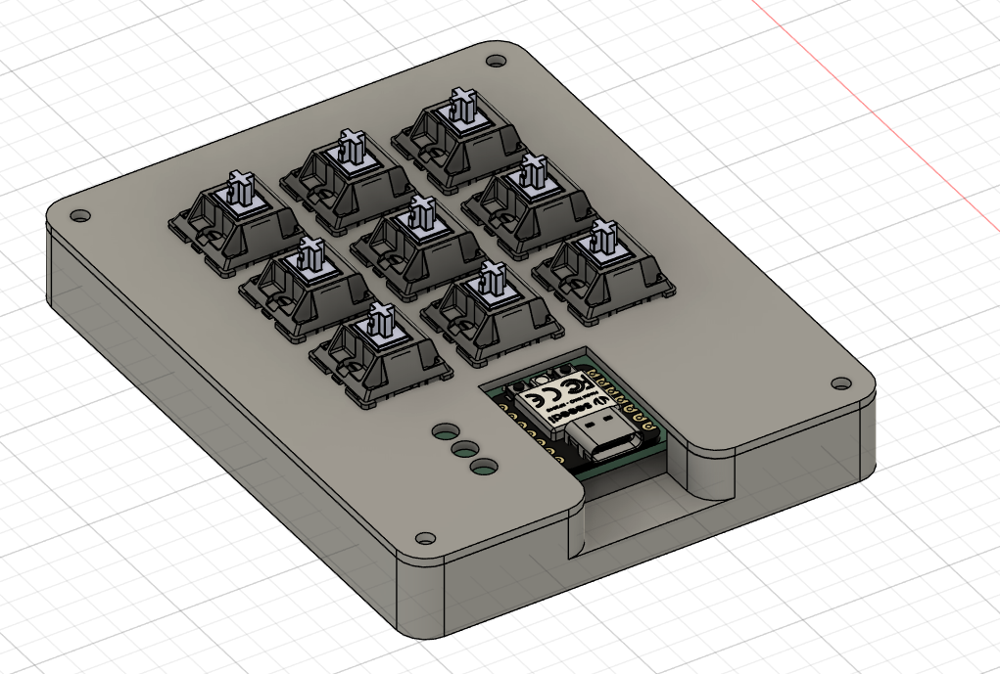
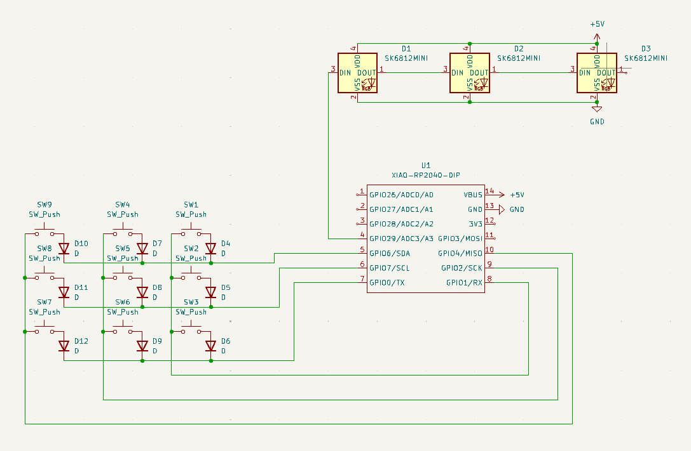
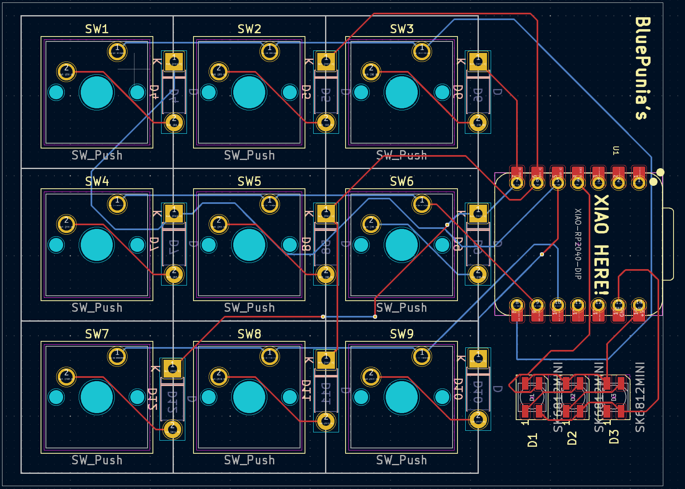
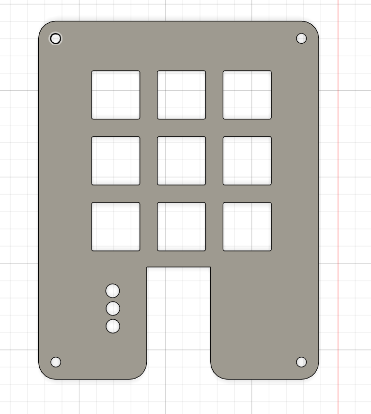
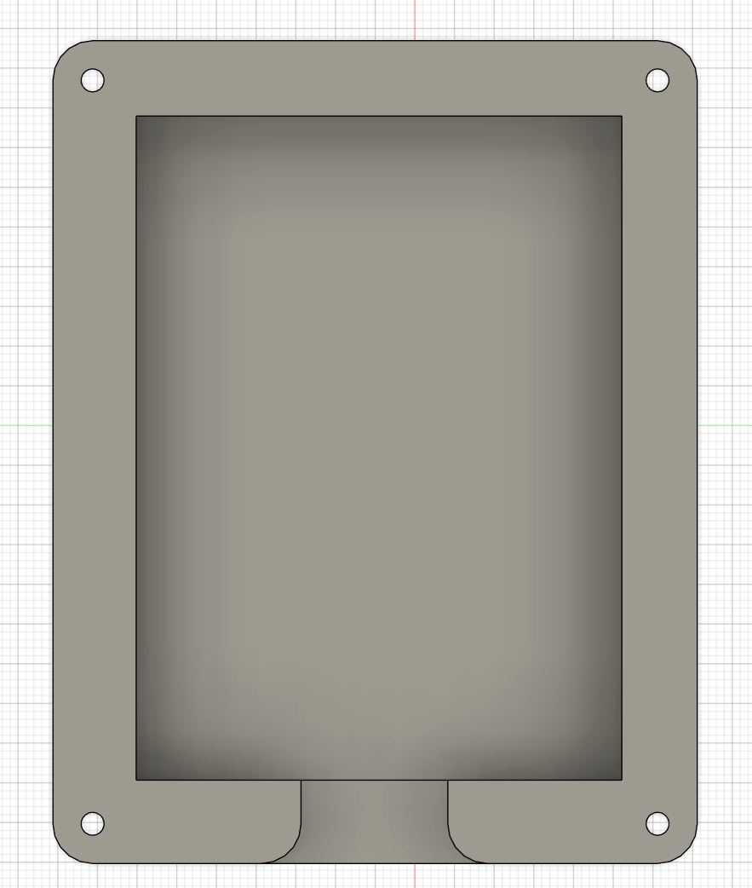

# BluePunia's hackpad 
## INSPIRATION
I wanted to create something PCB-related for the first time in my life - wanted to learn something new. 

I created a rather simple design, yet it was challenging for me cause I've never used KiCad or Fusion 360 before. 

## Design:
My hackpad uses 9 switches and 3 RGB diodes, it's simple but also very useful for programmers or streamers.

## Schematic:

## PCB:

## Case:

(It's branded on the very bottom)

## BOM:
9x Cherry MX Switches

9x DSA keycaps (white if possible)

4x M3x16mm bolts 

3x 1N4148 diodes

1x XIAO RP2040

1x case (2 printed parts)

1x custom PCB

## Firmware 

The macropad is designed to have 3 layers, so basically instead of 9 binds I have 27. The user knows on which layer he is by looking at the RGB diodes, each one of them turned on tells the user on which layer he's on.

## Others:
It was an amazing journey making this hackpad, fortunately my friends helped me a bit. 
(I couldn't import the 3d model of the 1N4148 diode into the 3D view of the entire hackpad, Sorry :33)

