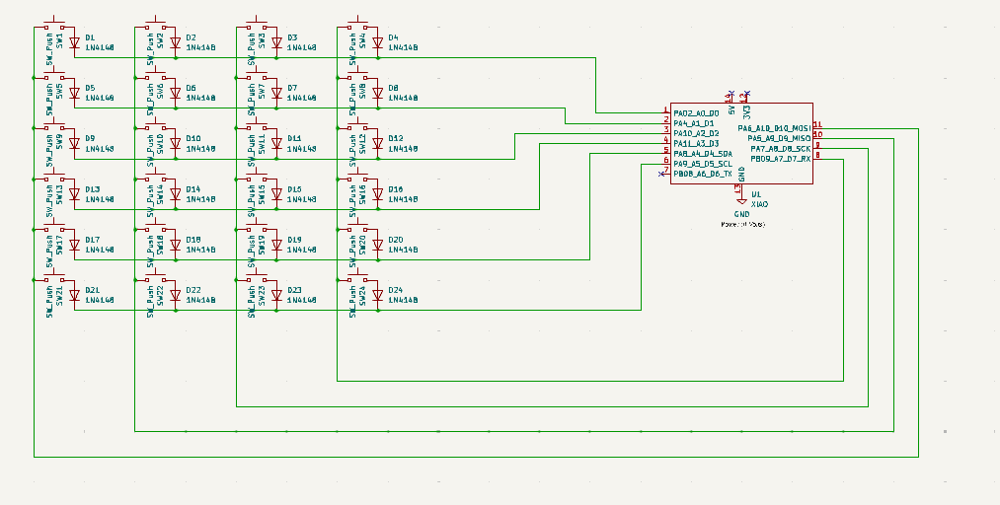
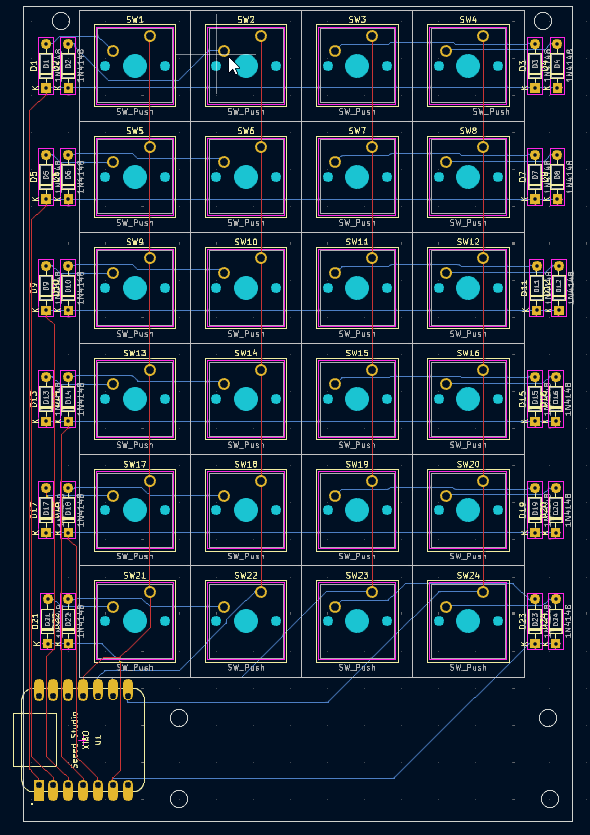
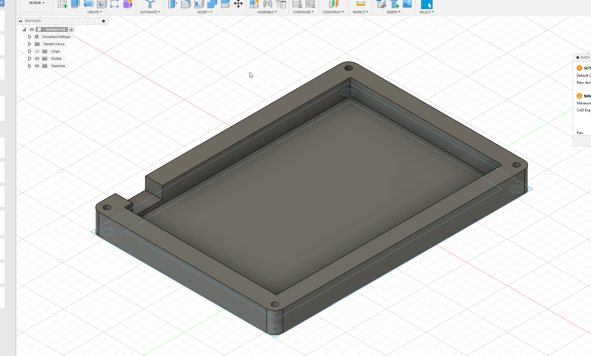

# Boos Button Pad V1
## Introduction:
When I am typing, coding or doing whatever I love not using my mouse. And I really did not want to mess up my keyboard with custom software. But if I make an extension to my keyboard that goes to the left side of it, I thought I could speed up my production. Hence the Boo Button Pad!
## Challanges:
I have never made stuff like this before uh, ever. It was all new to me with eveyrbint form the pcb design to the case. And the whole whole I was sick! Get a load of that! But I was able to overcome these challenges by asking the HackClub community and my friends for support.
## BOM (Bill of Materials)
- 24 Blank DSA white keycaps
- 24 M3x16mm screws
- 1 Seeed XIAO RP2040
- 24 MX-Style switches
## Images of the makropad

