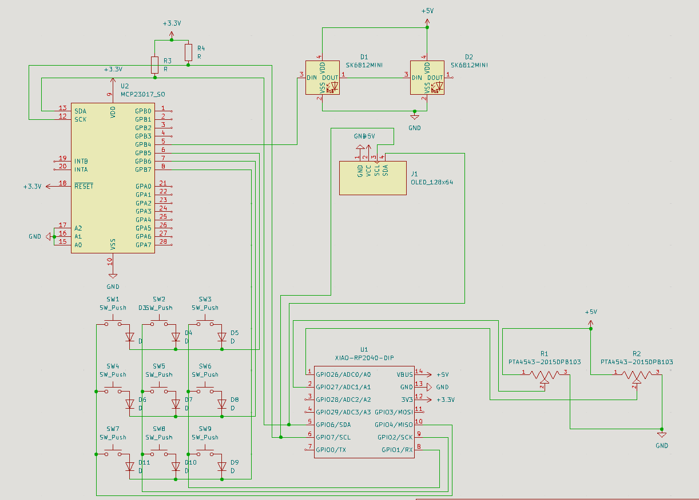
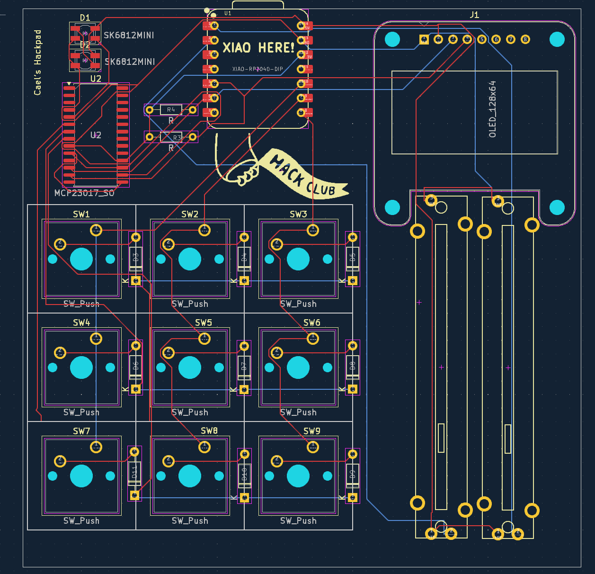
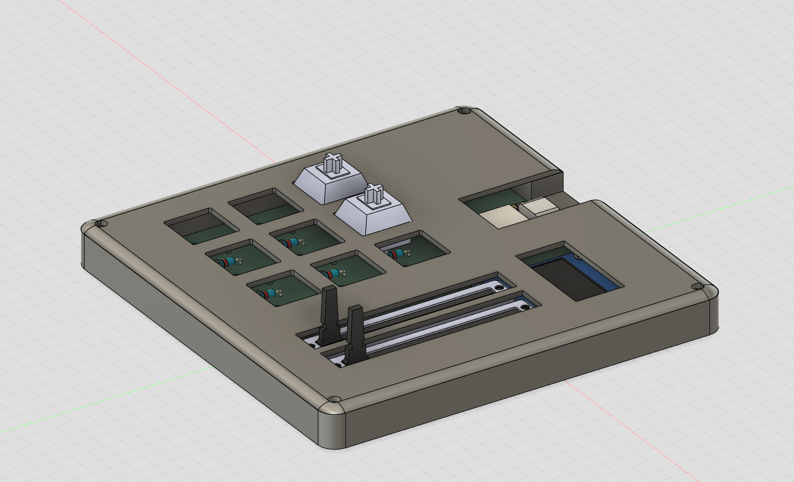

# Cael's HackPad!

## Features:
- Small OLED for variable text & info
- 9 keys for shortcuts or a mini WASD setup
- two sliders for adjusting spotify volume and mic volume

## PCB
Schematic            |  PCB                      | Case
:-------------------------:|:-------------------------:|:-------------------------:
  |    |  

This was my first time ever designing a PCB so it was fun to experiment around and figure out how stuff works!

I've modeled before, but this was my first time using Fusion 360 so its not as pretty as I would have liked, but that's always space for improvement, can I can redesign and print a new case at home

## Firmware overview
The goal of the firmware was to make sure that the keys are all working as intended and that the board can post info to the OLED screen correctly, and the sliders are reporting correct values.
It's def not perfect and i'll need to fool around with it in the future to get it to work 100%, but its a starting point that should at least help me test the setup!

## BOM for each board
- 9x Chery MX Switches
- 1x Seeed XIAO RP2040
- 2x SK6812 MINI Leds
- 9x blank keycaps (white, if possible)
- 9x 1N4148 diodes
- 1x SSD1306 I2C 128x64 OLED Screen
- 4x M3x16 screws
- 4x M3 Heatset
- 2x 4.7kΩ resistors
- CAD/HackPad 98x98 BOTTOM.step 
- CAD/HackPad 98x98 TOP.step

Stuff not on the approved list:
- 1x PCB (~$2 for 5 on jclpcb, with 5 being the minimum quantity plus $1.5 for shipping) ~= $3.5
- 2x [Bourns Sliders (PTA4543-2015DPB103)](https://www.snapeda.com/parts/PTA4543-2015DPB103/Bourns/view-part/)  - ~$2.40/each (no minimum) but $8 shipping
- 1x I/O expander [MCP23017_SO](https://ww1.microchip.com/downloads/aemDocuments/documents/APID/ProductDocuments/DataSheets/MCP23017-Data-Sheet-DS20001952.pdf) - $1.90/each (would be shipped with sliders, saving a bit)

This is about $25 total, but I can split the difference by paying with my own money for the portion the grant doesn't cover.