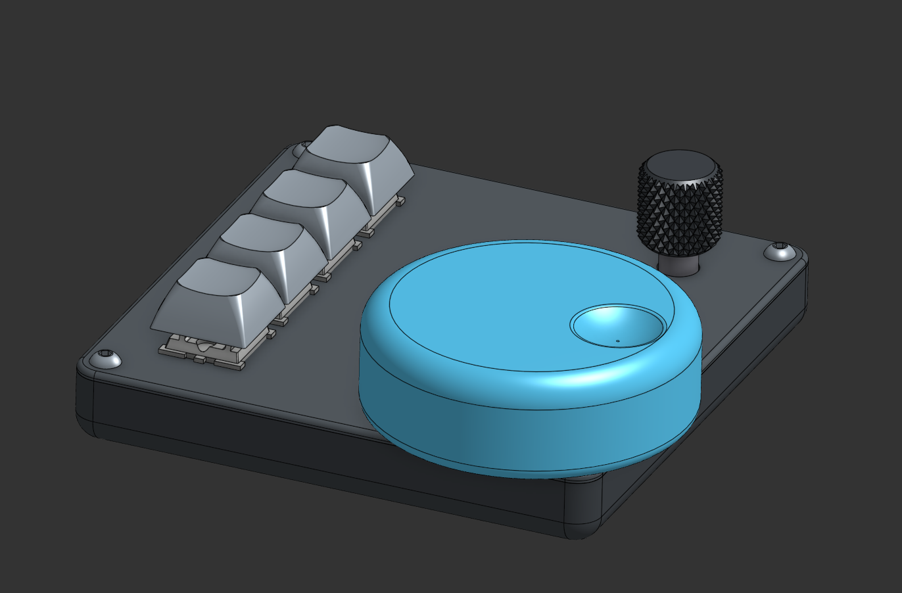
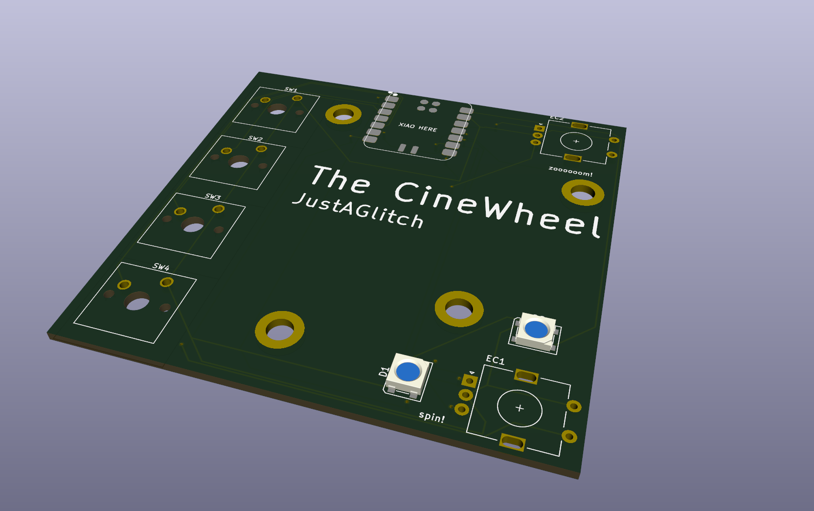
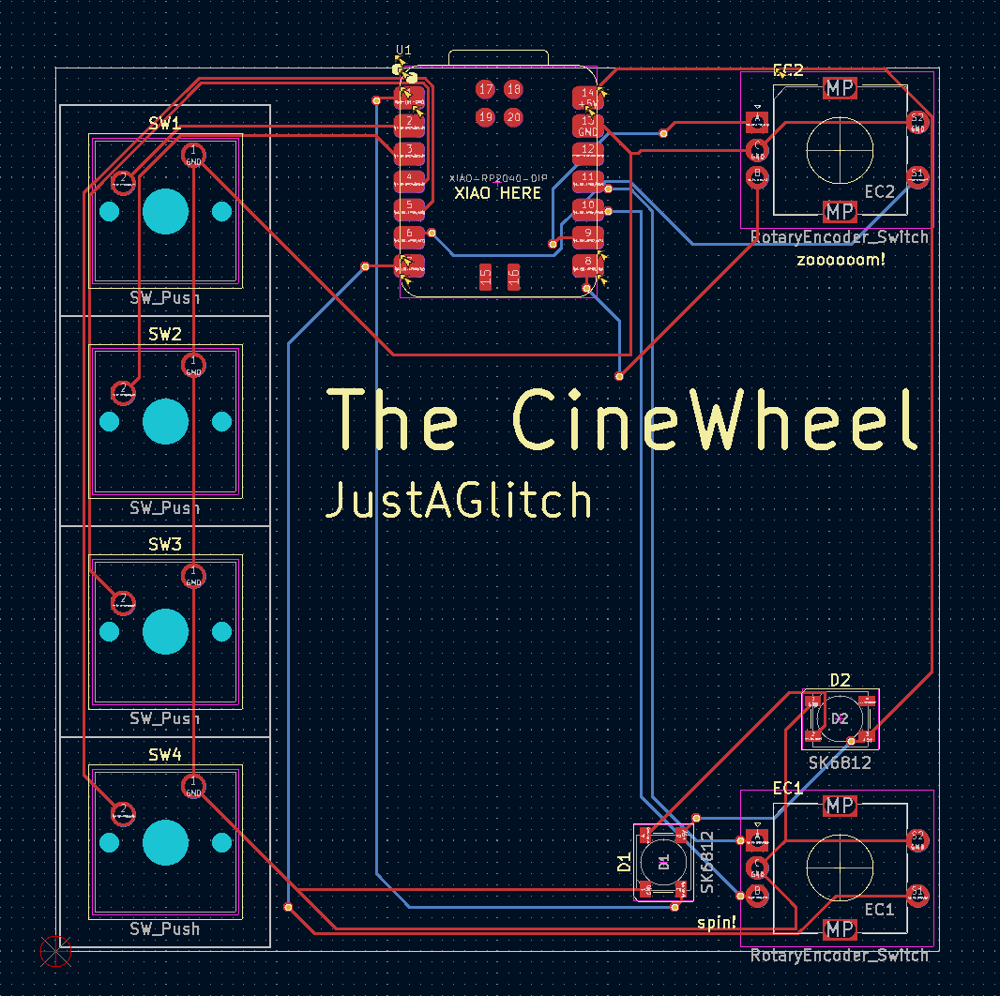
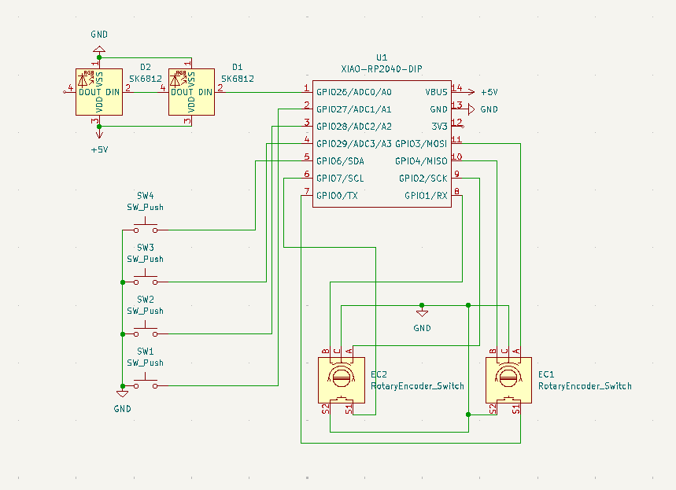

Late submission as approved by Alex

The CineWheel
-

This is my first time designing a pcb or a hid device in general. It is primarily for video editing, with a large wheel to jog through the timeline quickly, buttons for commonly used hotkeys, and a small wheel for zooming in and out on the timeline. Inspired by @ZackFreedman 's [Big Wheel](https://github.com/ZackFreedman/Big-Wheel) controller.

BOM:
* The PCB
* 4x Cherry MX style switches (preferably clicky but idk whatever works)
* 2x EC11 Rotary encoders with push-button switch
* 2x SK6812 LEDs
* 1x Seed XIAO rp2040
* 4x DSA keycaps
* 1x case bottom
* 1x plate
* 1x big knob 
* 1x small ec11 knob (if you have them, if not I can find one and print)

Pictures
- 
 

