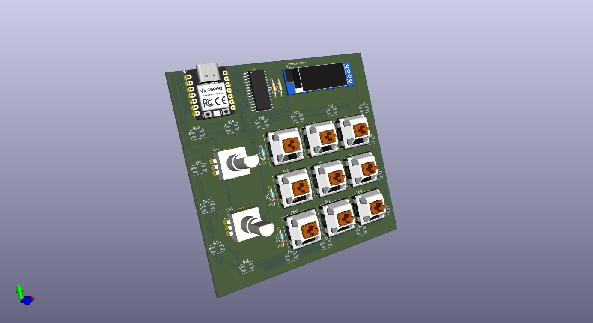

# ControlBoard

A 2 knob, 9 switch macropad with a 128x32 OLED.
All powered by a Seeed XIAO RP2040 along with a MCP23017. 

## Why
It would help me when I don't have my mouse with me, can be used with my laptop to control volume, brightness, etc. The possibilities are endless!

## BOM:
- 9x Cherry MX Switches
- 2x EC11 Encoder WITH button
- 1x 0.91in 128x32px OLED (SSD1306)
- 1x MCP23017
- 1x PCB
- 4x M3x20mm screws
- 1x Bottom case (3D Printed)
- 1x Top plate (3D Printed)
- 1x Encoder knob (3D Printed)
- 1x Switch plate (Laser-cut acrylic)
- 1x Through-hole 4.7k resistor
- 1x Seeed XIAO RP2040

## Challenges:
I am new to PCB design and 3D design, so i had to learn a lot of things, the guides really game in handy.

Schematic            |  PCB         |   Case
:-------------------------:|:-------------------------:|:-------------------------:|
 |  | 

