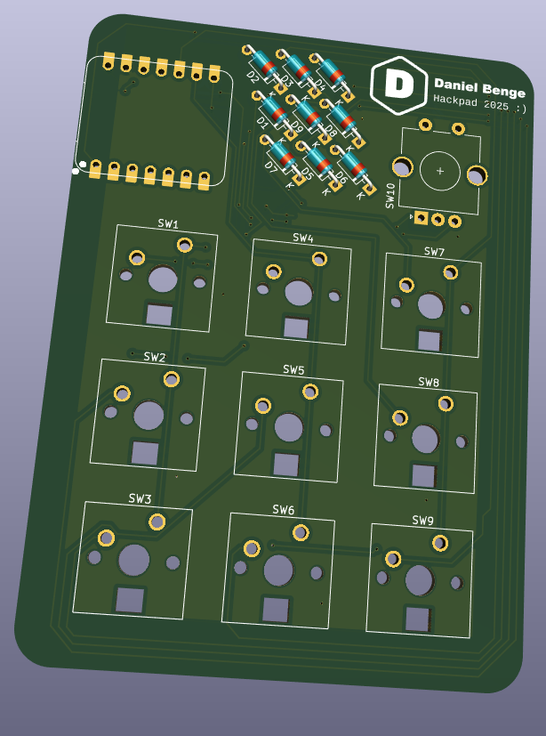
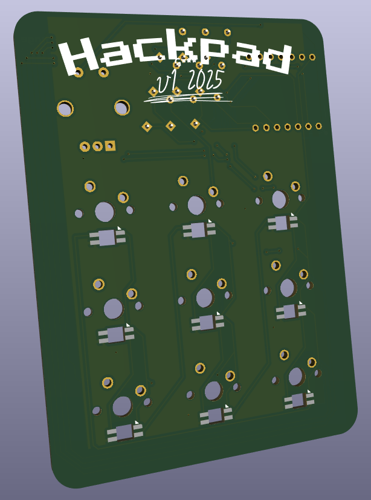
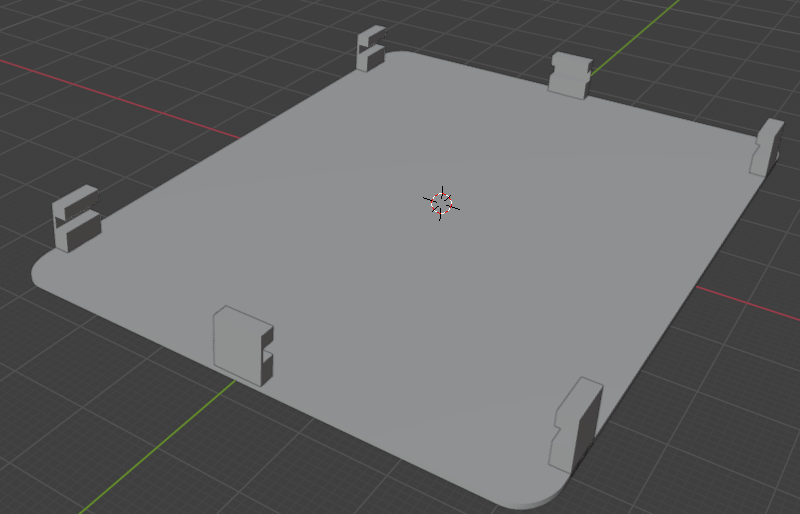

# Daniel's 3x3 Hackpad

Schematic            |  PCB         |   Case
:-------------------------:|:-------------------------:|:-------------------------:|
 |   | 

## Description

My hackpad is a 3x3 macropad with a rotary encoder. The switches are wired in a matrix, and I used neopixels under each switch. I have a fair amount of experience with PCB design, but this was my first time using copper pours, and wiring the matrix was pretty difficult! Once I receive the macropad, I'm hoping to plug it into a pi zero w and use it to control the lights in my room via Home Assistant. For the case design, I decided to use blender. Why? Because my friend laughed when I suggested using blender, so I took that as a challenge! It's a really simple design that leaves the board exposed, because I'm not a fan of the trend of covering up an awesome looking PCB with a boxy case, so with this I tried to give it as much exposure as possible. (please note that the production STL has one less clip than the one in the CAD folder, this is because I had the wonderful idea of having clips on _each side_ of the case, which would have prevented me from being able to slot the board in!)

## BOM

- 9x Cherry MX Switches
- 1x EC11 Rotary Encoder
- 4x Adafruit little rubber feet
- 1x XIAO RP2040
- 1x EC11 Rotary Encoder Cap
- 9x Red Blank DSA keycaps 
- 9x Through Hole 1N4148 Diodes
- 9x SK6812 MINI-E neopixels
- PCB (preferrably black not green)

## Components render

