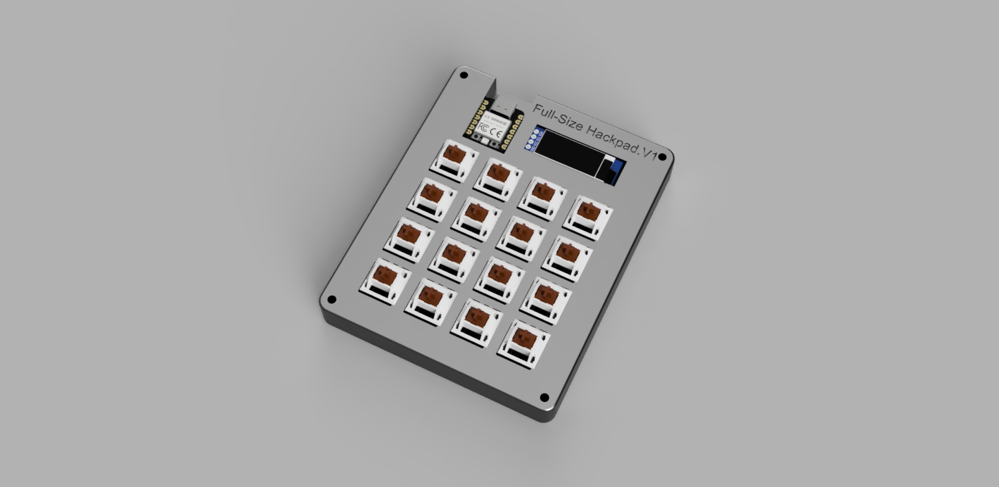
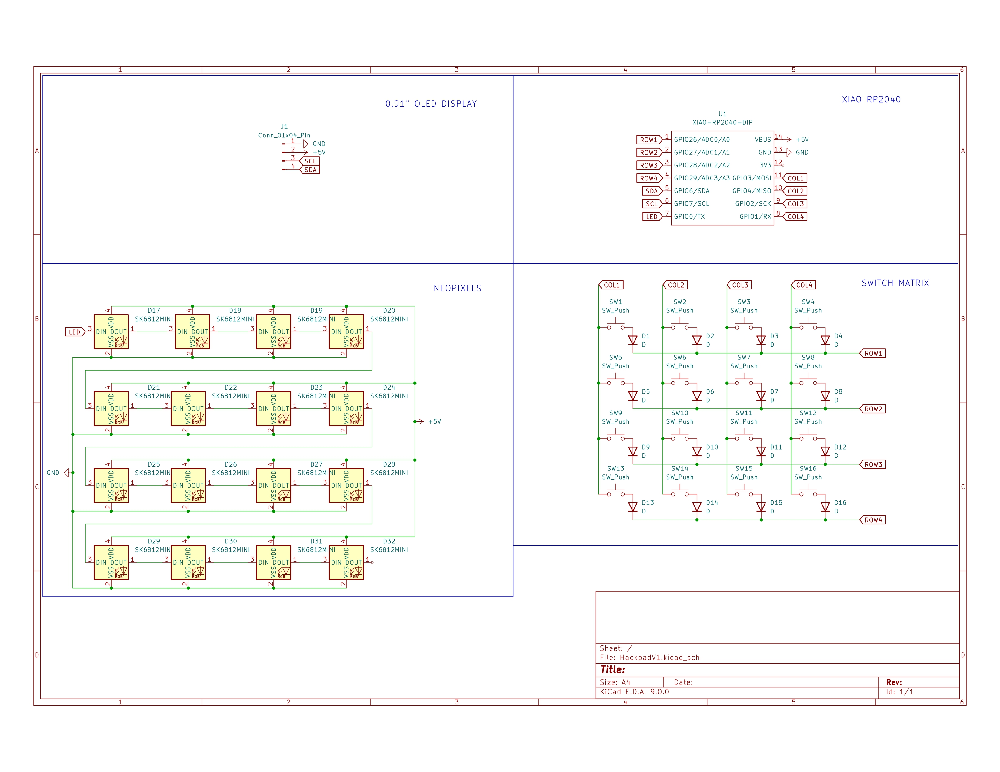
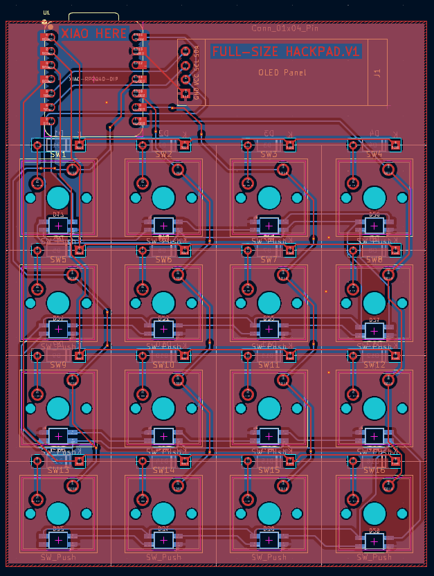
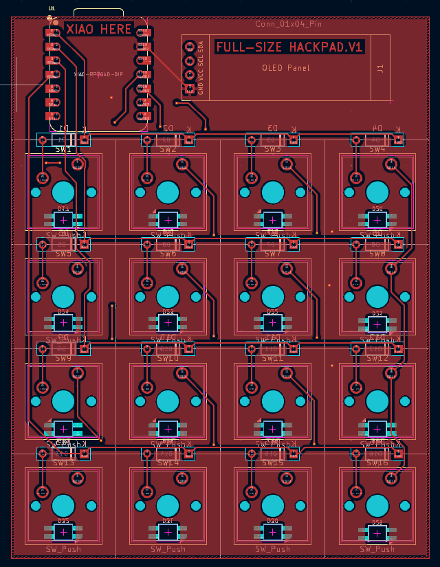
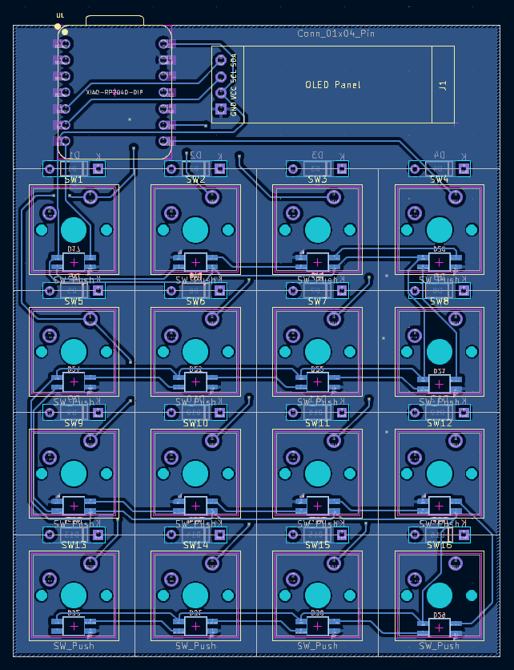
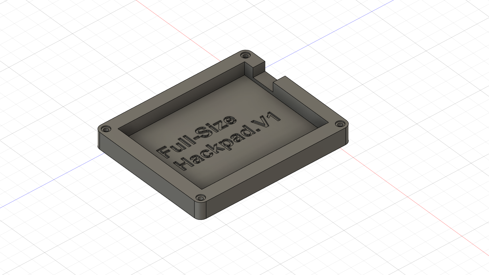
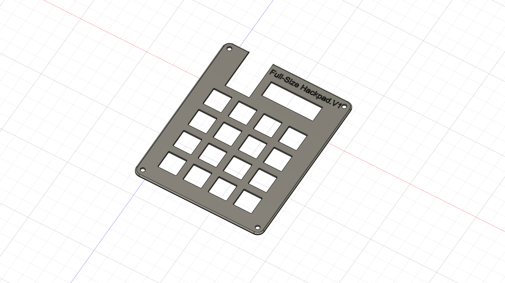
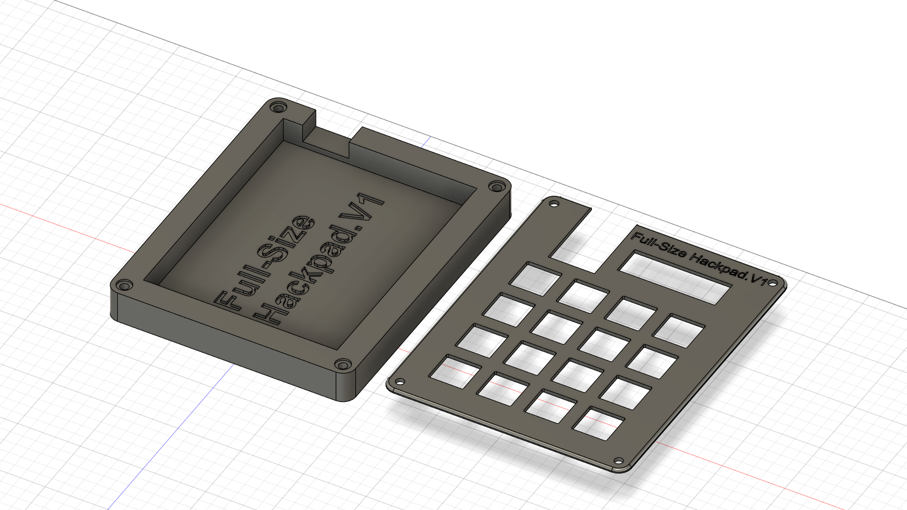

# Full-Size Hackpad.V1
Finally completed my Hackpad consisting of 16 keys and a 0.91" OLED after lots of research and routing lol!

### Inspiration

I wanted to create a separte full size numpad as my laptop does not have a numpad.

### Challenges

Everything was a challenge for me from using KiCad to designing the case in Fusion360. But the Hackpad guide was super useful so it helped me a lot!

### Specifications

BOM: 
- 16x Cherry MX Switches
- 16x SK6812 MINI-E Reverse Mount Leds
- 1x XIAO RP2040
- 16x Blank DSA Keycaps
- 4x M3x16 Bolt
- 4x M3 Heatset
- 1x 0.91"inch OLED
- 16x 1N4148

Others:
- KMK Firmware
- Top.step 
- Bottom.step

## PCB
| Schematic |
| - |
|  |

| Two sides |
| - |
|  |

| Front |
| - |
|  |

| Back |
| - |
|  |

## Case

| Bottom |
| - |
|  |

| Top |
| - |
|  |

| Both |
| - |
|  |

## Complete Keyboard CAD

