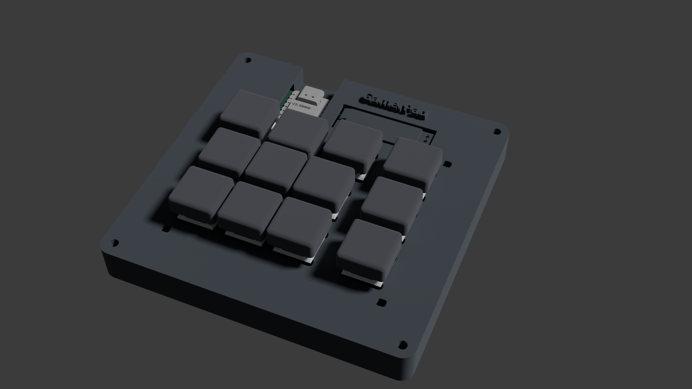
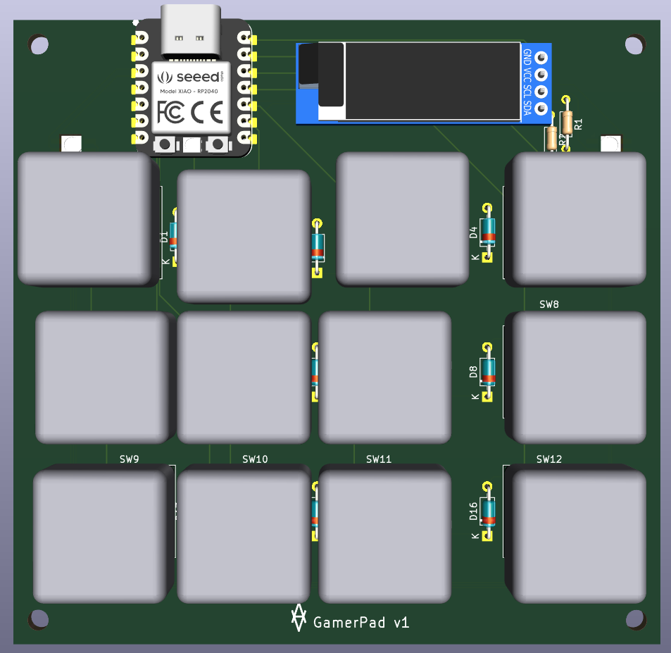
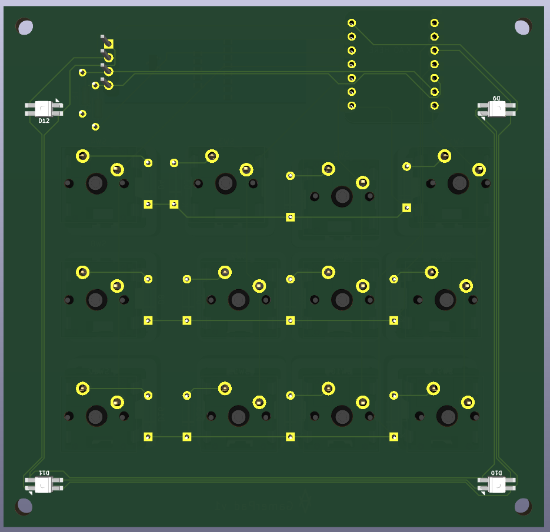
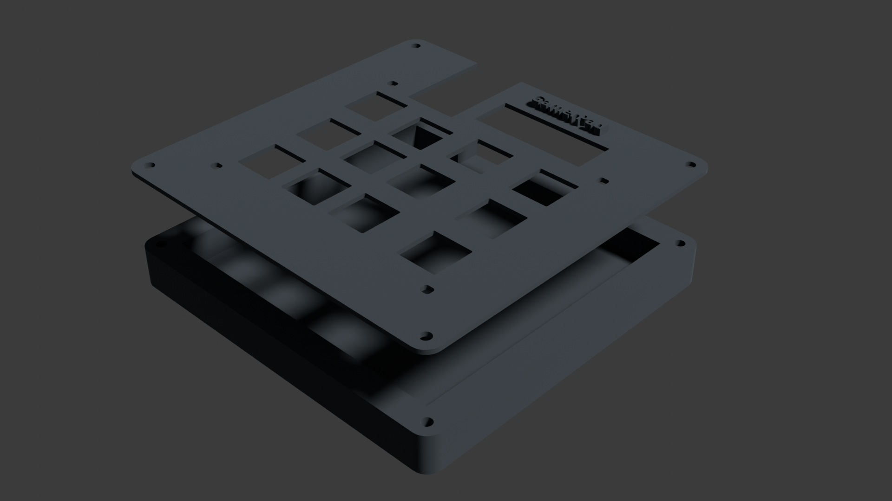

# GamerPad

I haven't had any experience until now with either PCB or CAD design, but I've
always wanted to make something, and this really motivated me to learn about both.

I really enjoyed the PCB design in KiCad and struggled quite a bit with FreeCAD
which is why I stuck to creating a case following the guide closely. I'm not
quite satisfied with the case, but it's the best I could achieve for now.

I also haven't had the time yet to implement the OLED display functions I really
wanted to add. I'll add them in the next few weeks.

This was a lot of fun, I especially noticed how much I liked PCB designing.

I made the board like this because I wanted to make something "unique" and gaming-related, even
though I'm not entirely sure it really improves things. But at least it's not just a smaller keyboard.

## Features

- 3 layers of keys:
  - 1: WASD and Q + E with macro recording buttons
  - 2: mouse control
  - 3: additional function keys (F13 - F20)
- 4 RGB leds for backlighting
- OLED for information display (coming in March 2025)

## Coming soon

- OLED display integration -> showing a hint about the current layer, also showing the recently pressed keys
- display of the macros, maybe even adding another layer that allows controlling the displayed info
- instead of using 3 keys for 3 layers, use only 2 (for switching one layer up/down) or just 1 (for switching to next layer) -> 1 or 2 more keys for actual functionality

## BoM

- 12x Cherry MX Switches
- 12x DSA Keycaps (preferably in white)
- 12x 1N4148 THT Diodes
- 4x M3x16mm screws
- 4x M3x5x4 Heatset inserts
- 1x 0.91" 128x32 OLED Display
- 4x SK6812 MINI-E RGB LEDs
- 2x Resistor 4,7k Ohm
- 1x XIAO RP2040
- 1x Case (2 printed parts) (preferably in either teal, cyan, blue or black)

## Renders

overall hackpad:

schematic:

PCB front:

PCB back:

case, top and bottom separate:

case, put together:

