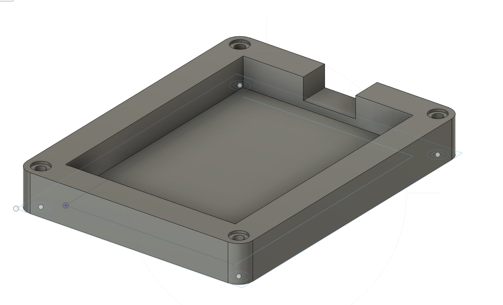
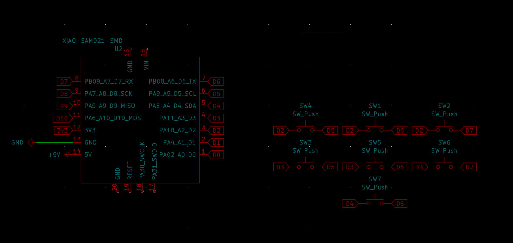
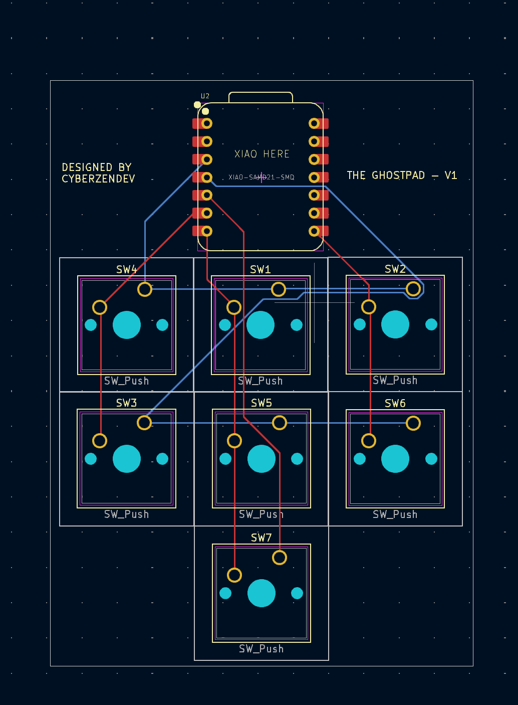

GhostPad - A Macro Pad for MacOS and Coding built in mind

## Features

- Uses a 16 key layout - 4 rows of 4 keys and one and a screen
- Firmware is written in python and uses the qmk library
- Is optimized for MacOS and Coding in mind

## BOM
- 1x Xiao ESP32C3
- Cherry MX Reds keyswitches X16
- Cherry MX Red Keycaps x16
- SSD1306 0.96inch
 oled screen- 3D Printed Case

## Fusion Design

## PCB - Schematic

## PCB - Layout

