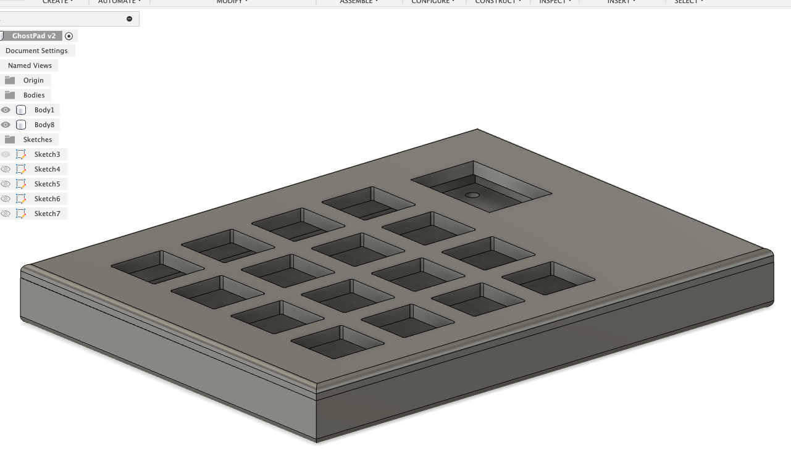
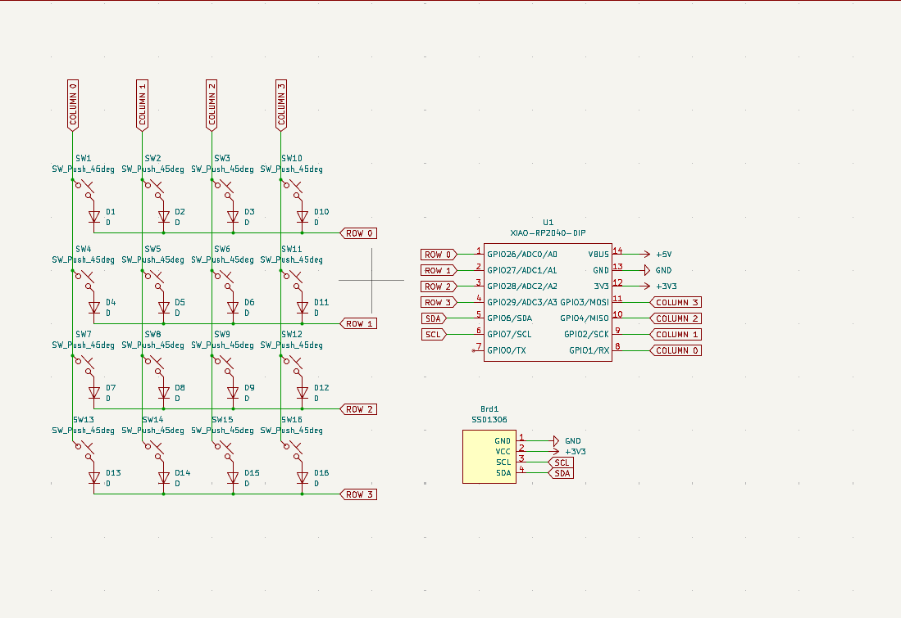
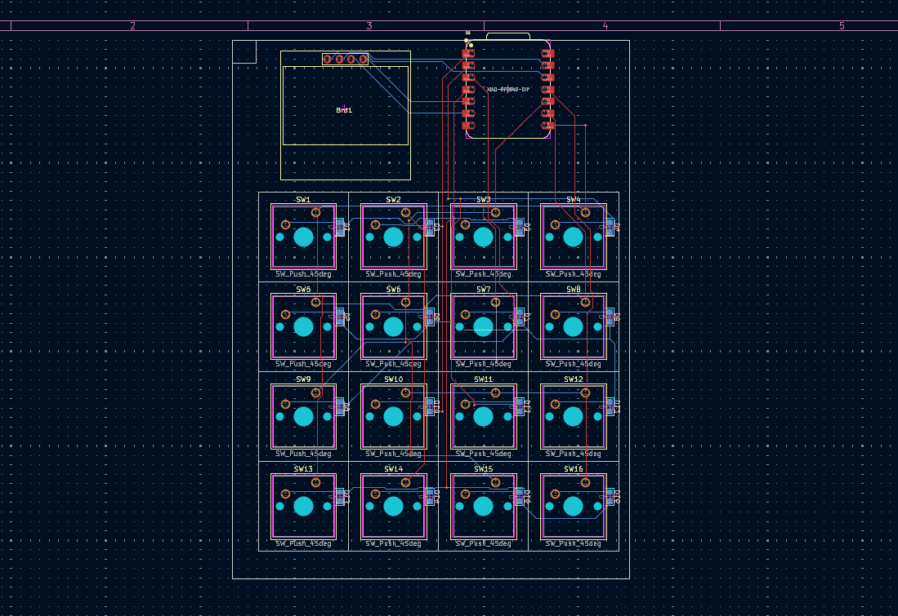

GhostPad - A Macro Pad for MacOS and Coding built in mind

## Features

- Uses a 7 key layout - 2 rows of 3 keys and one key at the bottom for super
- Firmware is written in python and uses the qmk library
- Is optimized for MacOS and Coding in mind

## BOM
- 1x Xiao ESP32C3
- Cherry MX Reds keyswitches X7
- 3D Printed Case

## Fusion Design

## PCB - Schematic

## PCB - Layout

