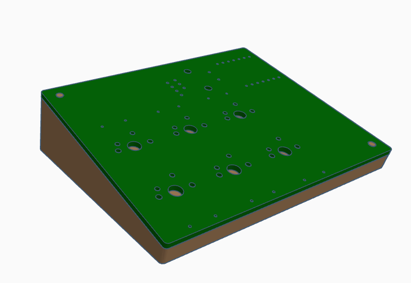
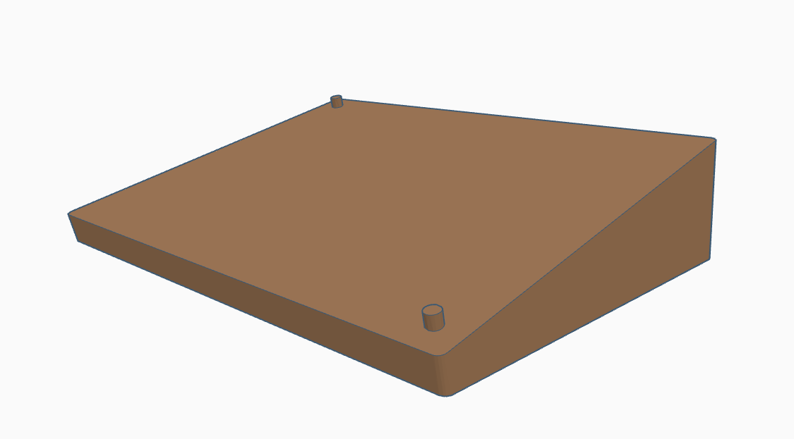
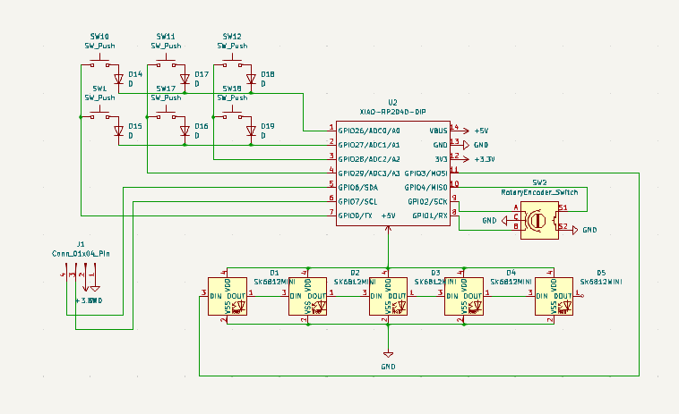
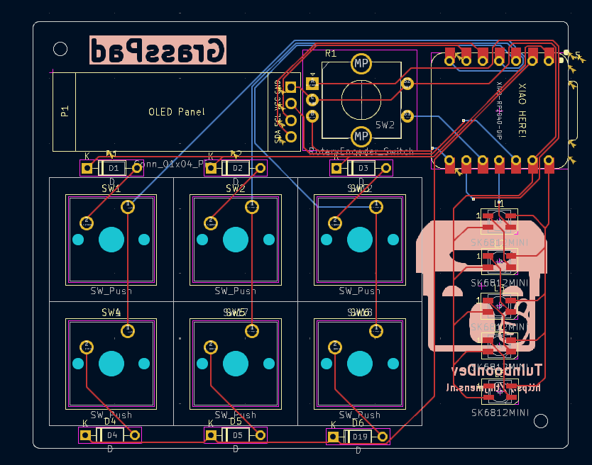
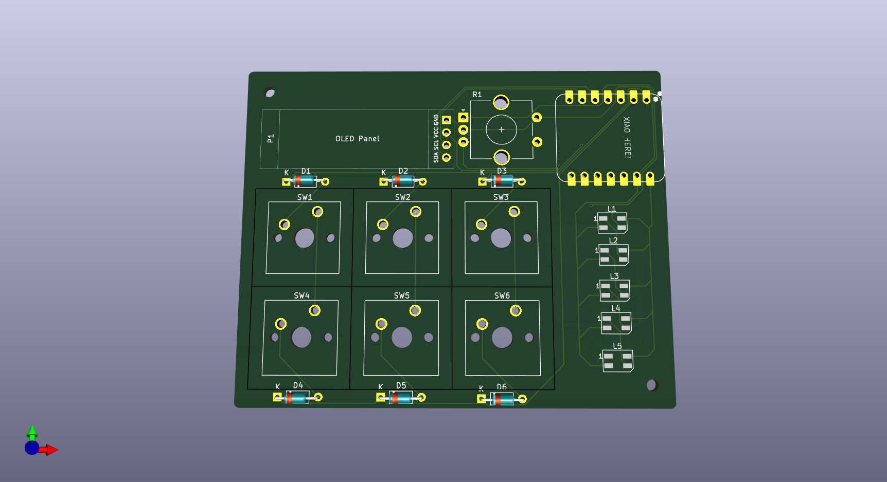

# GrassPad
A small macropad that looks like a block of grass, hence the name.

The GrassPad has 6 MX switches and one rotary encoder it also has an 128x32 OLED screen and 5 RGB LEDs.

# Full Model

# Case

# Schematic

# PCB
Wireframe:

PCB:

BOM:
- Seeed XIAO RP2040 x1
- PCB x1
- MX-Style switches x6
- EC11 Rotary encoder x1
- 0.91 inch OLED display (black if possible) x1
- Blank DSA keycaps x6
- SK6812 MINI-E LEDs x5
- 1N4148 DO-35 Diodes x6
