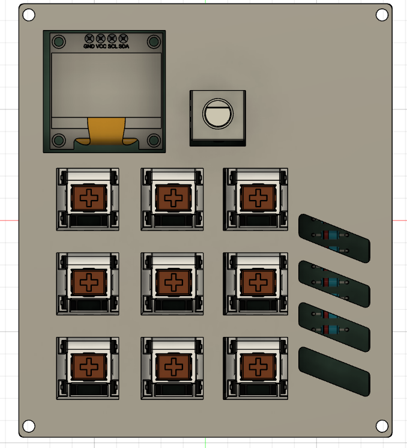

# MacroPad Project [Hephaestus]

## Overview
This project is a custom MacroPad powered by a Seeeduino XIAO RP2040. It includes an OLED display, a rotary encoder, and a 3x3 key matrix.

## Features
- **Seeeduino XIAO** as the main microcontroller
- **Rotary Encoder** with push-button functionality
- **3x3 Key Matrix**
- **OLED Display**
- **3D Printed Case** for enclosure

## Screenshots
### Overall Hackpad

### Schematic

### PCB Layout

### Case Design

## Bill of Materials (BOM)
The following table contains all the components needed for this macropad:

| Part Name             | Quantity |
| --------------------- | -------- |
| XIAO RP2040           | 1x       |
| Cherry MX keyswitches | 9x       |
| Diodes 1N4148 D-35    | 9x       |
| SSD1306 OLED .96      | 1x       |
| EC-11 Rotary Encoder  | 1x       |
| Printed Case          | 1x       |

## Firmware
The MacroPad firmware is implemented using KMK.

## Usage
- Rotary Encoder for volume control and mute.
- Press keys for WASD. (also Q/E)

## Future:
- Implement proper OLED functionality

## License
This project is open-source under the MIT License.

