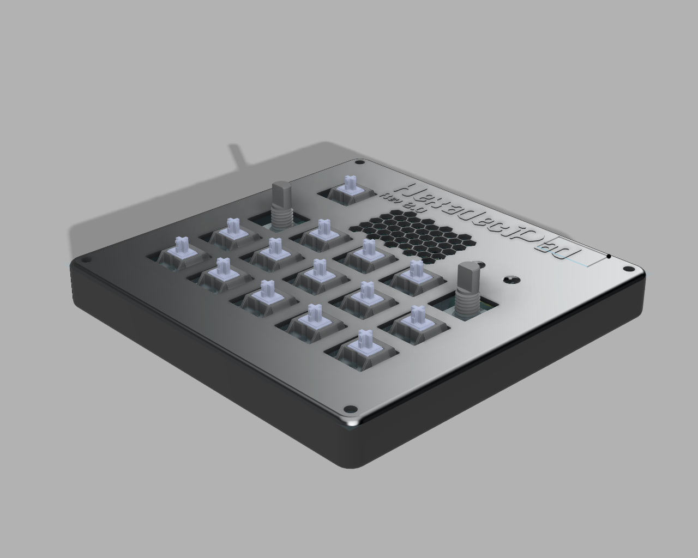
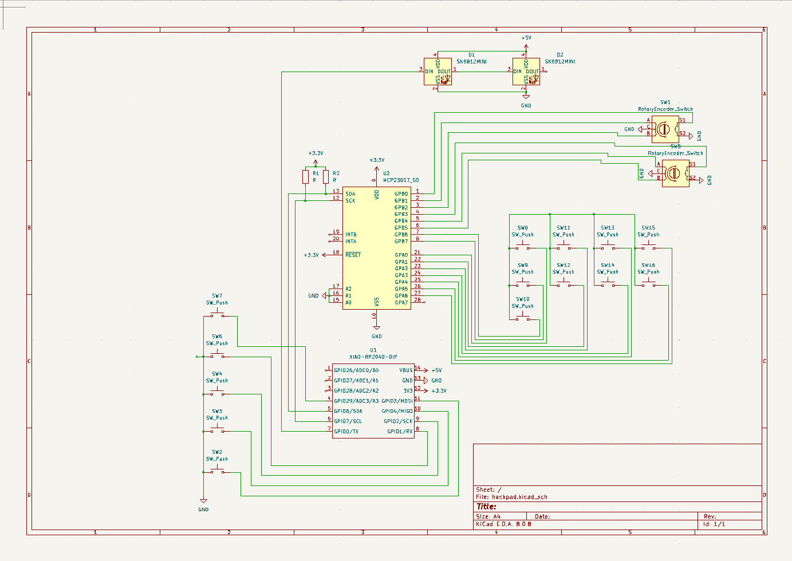
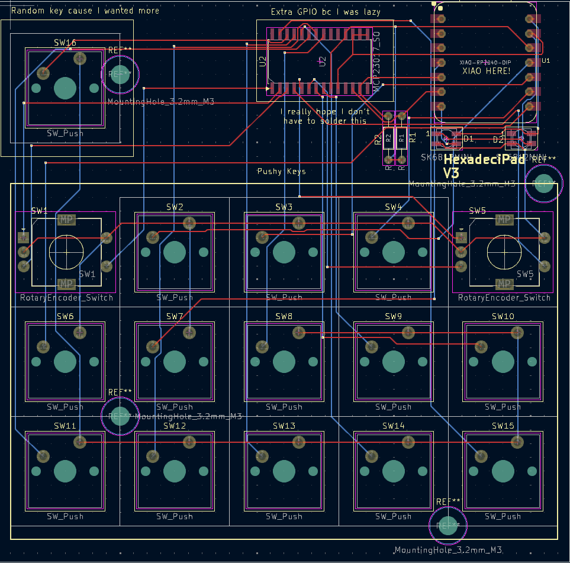

# HexadeciPad

Welcome to the HexadeciPad! This README provides an overview of the project, including screenshots, a Bill of Materials (BOM), and additional resources to help you understand and contribute to the project.

## Overview

The HexadeciPad is a custom macropad designed as part of the Hackpad limited-time You Ship, We Ship (YSWS) event. I decided to make this Hackpad after realising that my keyboard media controls are kinda trash.

I spent ages trying to create the firmware after not knowing what I was doing. Finally after 20 hours of messing around i ahave finished my Hackpad. The HexadeciPad has 16 total inputs (2x encoder and 14x chery mx switches)

My next steps are probably to create a GUI and button editor app to make it easy to assign custom commands.

## Features:

 * 16 Inputs!!! you heard me right!
    * 2 EC11 Encoders
    * 14 Cherry MX Switches
 * A janky ahh PCB made by yours truly :3
 * Media Controls
 * A bunch of app opener keys thingys
 * Custom FW (KMK)

## 3D Model
[3D Model (Link to file)](./cad/STLs/Hackpad%20-%20Full-with%20PCB.stl)

## Screenshots

### Overall Hackpad

### Schematic

### PCB

## Bill of Materials (BOM)

| Part Number                | Description                                      | Quantity |
|----------------------------|--------------------------------------------------|----------|
| SK6812MINI                 | Addressable RGB LED                              | 2        |
| R_Axial_DIN0204_L3.6mm_D1.6mm_P7.62mm_Horizontal | Resistor, Axial, THT, Horizontal | 2        |
| RotaryEncoder_Alps_EC11E-Switch_Vertical_H20mm | Rotary Encoder with Switch | 2        |
| SW_Cherry_MX_1.00u_PCB     | Cherry MX keyswitch, 1.00u, PCB mount             | 14       |
| XIAO-RP2040-DIP            | Seeed Studio XIAO RP2040                         | 1        |
| MCP23017_SO                | I2C I/O Expander                                 | 1        |
| PCB                        | [`My custom PCB`](./production/gerbers.zip)      | 3?       |
| 3D Printed Case            | [`Top`](./production/Hackpad%20-%20Top%20Plate.stl) and [`Bottom`](./production/Hackpad%20-%20Case%20Base.stl) Color: Red if possible? (To match HC color)  | 1x Top 1x Bottom |
| M3x16mm SHCS Bolts | Case bolts | 4 |
| M3x8mm SHCS Bolts | PCB Screws | 4 |
| Blank DSA Keycaps White | Black or white. Maybe 7x black 7x white? | 14 |

## License

This project is licensed under the MIT License. See the [`LICENSE`](LICENSE ) file for details.