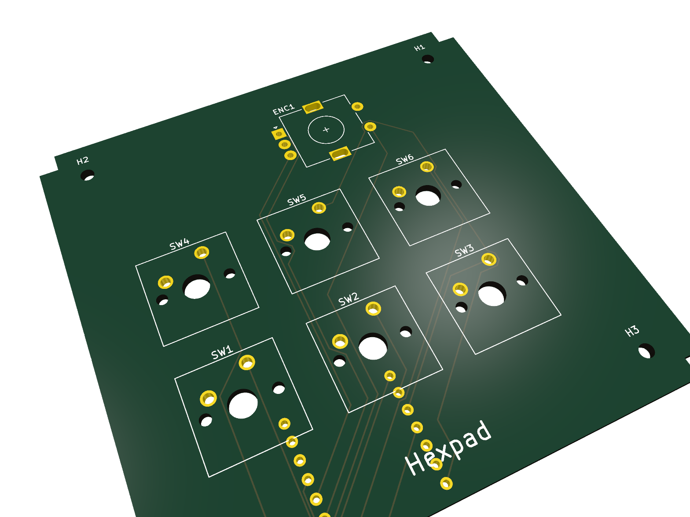
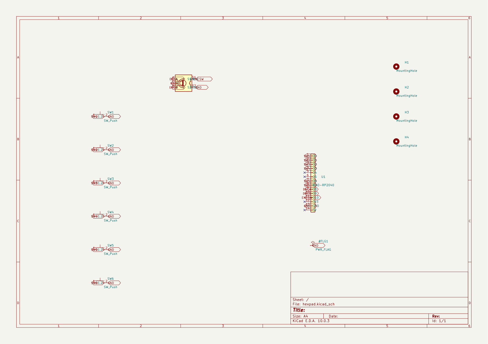
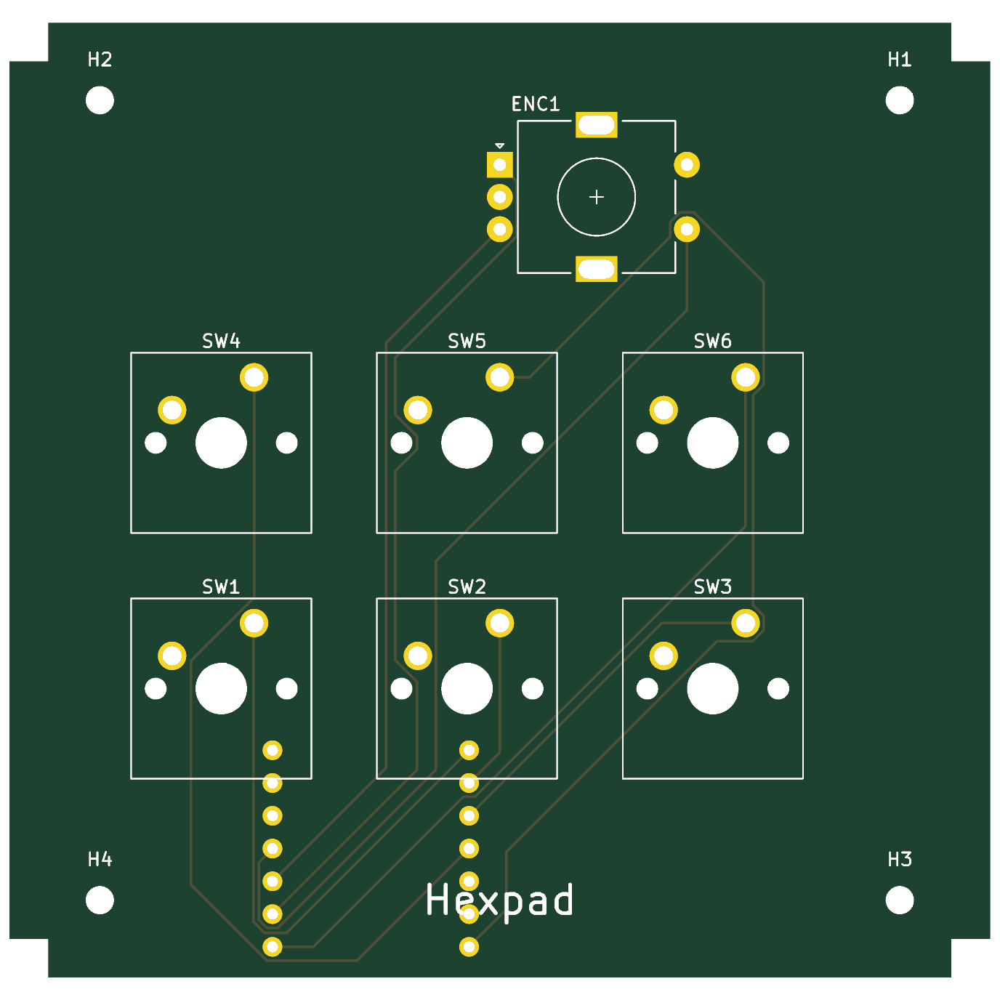
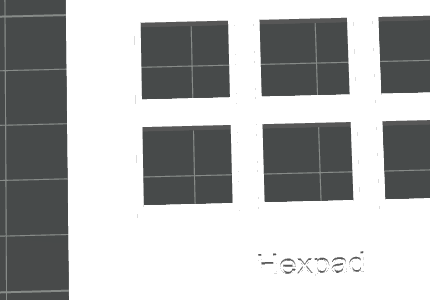

# Hexpad — a hex-shaped 6-key macropad

A 6-key (3×2) macropad with a rotary encoder: 3D-printed case, custom 2-layer PCB,
and KMK firmware, driven by a **Seeed XIAO RP2040**. Keys wire **direct to GPIO**
(no matrix, no diodes), and the encoder handles volume/scroll.

## Inspiration & challenges

I wanted a compact editing/clipboard pad with a volume knob that didn't look like
every other square macropad — so Hexpad uses a hexagonal silhouette around a
centered 3×2 key cluster with the encoder up top.

Two things were genuinely fiddly. First, the original top-plate CAD came out of an
early IDE session malformed — the plate solid was fused to a stray slab 74 mm
below it, so it "levitated" in the slicer. I had to reverse-engineer the real
dimensions from the STEP geometry and rebuild the plate as a clean parametric
build123d script. Second, rather than hand-draw the board I generated the PCB
programmatically with KiCad's `pcbnew` API from a single coordinate spec, which
guarantees the switch, encoder, and mounting-hole positions line up exactly with
the printed plate (19.05 mm pitch, mounts at ±31 mm).

## Gallery

| Schematic | PCB | Case |
|-----------|-----|------|
|  |  |  |

## Bill of materials

| Qty | Part | Notes |
|-----|------|-------|
| 1 | Seeed XIAO RP2040 | MCU, mounted on the back; USB-C exits the front edge |
| 6 | Cherry MX (or compatible) switch | direct-wired, one GPIO each |
| 1 | Alps EC11 rotary encoder w/ switch | A/B + push → 3 GPIO, common → GND |
| 4 | M2 screw (~6 mm) | through the case into the plate's corner posts |
| 6 / 1 | MX keycaps / encoder knob | cosmetic |
| 0 | diodes | **none** — direct wiring is valid for ≤7 keys |

## Pin map

| Input | XIAO pin | | Input | XIAO pin |
|-------|----------|-|-------|----------|
| SW1–SW3 (front) | D0, D1, D2 | | Encoder A / B | D8 / D9 |
| SW4–SW6 (rear) | D3, D6, D7 | | Encoder push | D10 |

`D4`/`D5` (SDA/SCL) are left free for a future OLED. All inputs use the RP2040's
internal pull-ups (a press/turn pulls the pin to GND).

## Folder contents

| Folder | Files |
|--------|-------|
| `CAD/` | `hexpad_assembly.step` — full case (top plate + bottom case), name engraved on the plate |
| `PCB/` | `hexpad.kicad_pro` / `.kicad_sch` / `.kicad_pcb` / `.kicad_sym` / `sym-lib-table`, plus `hexpad-gerbers.zip` (JLCPCB-ready) |
| `Firmware/` | `code.py` (KMK keymap) + flashing/remapping `README.md` |
| `docs/images/` | render, schematic, PCB, and case images |

- **PCB:** 2-layer, **76 × 74 mm**, silkscreen-branded "Hexpad". DRC: 0 errors,
  0 unconnected (silkscreen / courtyard warnings only). Schematic ERC: 0 violations.
- **Firmware:** KMK (CircuitPython). Default keymap: front row Copy/Paste/Cut,
  rear row Undo/Redo/Save, encoder = volume (press = mute).
- **Case:** 3D-printed; "Hexpad" engraved into the top plate's front margin.

## Toolchain

build123d (CAD → STEP) · KiCad 10 (PCB) · Bambu Studio (slicing) · CircuitPython + KMK.
