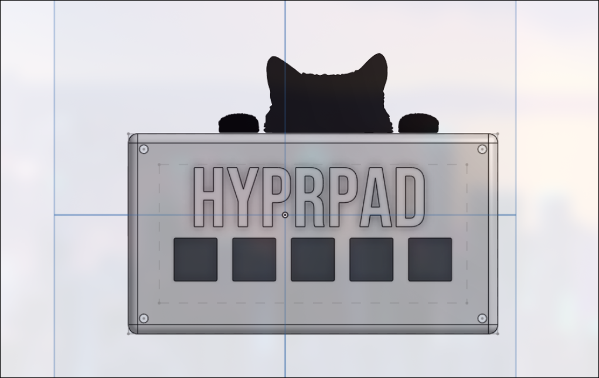
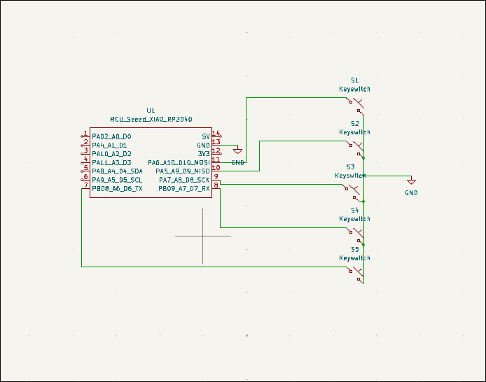
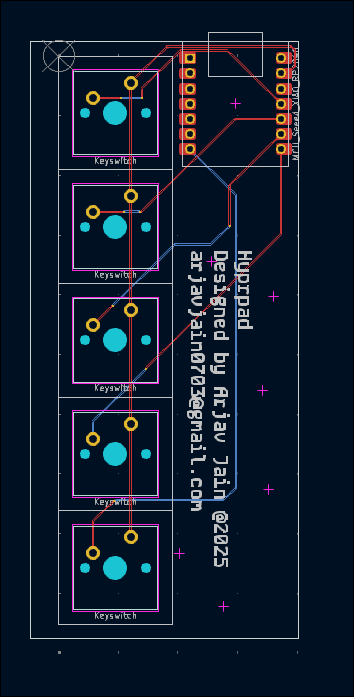
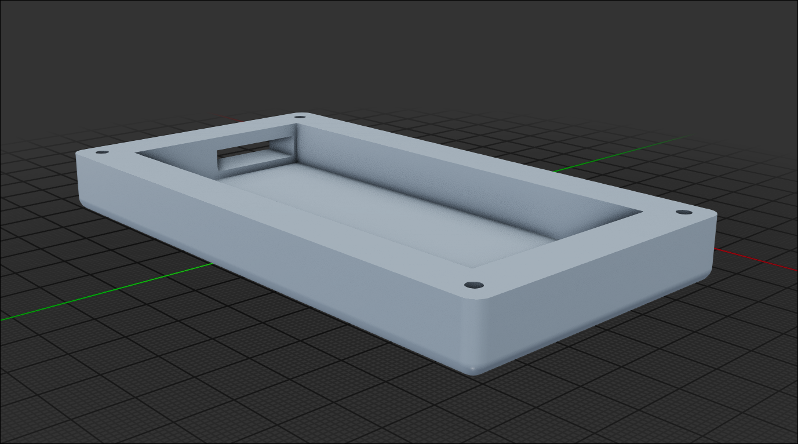

# Hyprpad

### Why did I make it?
As a hyprland user, I really needed a quick way to switch between windows without having to press those stupid shortcuts! So, I designed HyprPad.

### What was the hardest part about this ?
I had tons of issues with Ki-cad libraries and my files. I accidently lost all of my PCB files for KiCAD. Had to recover them from my drive :)

### Bill of Materials
 - 4x M3 16mm screws 
 - 1x Seeed XIAO RP2040
 - 5x MX-Style switches (Blue)
 - 5x Blank DSA keycaps (Either White or Red)
 - Case (all black or a mix of Black and White)

### Schematic

---
### PCB (the back silkscreen is hidden for easy understanding)
 for some reason, the connections of my PCB (wires) are blank in between, is it a problem? I am using KiCAD

### Case
- Bottom

- Top

P.S. The case also has three other parts for decoration. They are clearly visible in the image at the top of this file.