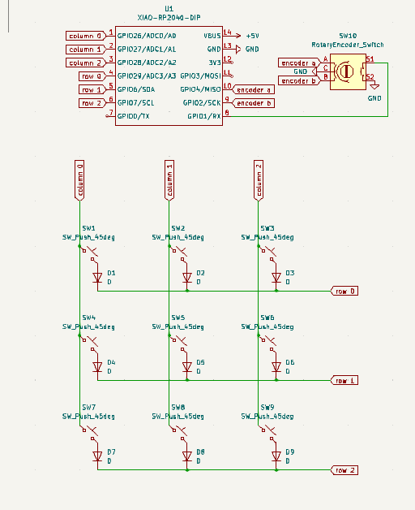
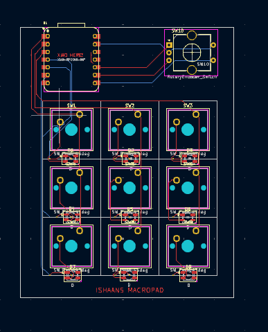
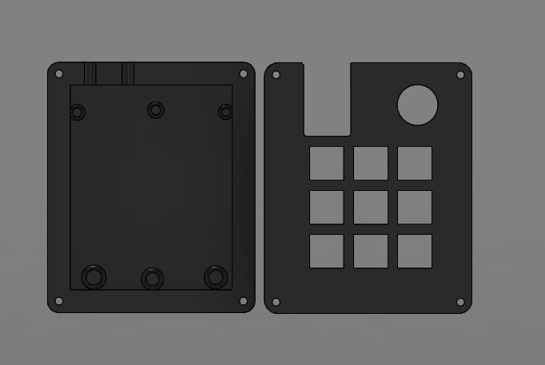
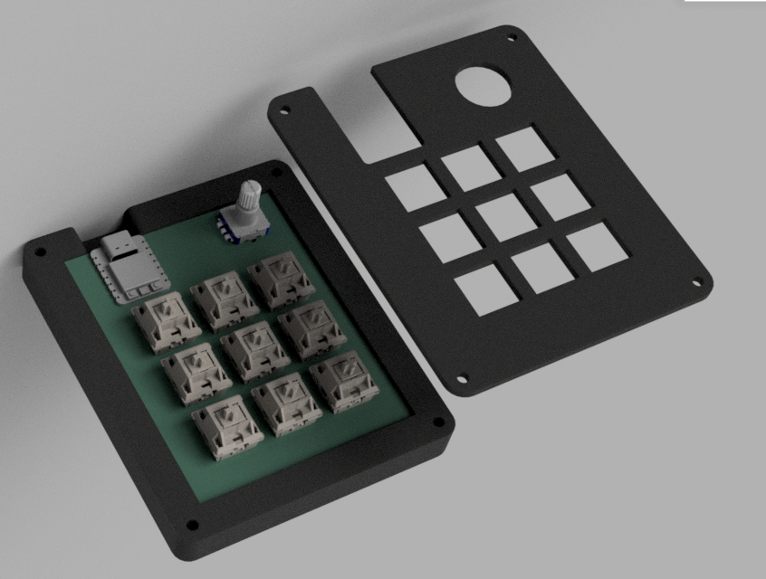

# Ishaan's MacroPad

A 9 key macropad designed to help streamline the design process.

# Inspiration

I was heavily inspired by Salim Benbouziyanes macropad.

# challenges

This was my first time creating a pcb, and I definitely struggled trying to design it.

## BOM (Bill of Materials)

- 1x Seeed XIAO RP2040
- 9x Cherry MX switches
- 1x EC11 rotary encoder dode switch
- 1x PCB
- 9x Through-hole 1N4148 Diodes
- 9x SK6812 MINI-E LEDs
- 8x M3x16mm screws
- 8x M3 hex nuts

## Images

