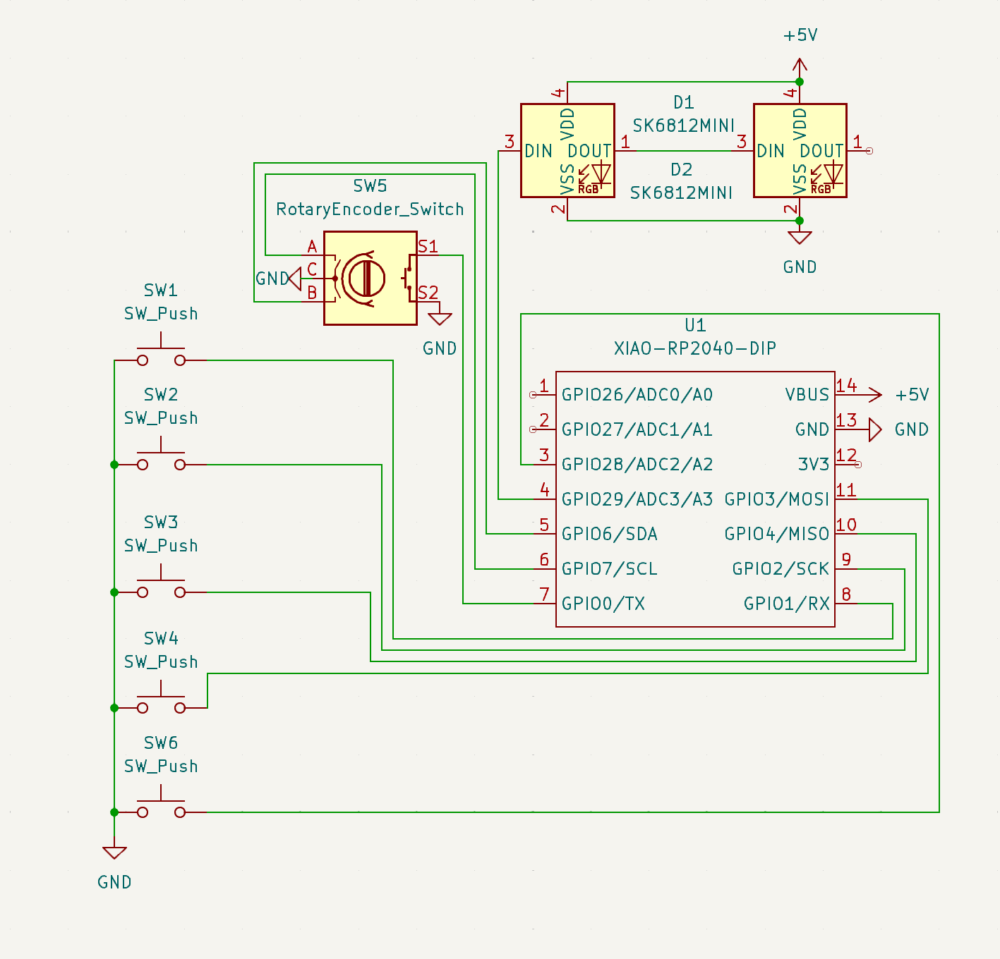
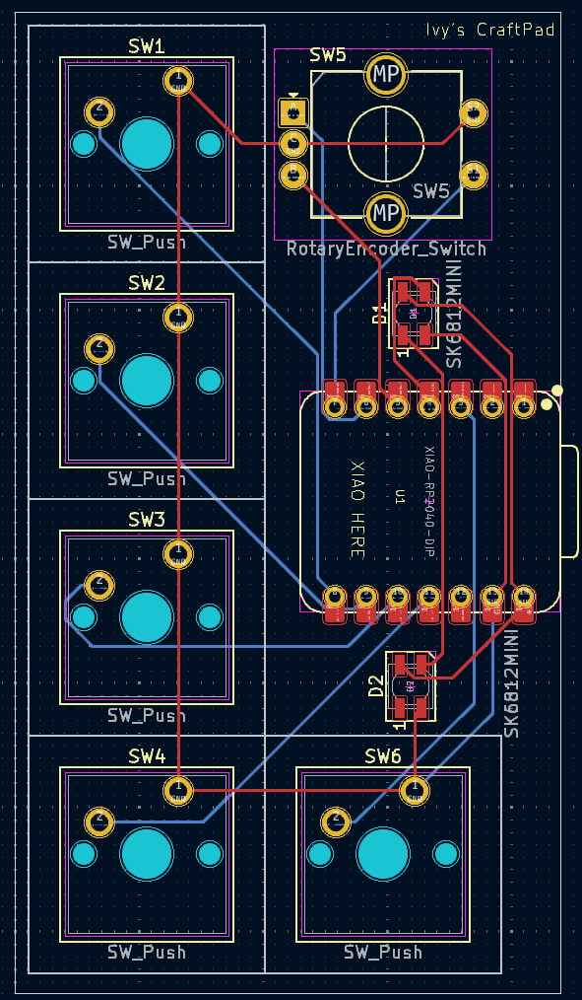

# Ivy's HackPad aka. CraftPad
I've made a hackpad which I'm calling a craftpad because it is made to be used to control a minecraft server.

## BOM:
- 1x Seeed XIAO RP2040 microcontroller
- 1x Rotary Encoder EC11
- 2x RGB LED's
- 5x Cream Keycaps
- 5x MX Cherry Switches

## Images of the HackPad
  
  

