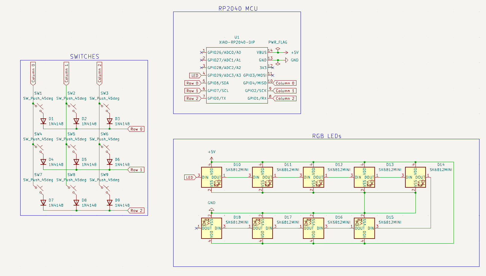
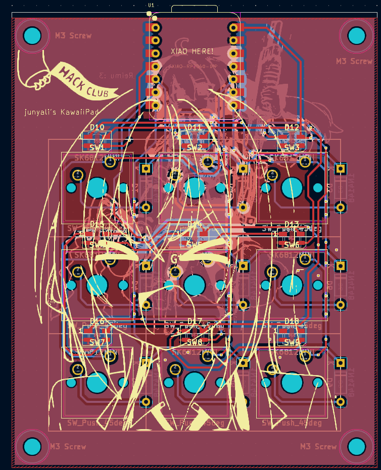
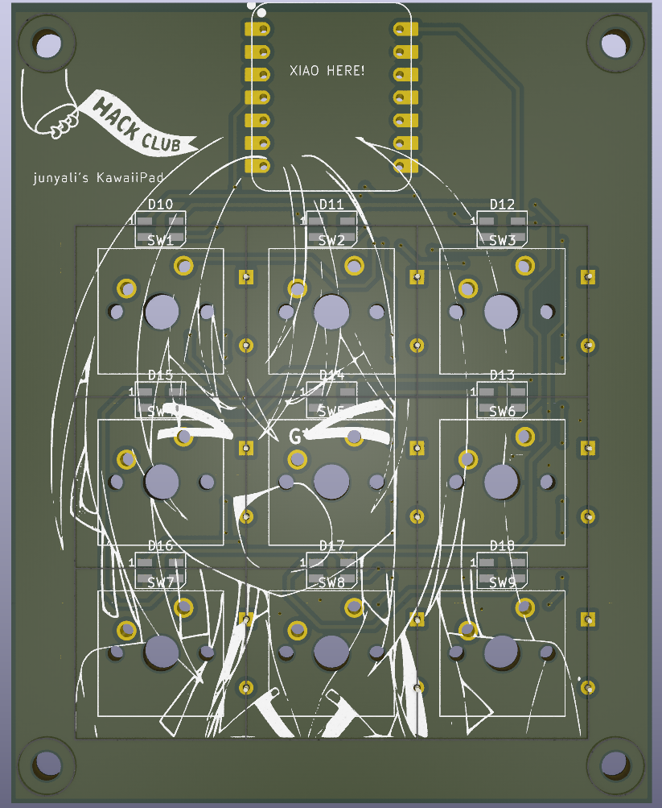
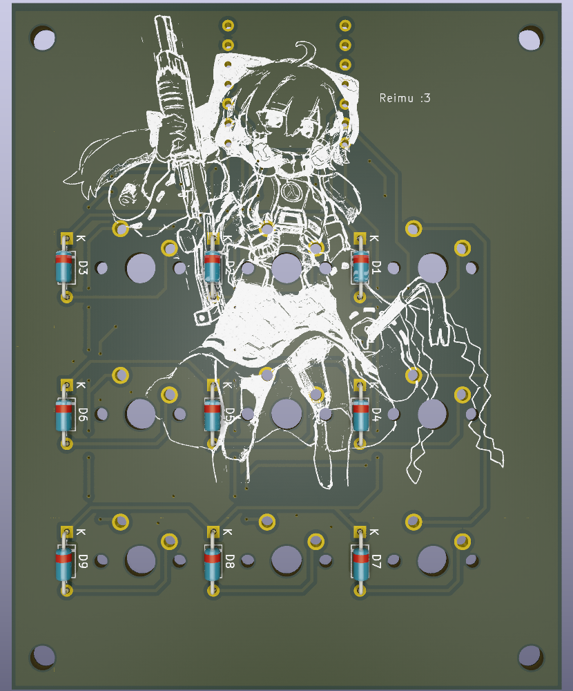
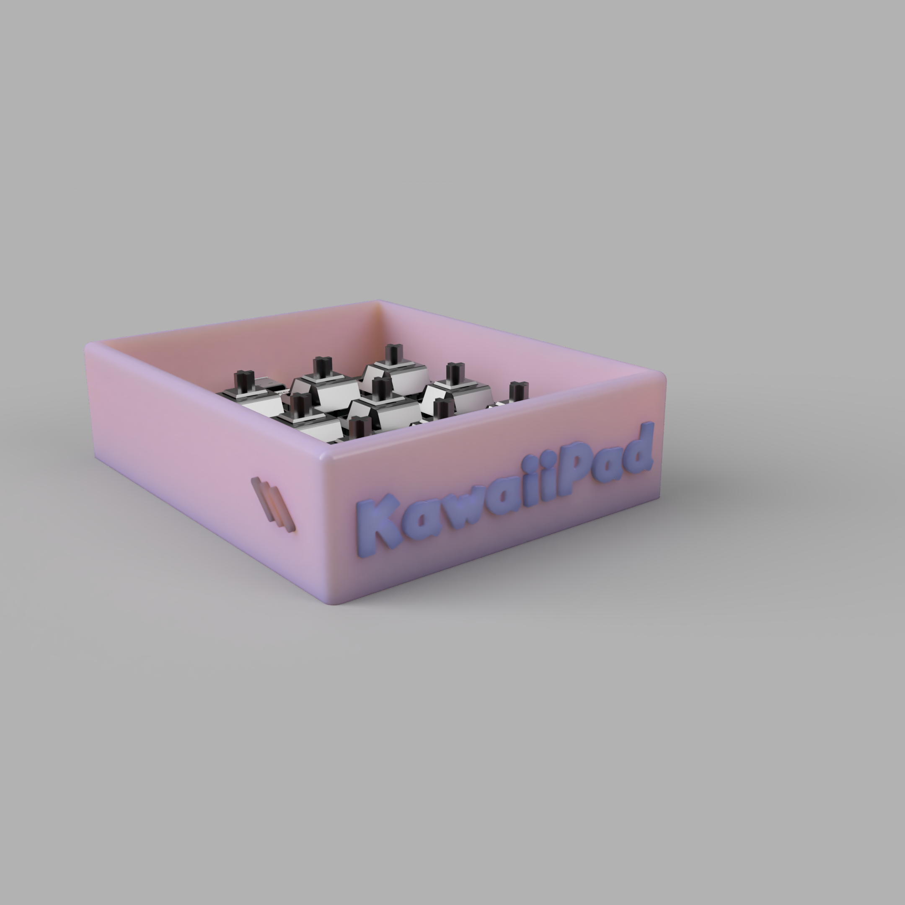

# KawaiiPad

My first macropad that looks quite cute! :3
Designed in KiCAD, Fusion360, and QMK Firmware

## BOM

- 1x SEEED XIAO RP2040
- 9x Cherry MX switches
- 9x White keycaps (include some Hack Club ones please!!)
- 9x 1N4148 Through-hole diodes
- 9x SK6812-MINI LED
- 4x M3x16mm screws
- 4x M3 hex nuts
- 1x KawaiiPad 3D Printed case
- ~~100g of Francium owo~~

## Concept

| Demo             |                      Image                       |
|------------------|:------------------------------------------------:|
| Schematic        |                |
| PCB Design       |              |
| PCB Front Render |  |
| PCB Back Render  |    |
| Case Render      |            |

## Final thoughts
Honestly, this was a really daunting task considering I have never touched PCB design, and hadn't used Fusion360 for CAD design in at least 4 years. After some motivation from the helpful Hack Club community, I am pretty pleased with the final results :DD