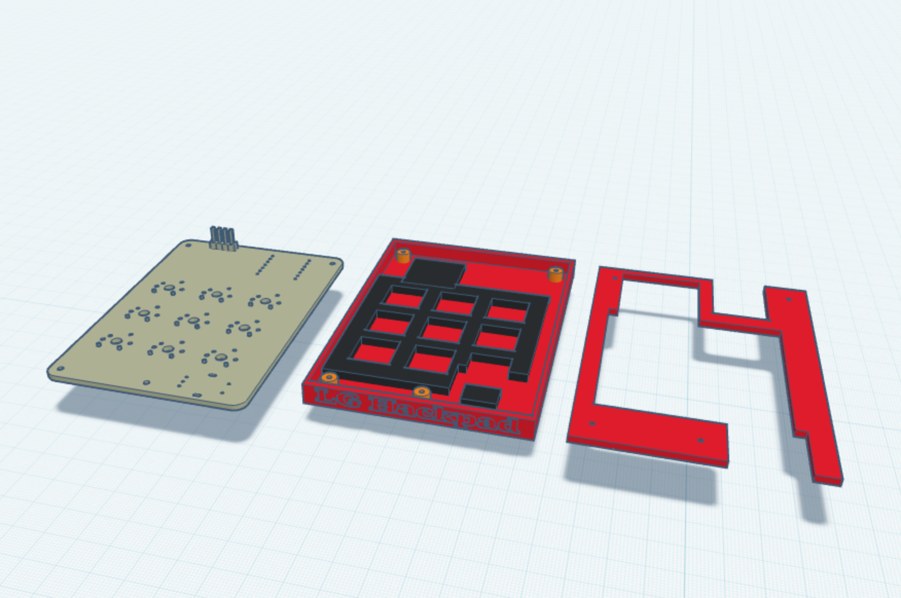
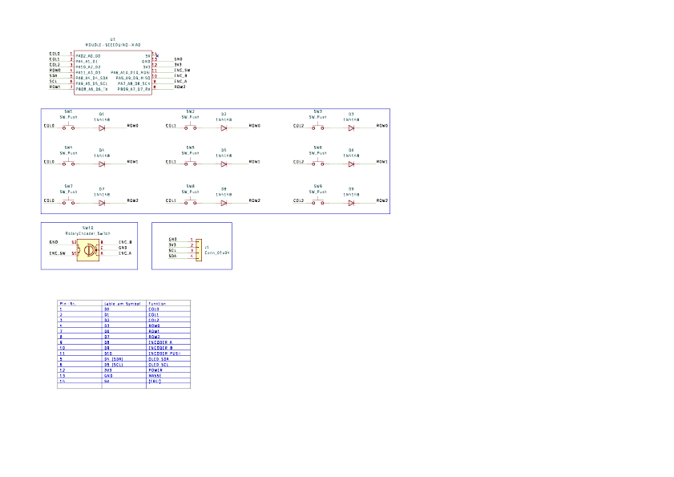
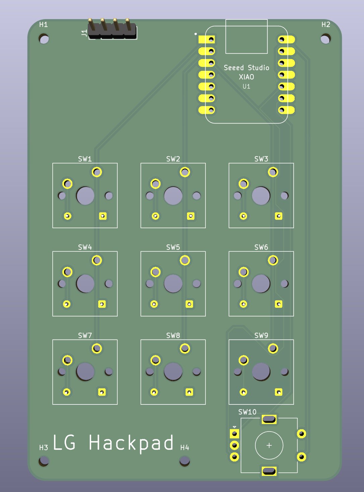
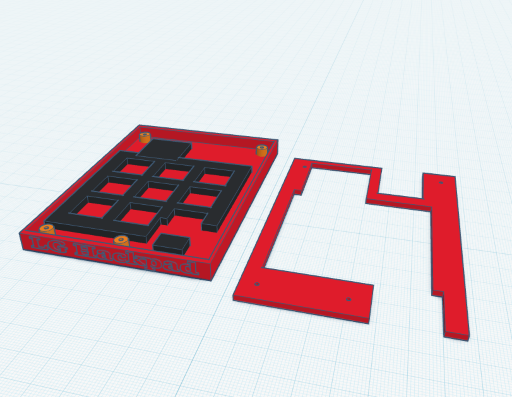

# LG Hackpad

A custom 9-key mechanical macropad with a rotary encoder and a 0.96" OLED
display, built around the **Seeed XIAO RP2040**. Designed from scratch in KiCad
(my first ever PCB) with a Tinkercad-designed open case, custom CircuitPython
firmware and a cross-platform desktop configurator app.

## Full render

## Inspiration & challenges

I wanted a macropad that isn't just static keys but actually adapts to what I'm
doing — so the **rotary encoder browses through profiles** (turn to preview on
the OLED, click to confirm) and **every one of the 9 keys is freely
configurable** through a desktop app, either as a key combo or a custom script.

The biggest challenges as a first-timer:
- **Routing a 2-layer board by hand** around the matrix diodes and the encoder
  without crossing nets, while keeping a clean GND pour.
- **Fitting everything under 100 × 100 mm** — I had to shrink the outline and
  reposition the bottom edge and mounting holes without breaking the carefully
  placed switch matrix (final size: **68 × 99.68 mm**).
- **Designing an open case without print supports** — I went with an exposed
  XIAO RP2040 because it looks cool, and added an anti-flex support grid under
  the PCB so the board doesn't bend when pressing keys.

## Bill of materials (BOM)

| # | Qty | Part | Notes |
|---|-----|------|-------|
| 1 | 1 | Seeed XIAO RP2040 | main MCU (through-hole) |
| 2 | 9 | Cherry MX–compatible switch | PCB-mount, 3×3 matrix |
| 3 | 9 | 1N4148 diode | THT, per-key (COL→ROW), n-key rollover |
| 4 | 1 | EC11 rotary encoder w/ push switch | profile browser |
| 5 | 1 | SSD1306 0.96" OLED (I²C, 4-pin) | status / profile preview |
| 6 | 1 | Custom PCB (2-layer) | 68 × 99.68 mm |
| 7 | 1 | 3D-printed case (tray + open top frame) | PLA, no supports |
| 8 | 4 | M2 screw | case mounting |
| 9 | 9 | Keycap (DSA) + 1 encoder knob | from the kit |

## Pin mapping (XIAO RP2040)

| Function | Pin | | Function | Pin |
|----------|-----|---|----------|-----|
| COL0 | D0 | | ROW0 | D3 |
| COL1 | D1 | | ROW1 | D6 |
| COL2 | D2 | | ROW2 | D7 |
| Encoder A | D8 | | OLED SDA | D4 |
| Encoder B | D9 | | OLED SCL | D5 |
| Encoder SW | D10 | | | |

Matrix is wired **COL2ROW** (column → switch → diode anode, cathode → row).

## Photos

| Schematic | PCB | Case |
|-----------|-----|------|
|  |  |  |

## Files

- `PCB/` — KiCad schematic + board
- `Production/` — fabrication gerbers + drill (`hackpad-gerbers.zip`)
- `CAD/` — case STL (`Hackpad-case.stl`)
- `Firmware/` — CircuitPython firmware
- (bonus) desktop configurator app — see the main project repo

## License

MIT — software and hardware. Use it, remix it, just keep the credit.

— Lucas G. (Sacul518)
