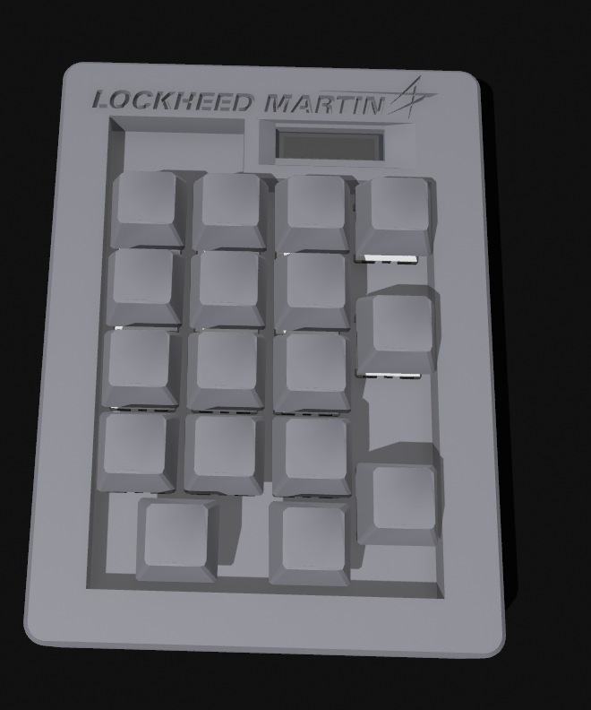
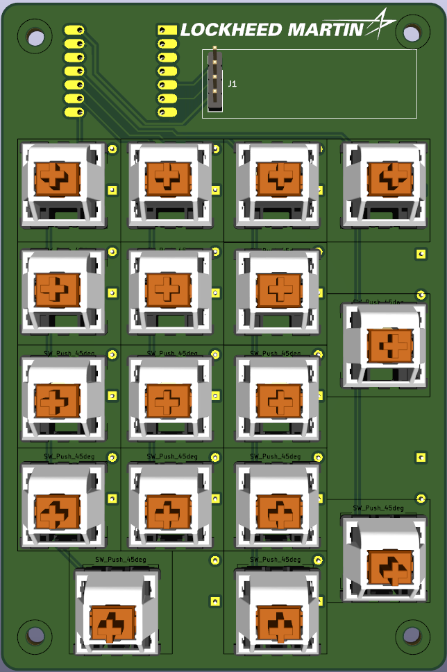
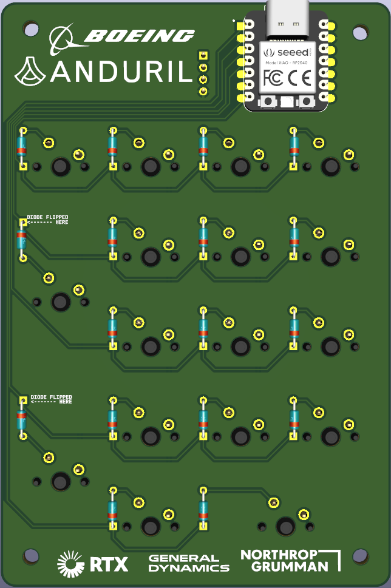

# Military  Industrial Complex Pad
First time making anything w/pcbs, so this was a learning experience. I'm not sure if I'll ever make another one, but I'm glad I did it. The biggest struggle was working with CAD software in general ( Using Shapr3D ) and I spent wayyy too much time creating the 8 screw holes needed for the case.

# About
This is a 5x4 numpad with a 128x32 OLED display.

# Notes
This is a 150mm long PCB which is outside the 100mm limit for the pcb. But I'm grandfathered in because I made the PCB before the 100mm limit was put in place. (Check the slack! @blahajfromikea)
# BOM:
- 17x Cherry MX switches
- 17x Through-hole 1N4148 Diodes
- 17x DSA Keycaps ( if possible send 3 2-unit long Keycaps )
- 8x M3 Heat-Set Inserts
- 4x 12mm M3 Bolts
- 4x 18mm M3 Bolts
- 1x Seeed XIAO RP2040 (through-hole)
- 1x 4 Pinheader 2.54mm Vertical
- 1x SSD1306 0.91 inch 128x32 I2C OLED (4 pin)
- 1x PCB
- 1x All-White (If possible) PLA Case. (3 .stl files)