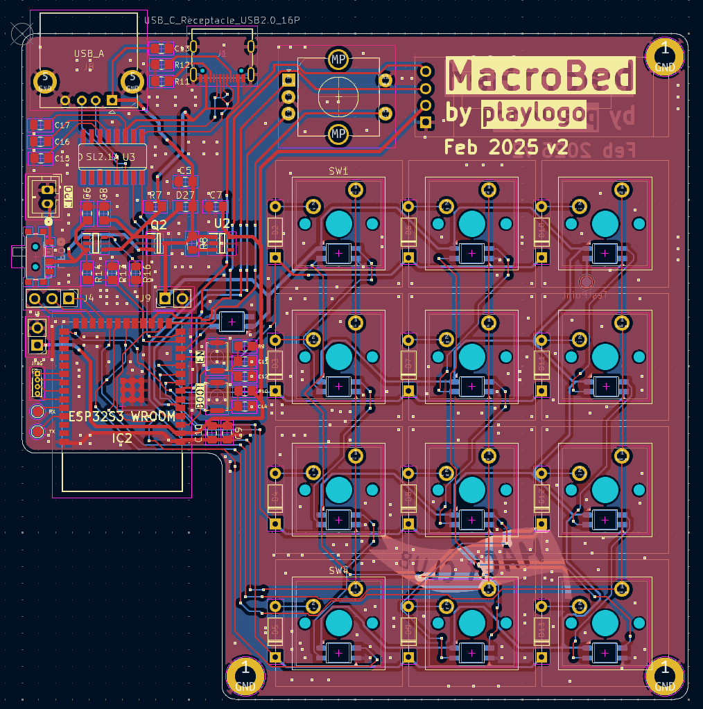
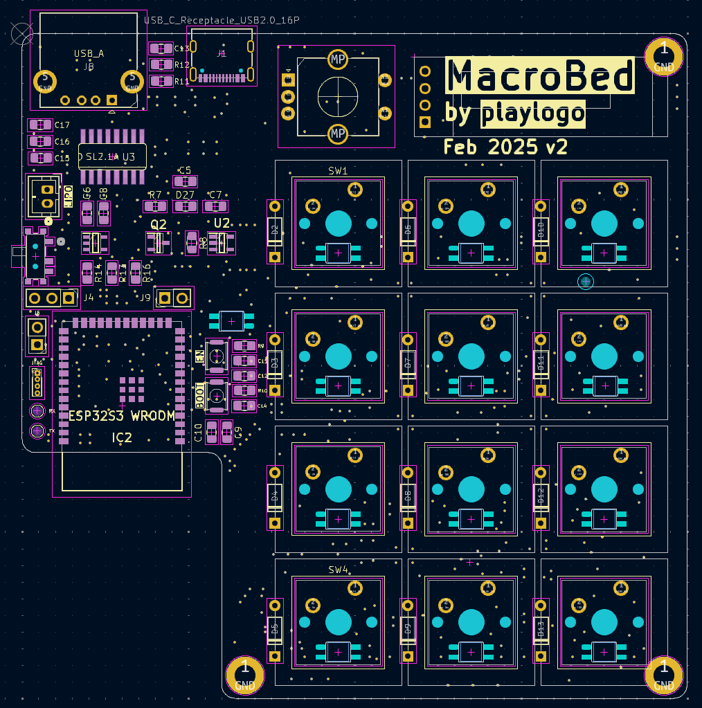
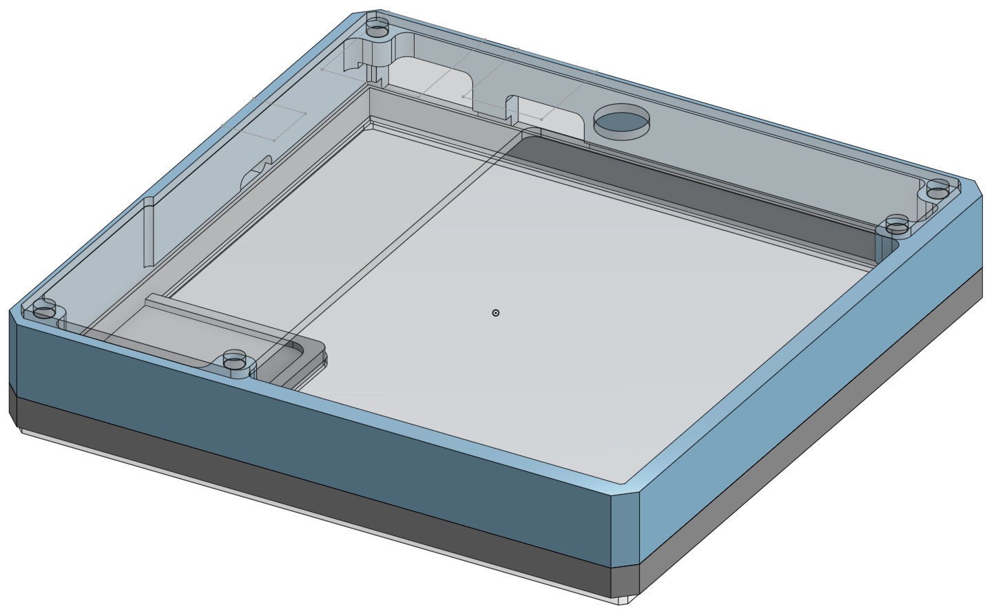
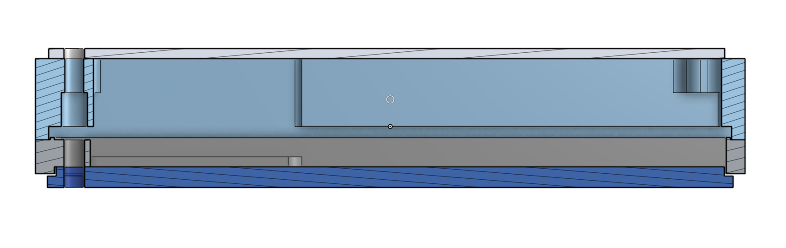
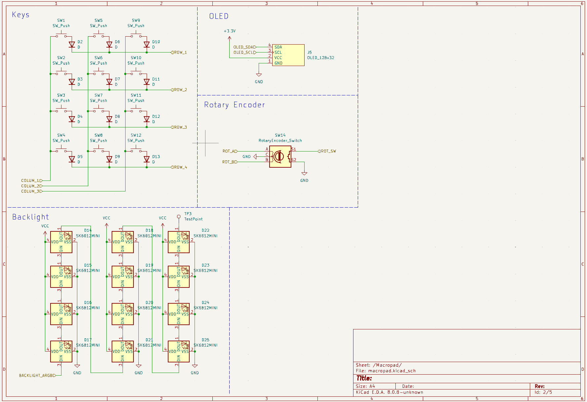
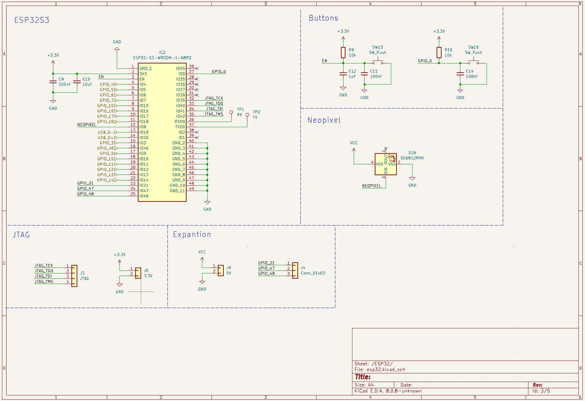

# MacroBed

|  | |
| ---------------------------------------|------------------------------------|
|  |  |

> This macropad used a ESP32-S3-WROOM instead of a XIAO RP2040

> This macropad exceeds the $20 budget by $6, for a total of $26. But this design also doesn't need an expensive XIAO RP2040, so maybe it cancels out?

Features:

- An ESP32S3 for WiFi and BLE
- An integrated 400mAh Lipo + charger circuit
- An integrated 1 port USB Hub

Why?:

When working with 3D printers running Klipper you always need to have the webinterface open to move the hotend, extrude filament, etc. This quickly gets annoying when your phone locks itself after a few minutes or you have to reload Fluidd because it constantly breaks (thank you slow RPI).

This MacroBed (from "Bedslinger" 3D printers... Brilliant name right ?) will use the ESP32's WiFi to interact with moonraker in standalone-mode and can be powered of the internal Lipo for ~1h.

Assembly:

This MacroBed features CNC cut acrylic plates, which i can manufacture myself. All 3D printed parts have a tolerance of 0.3mm. I also have access to a hot air soldering station for the ESP32 and other ICs.

Future plans:

- Custom printed keycaps using [this guide](https://geekhack.org/index.php?topic=96010.0)

## BOMs

BOM for parts from HQ:

- 12x Switches
- 12x White / Transparent keycaps
- 12x Diodes
- 1x ER11 Rotary encoder
- 1x OLED 128x32px
- 3x M3 Heat insert

BOM for parts from LCSC (23.04$ total: 14.26$ parts + 8.74$ cheapest shipping...):

- 1x [ESP32-S3-WROOM-1-N8R2](https://www.lcsc.com/product-detail/WiFi-Modules_Espressif-Systems-ESP32-S3-WROOM-1-N8R2_C2913204.html)
- MOQ [CoreChips SL2.1A](https://www.lcsc.com/product-detail/USB-HUB-Controllers_CoreChips-SL2-1A_C192893.html?s_z=n_C192893)
- MOQ [TP4054 lipo charger SOT-23](https://www.lcsc.com/product-detail/Battery-Management_MSKSEMI-TP4054-MS_C7473157.html?s_z=n_TP4054)
- MOQ [LDO 3.3V fixed](https://www.lcsc.com/product-detail/Voltage-Regulators-Linear-Low-Drop-Out-LDO-Regulators_MICRONE-Nanjing-Micro-One-Elec-ME6211C33M5G-N_C82942.html?s_z=n_ME6211C33M5G-N)
- MOQ [P-Channel mosfet SOT-23](https://www.lcsc.com/product-detail/MOSFETs_Jiangsu-Changjing-Electronics-Technology-Co-Ltd-CJ2301-S1_C8547.html)
- MOQ [USB-A female connector](https://www.lcsc.com/product-detail/USB-Connectors_Shenzhen-Kinghelm-Elec-KH-AF90DIP-112_C503996.html?s_z=n_usb%20a)
- MOQ [USB-C female connector](https://www.lcsc.com/product-detail/USB-Connectors_G-Switch-GT-USB-7010ASV_C2988369.html?s_z=n_G-Switch%20GT-USB-7010asv)
- MOQ [Mini switch](https://www.lcsc.com/product-detail/Tactile-Switches_G-Switch-GT-TC029A-H020-L1N_C778164.html?s_z=n_SKRKAEE020)
- MOQ [SPDT switch](https://www.lcsc.com/product-detail/Slide-Switches_G-Switch-MK-12C02-G020_C963206.html)
- MOQ [Shotkey diode SOD-323](https://www.lcsc.com/product-detail/Schottky-Diodes_LGE-B5819WS_C402231.html?s_z=n_b5819)
- Resistors:
  - MOQ [10k 0805](https://www.lcsc.com/product-detail/Chip-Resistor-Surface-Mount_VO-SCR0805J10K_C5140188.html?s_z=n_resistor)
  - MOQ [5.1k 0805](https://www.lcsc.com/product-detail/Chip-Resistor-Surface-Mount_UNI-ROYAL-Uniroyal-Elec-0805W8J0512T5E_C26023.html?s_z=n_resistor)
  - MOQ [100k 0805](https://www.lcsc.com/product-detail/Chip-Resistor-Surface-Mount_VO-SCR0805J100K_C3017875.html?s_z=n_resistor)
- Ceramic capacitors:
  - MOQ [10uF 0805](https://www.lcsc.com/product-detail/Multilayer-Ceramic-Capacitors-MLCC-SMD-SMT_Samsung-Electro-Mechanics-CL21A106KOQNNNE_C1713.html)
  - MOQ [100nF 0805](https://www.lcsc.com/product-detail/Multilayer-Ceramic-Capacitors-MLCC-SMD-SMT_FH-Guangdong-Fenghua-Advanced-Tech-0805B104J500NT_C29926.html)
  - MOQ [1uF 0805](https://www.lcsc.com/product-detail/Multilayer-Ceramic-Capacitors-MLCC-SMD-SMT_YAGEO-CC0805JKX7R9BB105_C541528.html)

JLCPCB Total (way cheaper than PCBWay): ~2$ using "New Customer" coupon

Parts already in stock:

- 13x SK6812-MiniE Leds
- 1x JST 2-Pin PH-connector
- 2.54mm Pins
- M3 Screws
- Lipo battery

## Schematic

Link to [Full schematic (pdf)](assets/schematic.pdf)

 

