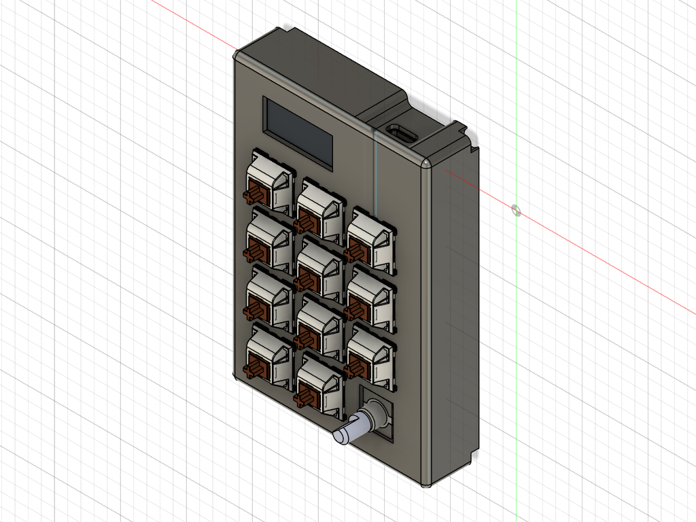
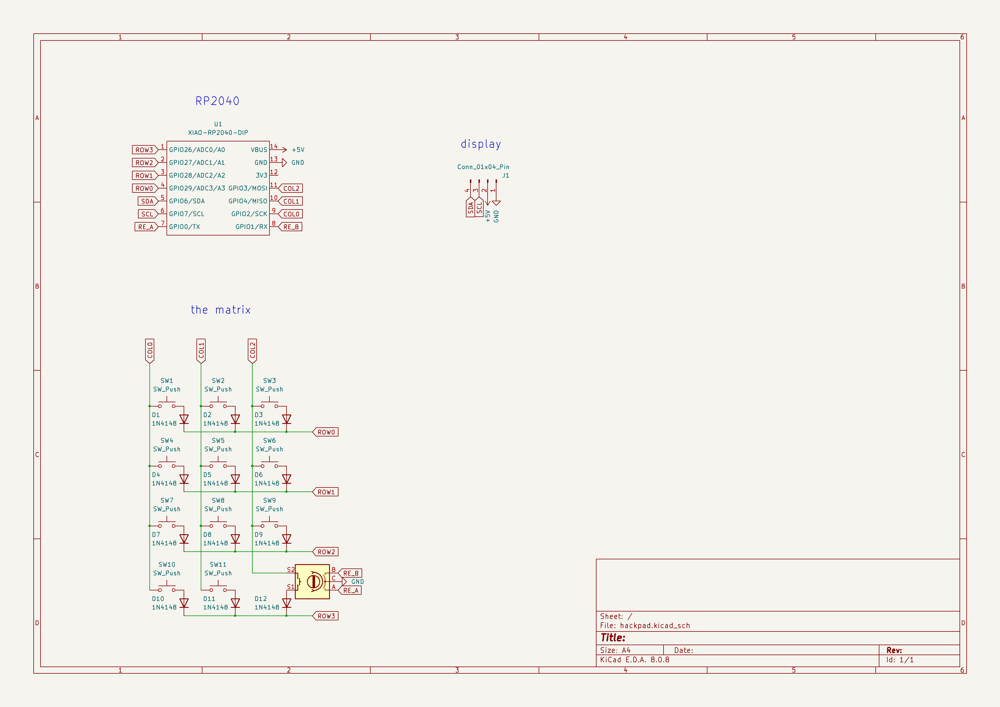
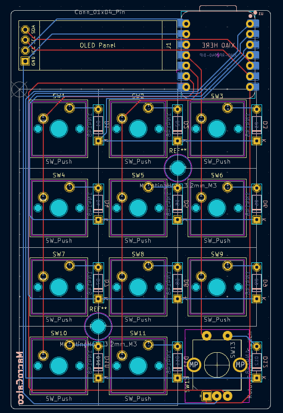
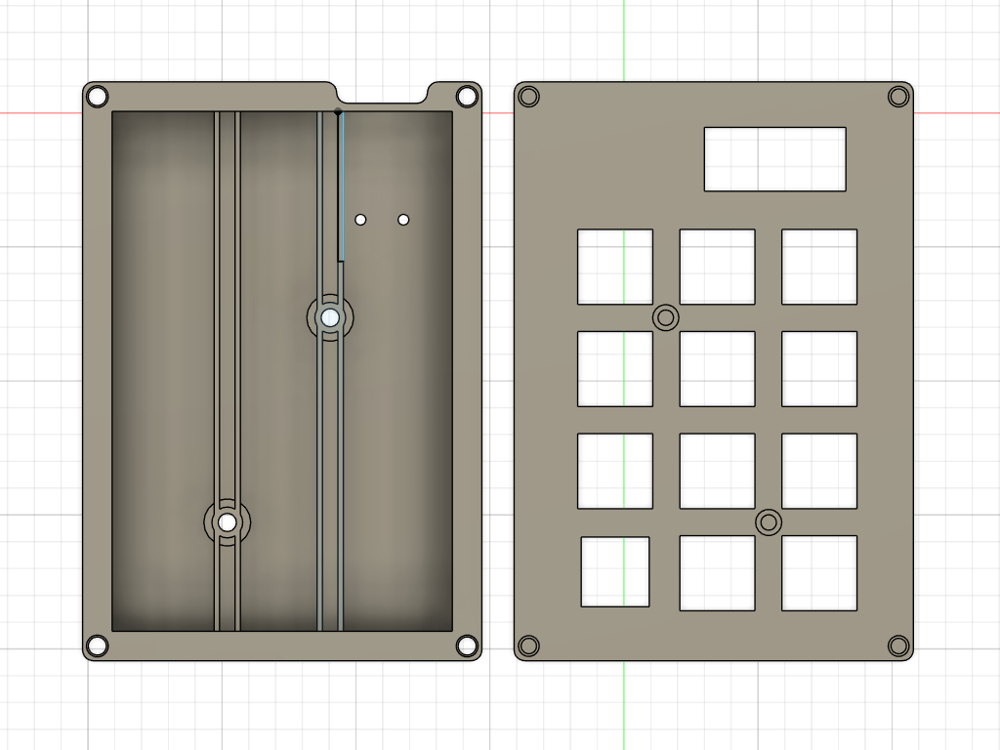

# macrocalco
A macropad that almost looks like a calculator

## Info
The main idea was to make a numpad like device that can also be used as a normal macropad with the press of a button (actually it's 2).

Most of the pad was made in 5 days while I was sick and since I had never used KiCad, Fusion or QMK (not hard to notice tbh), most of the time was passed fighting the tools since I had no idea how to do stuff.

## Pics

### Schematic

### PCB 

### Case
The top part will hold the switches, the bottom screws into the top (though the pcb) to keep everything safe

## BOM
11x Cherry MX Switches (any tactile/linear switch)  
11x DSA Keycaps (if possible a color contrasting with the case ie. black case w/ white keycaps)  
6x M3x16mm Screws  
11x 1N4148 Diodes  
1x 0.91" 128x32 OLED Display  
1x EC11 Rotary Encoder  
1x XIAO RP2040  
1x Case (2 printed parts, preferably black or white but any color is ok!)  