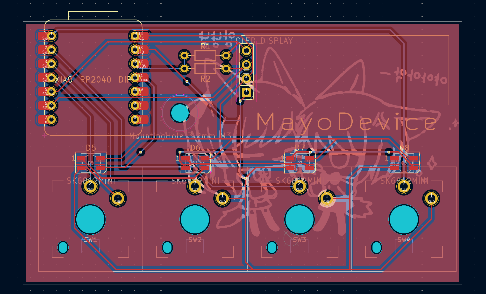

# MayoDevice

Fingers hurt when play osu

So now I can be sure it is a skill issue

MayoDevice is a 4 key Macropad with an OLED display. Uses a custom QMK firmware for RGB lighting and keys-per-second display. Though I'm not sure how well the leds will actually be visible.

Uses low profile switches solely for aesthetic purposes.

## Circuit

|         Schematic         |         PCB         |
| :-----------------------: | :-----------------: |
|  |  |

**_Made in Kicad_**

Didn't get too creative cause it was my first time doing pcb design, but it was also the most fun and easiest part for me

## CAD Model

|      Fully assembled      |        Yeah it fits        |
| :-----------------------: | :------------------------: |
|  |  |

**_Made in Fusion_**

I did not like CAD as much - I thought the constraints and designing were pretty cool, but Fusion 360 has a bug on Mac that unfocuses your window when you click on the hierarchy. Both Fusion and FreeCAD also crashed constantly, but Fusion less so. It fits though

## Firmware

**_Made with QMK_**

I'll update this when I actually test it. It built though, and it's supposed to "heat up" with keypresses per second to alter saturation and shifts hue when you tap. The OLED has a rudimentary display as well.

# Bill of Materials

-   4x Choc v2 (preferably linear) (thing with (+) hole)
-   5x Choc v2 Keycap
-   1x PCB
-   1x XIAO RP2040
-   1x OLED 0.91 128x32 display
-   4x WS2812B LED

-   4x M3x16mm SHCS Screw
-   1x M3x12mm SHCS Screw
-   5x Heatset inserts M3x5x4
-   2x 4.7kΩ Resistor

-   3 printed parts (case, plate, cover)

---

Backside silkscreen art by @pppphasha
