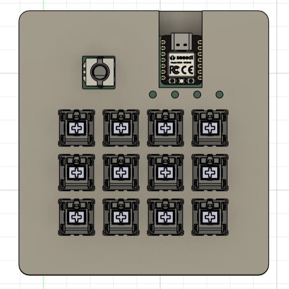
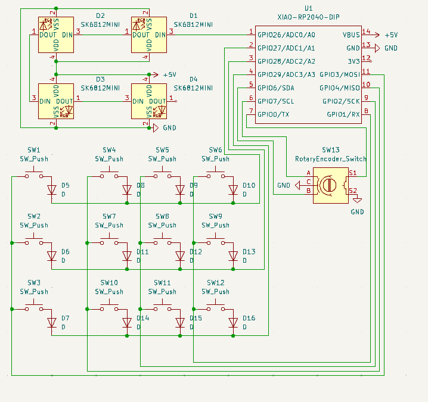
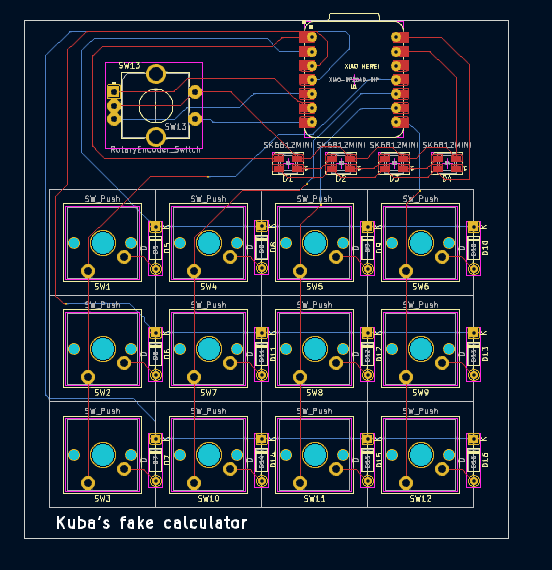
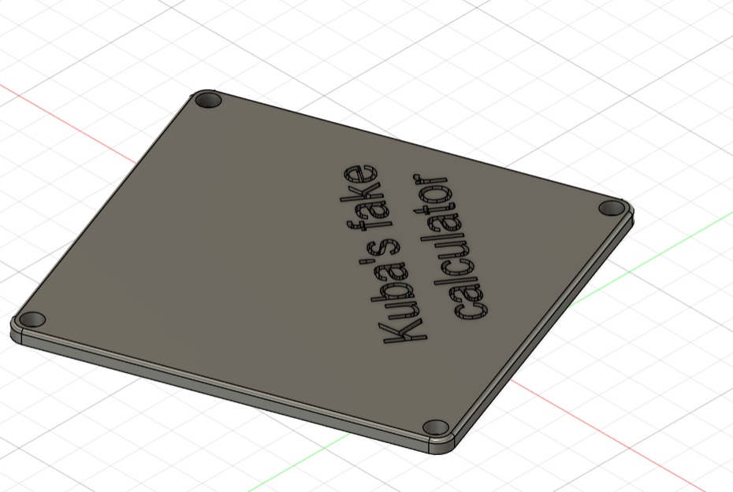
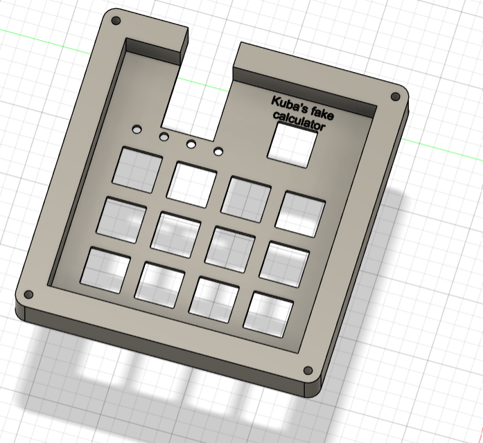
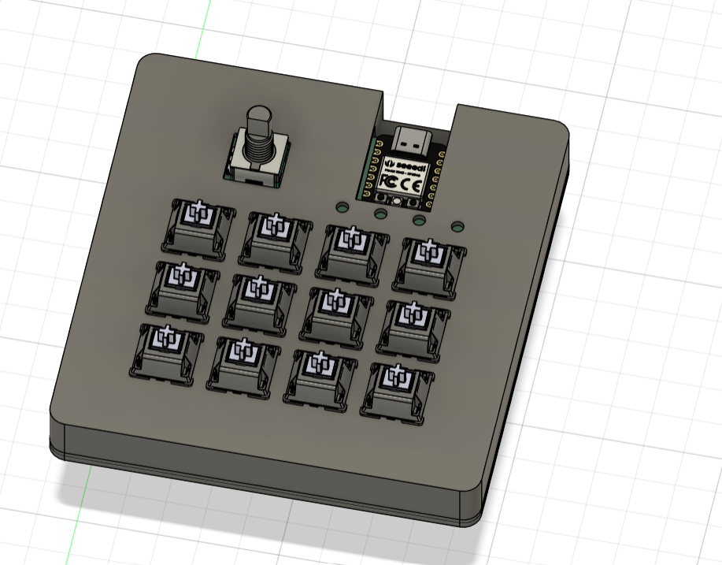

## Project - Kuba's fake calculator

When  I heard about this chalange I knew I had to try to build my own macropad. I had never create a electronic thing like this, so it was absolutely new experience to me. I learned a lot about designing a pcb and I hope this knowlege will be uesfull in the future. Overall it was a really good time but I struggled a litlle with fusion 360 program but i managed to use it.

## Design

my hackpad uses 9 switches and 4 rgb diodes and 1 rotary encoder switch

## Speciications
### BOM

12x Cherry MX switches
1x EC11 Rotary Encoder
4x SK6812 MINI LED 
4x M3x16mm screws
1x XIAO-RP2040-DIP
1x case (2 printed parts)
1x custom pcb 
12x DSA keycaps (black if possible)
12x 1N4148 diodes

Firmware
case top part
case bottom part

## Here are imagesof my pcb in KiCad

### Schematic

### Pcb

## Here are images of my case

(im sorry for having do diodes in case but my fusion skils arent that good)

## Firmware
by macropad is desugned for having 3 layers and with this I have 36 keybinds instead of 12. User know which layer is he on because of diodes that tell him which layer is he using

### Others
It was nicely spent time and if I would able to I would take part in that project again