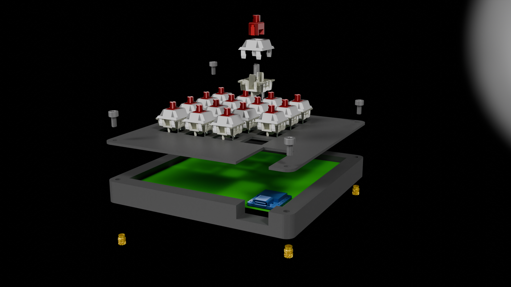
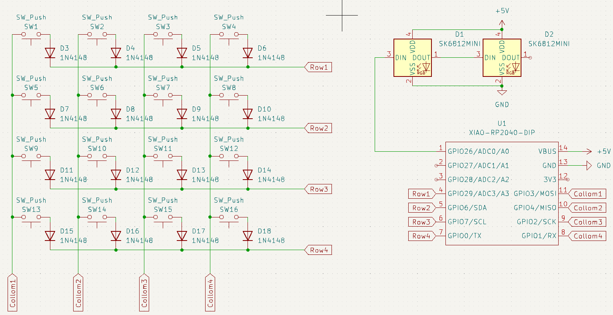
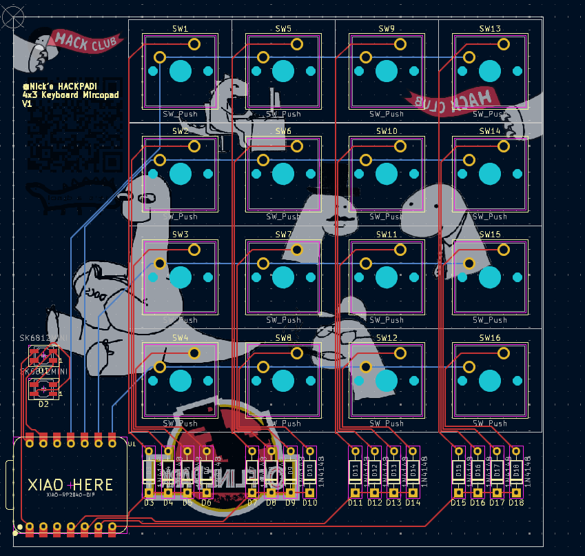
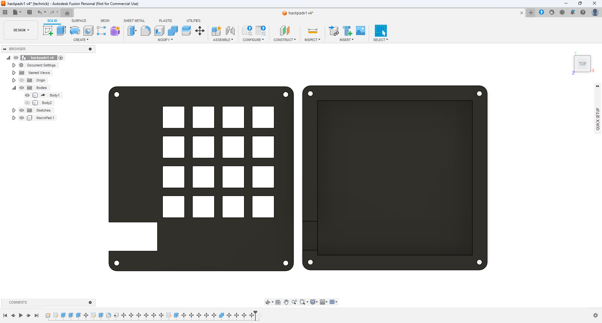

# Nick's macropad
  

### Inspiration

I wanted a macropad for using shortcuts/macros for things like in blender switching from renderer view to wireframe view. and i used 16 keys to let be add more stuff later if i want  

### Challenges

This was my second time using Fusion 360! The first time i wanted to experiment on my own but it was a compete failure, so this was great to actualy learn to use the program. I'm very proud of the result. I was very happy about the stuff i have leared from Duccs Fidget Toy tutorial and when i tried to aply the things he did to my idea is worked flawlessy, Thanks again.

### Specifications

BOM: 
- 16x Cherry MX Switches (blue)
- 2x SK6812 MINI Leds
- 1x XIAO RP2040
- 16x Blank DSA Keycaps (random colors)
- 4x M3x16mm Bolt
- 4x M3 Heatset
- 16x 1N4148 Diodes
- 1x Case (2 printed parts)

Others:
- KMK Firmware
- Top.step 
- Bottom.step

Schematic            |  PCB         |   Case
:-------------------------:|:-------------------------:|:-------------------------:|
    |    | 

