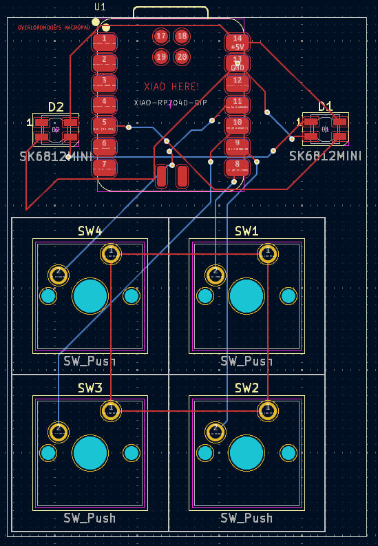

OverlordNoob's Macropad

INSPIRATION

this is my first time on hack club, and I found this. Multiple people helped me on #hackpad, even though I was very annoying. My macropad uses 4 switches, 1 rp2040, and 2 leds.

CHALLENGES

This was my first time on hackclub so I had absolutely no Idea on what I was doing, it took me a long time, but it worked, (even though I might have gotten no sleep.)

Specifications

BOM:

4x Cherry MX Switches
2x SK6812 MINI Leds
1x XIAO RP2040
4x Blank DSA Keycaps
4x M3x16 Bolt
4x M3 Heatset

Others:
KMK Firmware
Top.step
Bottom.step

Case:

PCB:

Schematics:

