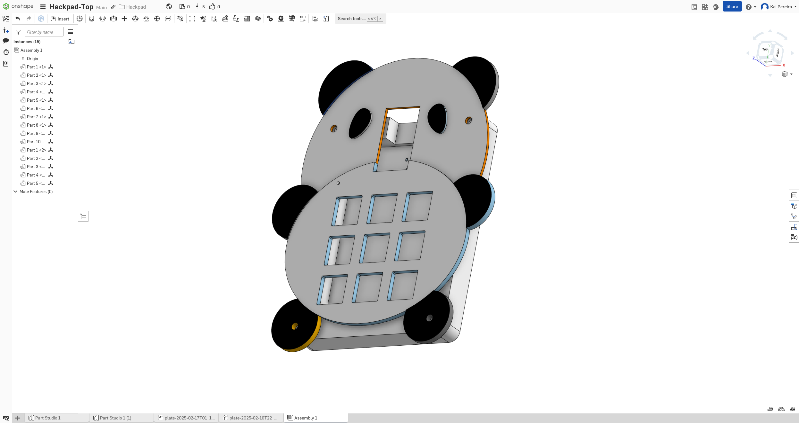
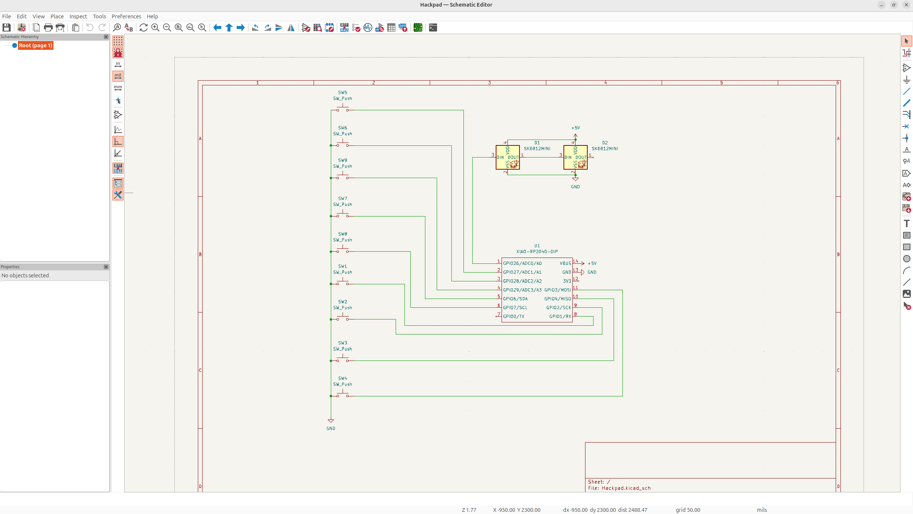
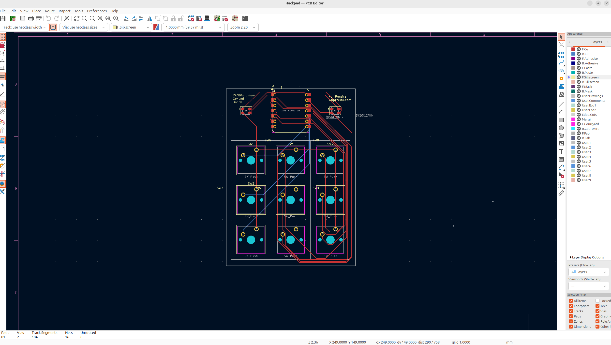

# PANDAmonium Components Board
The PANDAmonium Components board is a panda themed macropad designed by me (kai pereira);

It's a simple 9 key layout with some fun LED's and silly design.

I'm really happy I did this project because it heavily inspired me to turn away from just software and build more hardware projects.

## What I want to use it for
I want to use my macropad to potentially make some complicated VIM motions like search and replace or smth and maybe for optimizing the browser experience.

## Features
- 9 keys
- RGB LED's
- Panda themed case

## Screenshots

## BOM

- 1x XIAO-RP2040-DIP
- 9x Cherry MX Switches
- 2x SK6812 MINI LED

Expanded BOM in /PCB/BOM.csv