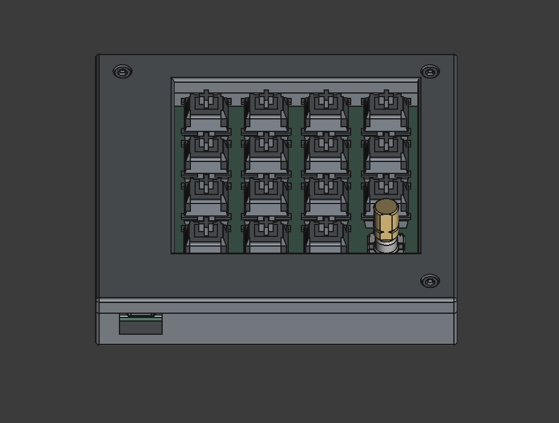
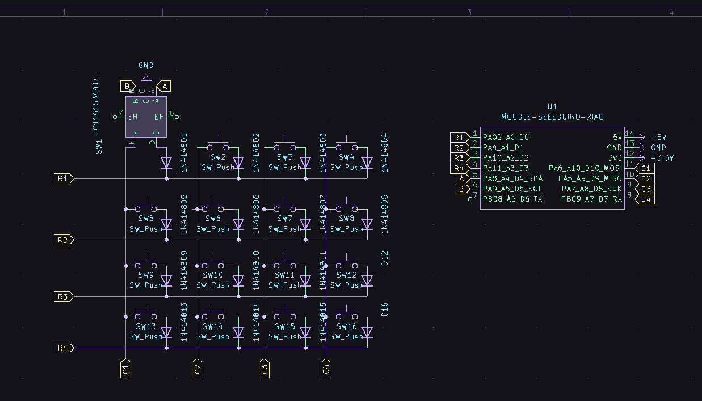
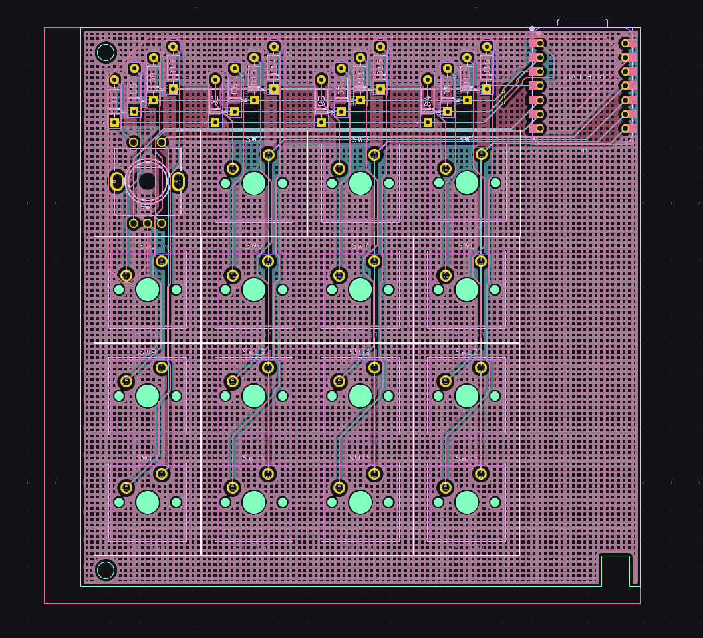
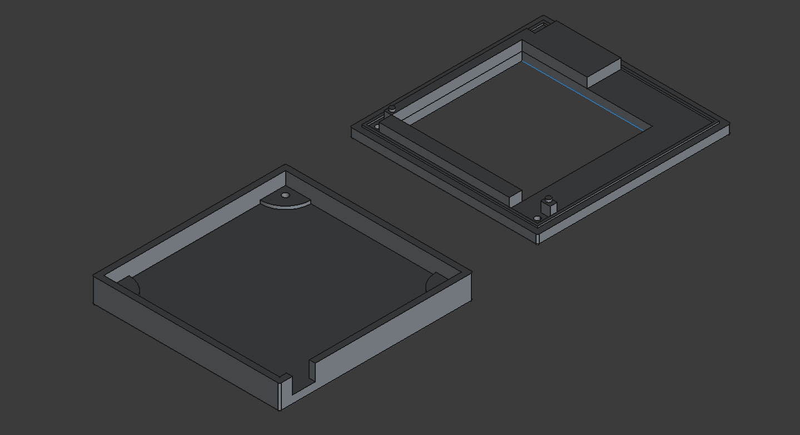

# PegokuPad
This is my first Macropad. It has 16 switches, one being a rotary encoder. It uses KMK.

# Hackpad

# PCB
## Schematic

## PCB

# Case

# BOM
| Item                          | Quantity |
|-------------------------------|----------|
| Brown MX switches             | 16x      |
| EC11 Rotary                   | 2x       |
| 1N4148 Diodes                 | 18x      |
| Blank DSA keycaps White       | 20x      |
| Seeed XIAO RP2040             | 1x       |
| M3x16mm screws                | 4x       |
| M3x5mx4mm                     | 4x       |